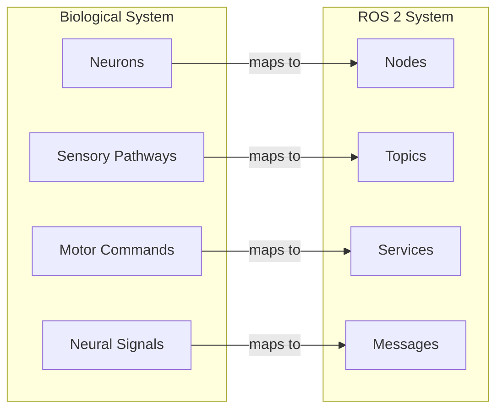
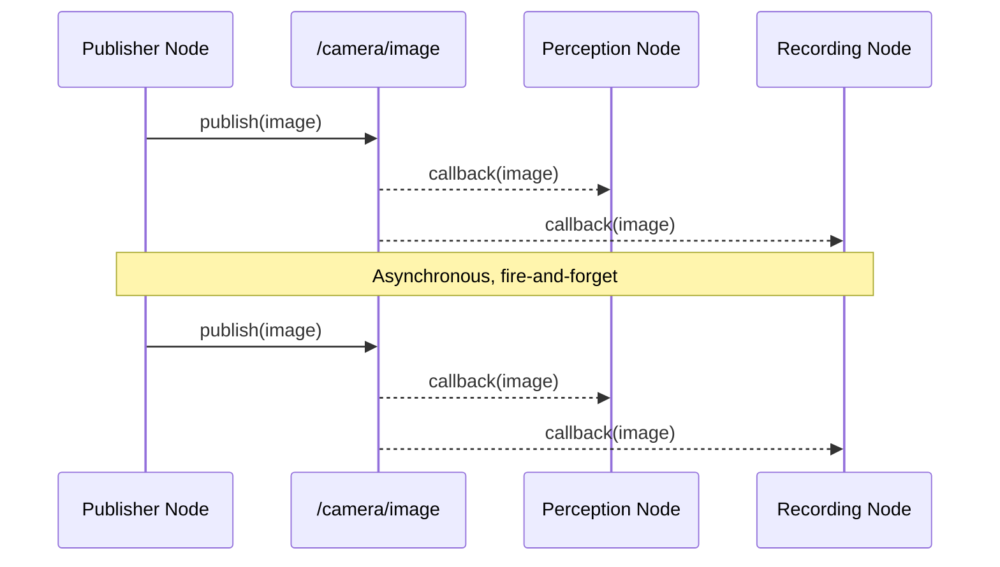
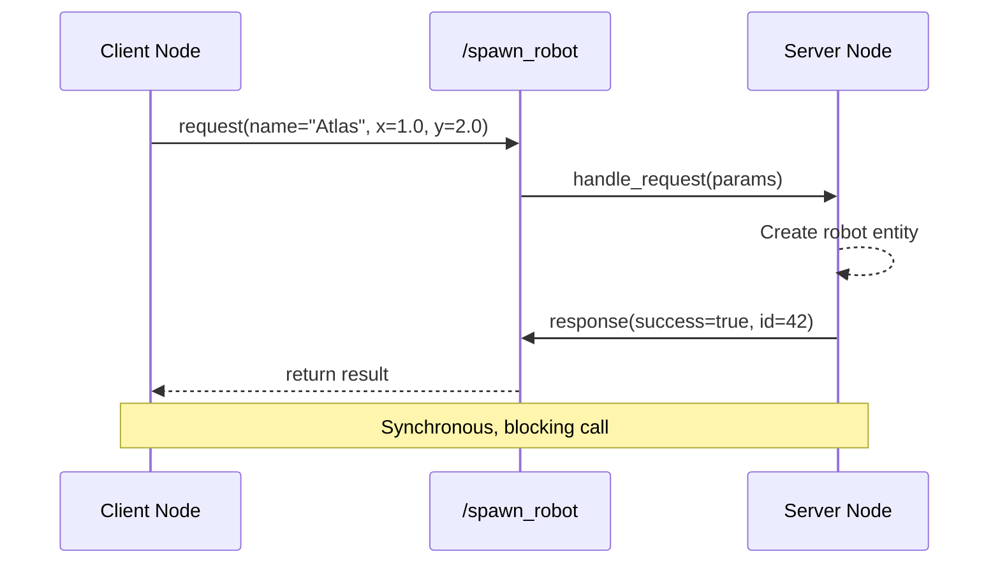
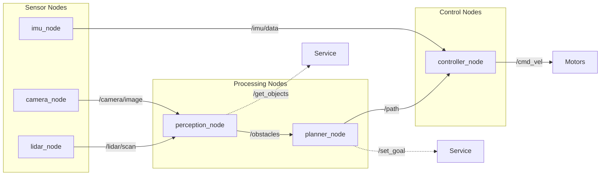
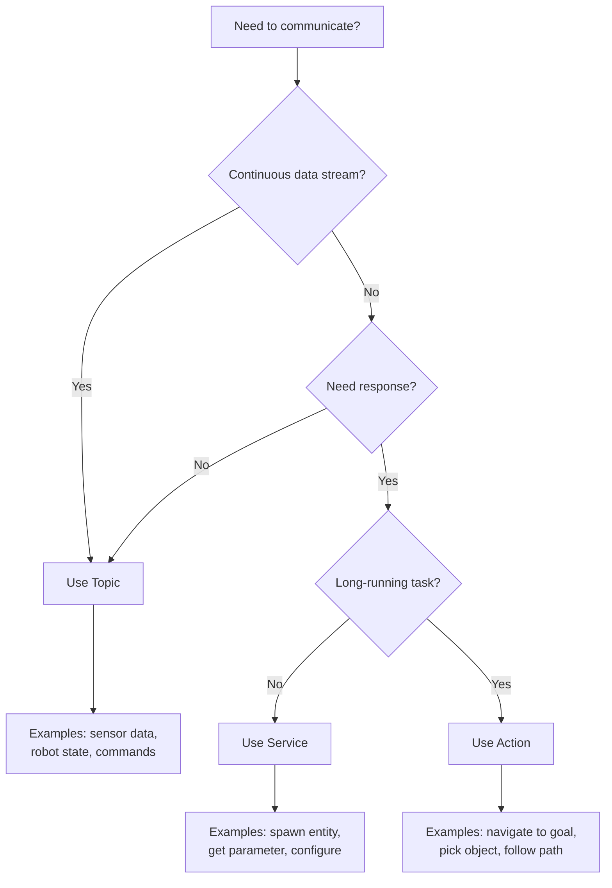

# ROS 2 Architecture and Communication

**Reading Time**: ~45-60 minutes | **Prerequisites**: None

---

## Learning Objectives

By the end of this chapter, you will be able to:

1. Explain the ROS 2 communication model using the nervous system analogy
2. Define nodes, topics, services, and messages with their characteristics
3. Identify when to use topics vs. services for a given robotics scenario
4. Diagram a simple ROS 2 node graph with appropriate connections
5. Describe the role of message types in ensuring type-safe communication

---

## 1.1 The Robot's Nervous System

**How do robot parts "talk" to each other?**

A humanoid robot is a complex system with dozens of components: cameras for eyes, motors for muscles, LiDAR for spatial awareness, and a central processor for decision-making. But how do all these parts coordinate? How does the perception system tell the motion controller that there's an obstacle ahead?

The answer is **ROS 2** (Robot Operating System 2) — a middleware framework that enables robot components to communicate. Think of ROS 2 as the **nervous system** of your robot.

### The Nervous System Analogy

Just as your biological nervous system coordinates your body's functions, ROS 2 coordinates a robot's software components:



| Biological Component | ROS 2 Equivalent | Role |
|---------------------|------------------|------|
| **Neurons** | **Nodes** | Independent processing units that perform specific functions |
| **Sensory Pathways** | **Topics** | Continuous channels carrying streams of information |
| **Motor Commands** | **Services** | Discrete, targeted requests that expect a response |
| **Neural Signals** | **Messages** | Structured data packets with defined formats |

### Why Distributed Communication Matters

Robots operate in the real world where:

- **Multiple sensors** generate data simultaneously (cameras at 30 fps, LiDAR at 10 Hz, IMU at 100 Hz)
- **Different components** run at different speeds (perception is slower than motor control)
- **Failures must be isolated** (a camera crash shouldn't stop the robot from walking)
- **Updates happen incrementally** (you want to upgrade perception without touching control)

ROS 2's distributed architecture addresses all these challenges by treating each component as an independent process that communicates through well-defined interfaces.

:::tip Success Check
Can you explain to a colleague why ROS 2 uses a distributed architecture instead of a single monolithic program? What are two benefits of this approach?
:::

---

## 1.2 Topics — The Sensory Pathways

Topics are the **continuous data streams** of ROS 2, analogous to sensory pathways in your nervous system. Just as visual signals flow continuously from your eyes to your brain, sensor data flows from robot sensors to processing nodes via topics.

### What is a Topic?

A **topic** is a named channel that carries messages of a specific type. Any node can:
- **Publish** messages to a topic (send data)
- **Subscribe** to a topic (receive data)



### Key Characteristics of Topics

| Characteristic | Description |
|----------------|-------------|
| **Many-to-many** | Multiple publishers can send to one topic; multiple subscribers can listen |
| **Asynchronous** | Publishers don't wait for subscribers; they just send |
| **Fire-and-forget** | No confirmation that messages were received |
| **Typed** | Every topic carries messages of exactly one type |
| **Named** | Topics have hierarchical names like `/robot/camera/image` |

### Message Types

Every topic is associated with a **message type** that defines the structure of data it carries. This ensures type-safe communication — a node expecting an image won't accidentally receive LiDAR data.

```yaml
# Example: sensor_msgs/msg/LaserScan.msg
# Standard message for LiDAR data

Header header           # timestamp and frame
float32 angle_min       # start angle of scan [rad]
float32 angle_max       # end angle of scan [rad]
float32 angle_increment # angular step between measurements
float32 range_min       # minimum range value [m]
float32 range_max       # maximum range value [m]
float32[] ranges        # range data [m]
float32[] intensities   # intensity data (optional)
```

### When to Use Topics

Topics are ideal for:

1. **Continuous sensor data**: Camera images, LiDAR scans, IMU readings
2. **Robot state information**: Joint positions, battery level, odometry
3. **Command streams**: Velocity commands, trajectory waypoints
4. **Notifications**: Events that multiple nodes might care about

**Real-world example**: A humanoid's camera node publishes images at 30 fps to `/camera/rgb`. Both the perception node (for object detection) and the logging node (for recording) subscribe to this topic independently.

:::tip Success Check
List three scenarios in robotics where topics are the appropriate communication pattern. Why would you choose topics over services for each?
:::

---

## 1.3 Services — The Motor Commands

While topics handle continuous data streams, **services** handle discrete operations that need a response — like motor commands that confirm execution.

### What is a Service?

A **service** is a named endpoint that accepts a request and returns a response. Unlike topics, services follow a **request-response** pattern:



### Key Characteristics of Services

| Characteristic | Description |
|----------------|-------------|
| **One-to-one** | One client sends a request; one server responds |
| **Synchronous** | Client waits (blocks) until response arrives |
| **Confirmed** | Client knows if the operation succeeded |
| **Typed** | Request and response have defined message types |
| **Discrete** | For one-time operations, not continuous data |

### Service Definitions

A service is defined by a pair of message types: **request** and **response**, separated by `---`:

```yaml
# example_interfaces/srv/SpawnRobot.srv

# Request
string robot_name
float64 x
float64 y
float64 theta

---

# Response
bool success
string status_message
int32 robot_id
```

### When to Use Services

Services are ideal for:

1. **Configuration changes**: Set parameters, change modes
2. **One-time operations**: Spawn entities, capture snapshot
3. **Queries**: Get current state, check status
4. **Commands requiring confirmation**: Enable motor, arm gripper

**Real-world example**: Before a humanoid starts walking, the motion planner calls the `/enable_motors` service and waits for confirmation that all motors are ready.

:::tip Success Check
List three scenarios where services are appropriate. What makes services better than topics for these use cases?
:::

---

## 1.4 Nodes in the Graph

Now that we understand topics and services, let's examine **nodes** — the fundamental processing units that use them.

### What is a Node?

A **node** is an independent executable that performs a specific function. Each node:

- Runs as a separate process (isolated memory, can crash independently)
- Has a unique name within the ROS 2 network
- Can publish/subscribe to multiple topics
- Can offer/call multiple services
- Communicates with other nodes through ROS 2 middleware

### The Computation Graph

A robot's software is a **computation graph** — a network of nodes connected by topics and services:



**Reading this graph:**
- Solid arrows (→) represent topic connections (continuous data flow)
- Dashed arrows (- - →) represent service connections (request-response)
- Data flows from left (sensors) through processing to right (actuators)

### Node Naming and Namespaces

Nodes and topics use hierarchical names:

| Component | Example | Purpose |
|-----------|---------|---------|
| Node name | `camera_node` | Unique identifier for the process |
| Namespace | `/robot1/` | Group related nodes (useful for multi-robot) |
| Full name | `/robot1/camera_node` | Globally unique identifier |
| Topic | `/robot1/camera/image` | Follows namespace hierarchy |

### Node Lifecycle

ROS 2 nodes follow a lifecycle with defined states:

1. **Unconfigured** → Node created but not ready
2. **Inactive** → Configured but not processing
3. **Active** → Fully operational
4. **Finalized** → Shutting down

This lifecycle enables graceful startup sequences (configure all nodes, then activate together) and clean shutdown.

:::tip Success Check
Look at the node graph diagram above. Can you identify:
1. Which nodes are publishers vs. subscribers?
2. What happens if `perception_node` crashes?
3. Why is `imu_node` connected directly to `controller_node`?
:::

---

## 1.5 Choosing Communication Patterns

When designing a robot system, you'll constantly ask: "Should this be a topic, a service, or an action?" Here's a decision framework:



### Decision Questions

Ask these questions in order:

1. **Is this continuous data?** (sensor streams, state updates) → **Topic**
2. **Do I need confirmation?** (no → Topic, yes → continue)
3. **Is this a quick operation?** (yes → Service)
4. **Is this long-running with progress updates?** → **Action** (covered in Module 3)

### Summary Table

| Pattern | Data Flow | Timing | Confirmation | Use For |
|---------|-----------|--------|--------------|---------|
| **Topic** | One-way, many-to-many | Async | No | Continuous data, events |
| **Service** | Request → Response | Sync (blocking) | Yes | Quick operations, queries |
| **Action** | Goal → Feedback → Result | Async with updates | Yes | Long tasks with progress |

### Common Patterns in Robotics

| Scenario | Pattern | Rationale |
|----------|---------|-----------|
| Camera publishing images | Topic | Continuous, multiple consumers |
| Checking battery level | Service | One-time query, needs response |
| Navigating to a location | Action | Long-running, needs progress feedback |
| Emergency stop command | Topic | Must be immediate, no waiting |
| Spawning a simulation entity | Service | One-time, needs confirmation |
| Joint state feedback | Topic | Continuous stream at high rate |

:::tip Success Check
For each scenario below, identify the best communication pattern and justify your choice:
1. A node that publishes the robot's current pose at 50 Hz
2. A request to change the robot's walking speed
3. A command to move the robot's arm to a specific position and report when done
4. A notification that the robot detected a human
5. A request to get the list of all detected objects
:::

---

## Chapter Summary

In this chapter, we explored ROS 2's communication architecture through the nervous system analogy:

| Concept | Description | Key Points |
|---------|-------------|------------|
| **Nodes** | Independent processes | Isolated, named, lifecycle-managed |
| **Topics** | Continuous data channels | Async, many-to-many, fire-and-forget |
| **Services** | Request-response endpoints | Sync, one-to-one, confirmed |
| **Messages** | Typed data structures | Ensures type-safe communication |

**Key takeaways:**
- ROS 2's distributed architecture isolates failures and enables incremental updates
- Topics are for continuous data; services are for discrete operations
- Message types ensure components speak the same "language"
- The computation graph visualizes how data flows through your robot

---

## What's Next

In Chapter 2, we'll dive into **Python and rclpy** — learning how to create nodes that publish, subscribe, and call services. You'll see how AI agent logic integrates with ROS 2's communication model.

---

## References

- [ROS 2 Documentation: Concepts](https://docs.ros.org/en/humble/Concepts.html)
- [ROS 2 Tutorials: Understanding Nodes](https://docs.ros.org/en/humble/Tutorials/Beginner-CLI-Tools/Understanding-ROS2-Nodes.html)
- [ROS 2 Tutorials: Understanding Topics](https://docs.ros.org/en/humble/Tutorials/Beginner-CLI-Tools/Understanding-ROS2-Topics.html)
- [ROS 2 Tutorials: Understanding Services](https://docs.ros.org/en/humble/Tutorials/Beginner-CLI-Tools/Understanding-ROS2-Services.html)
