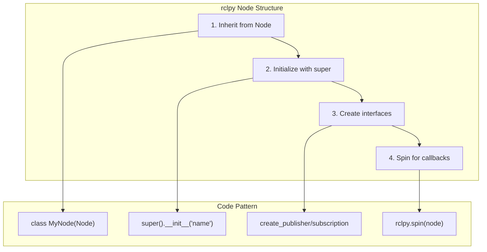
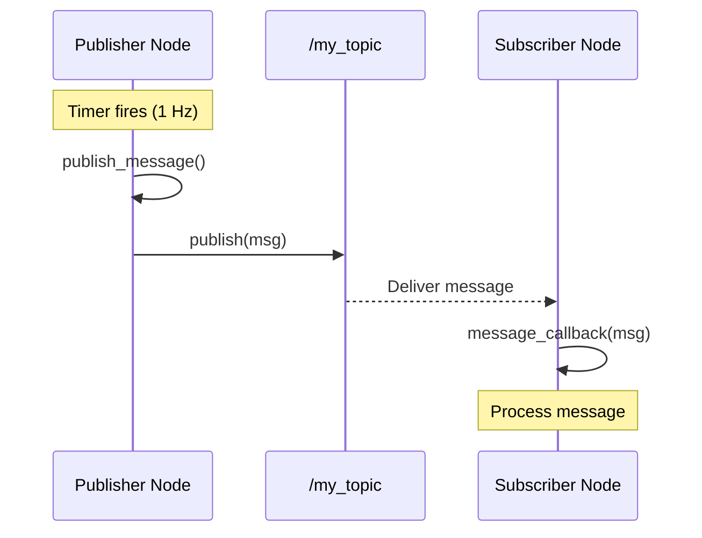
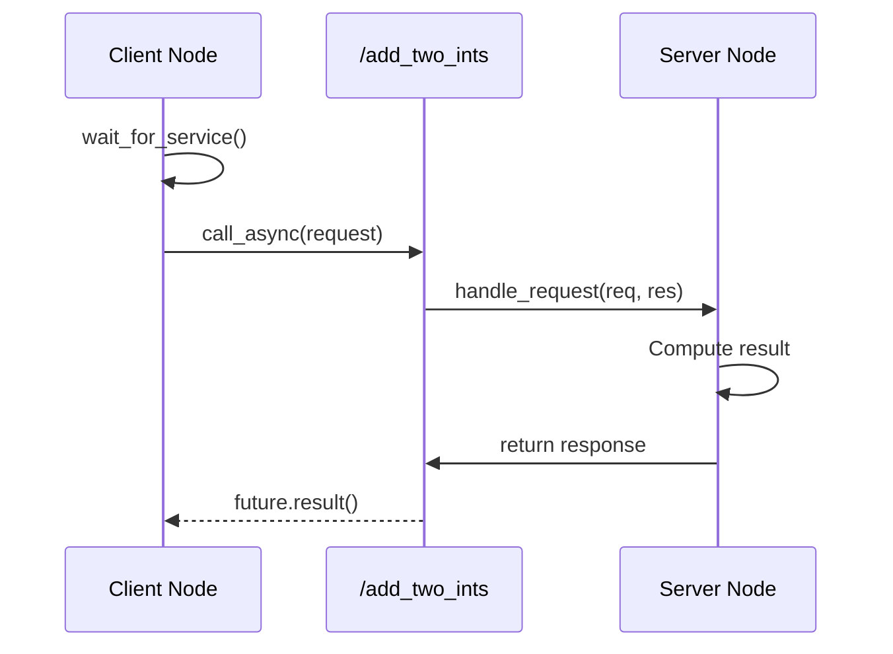
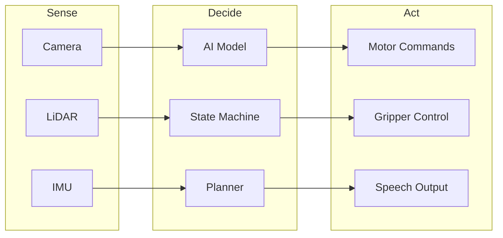
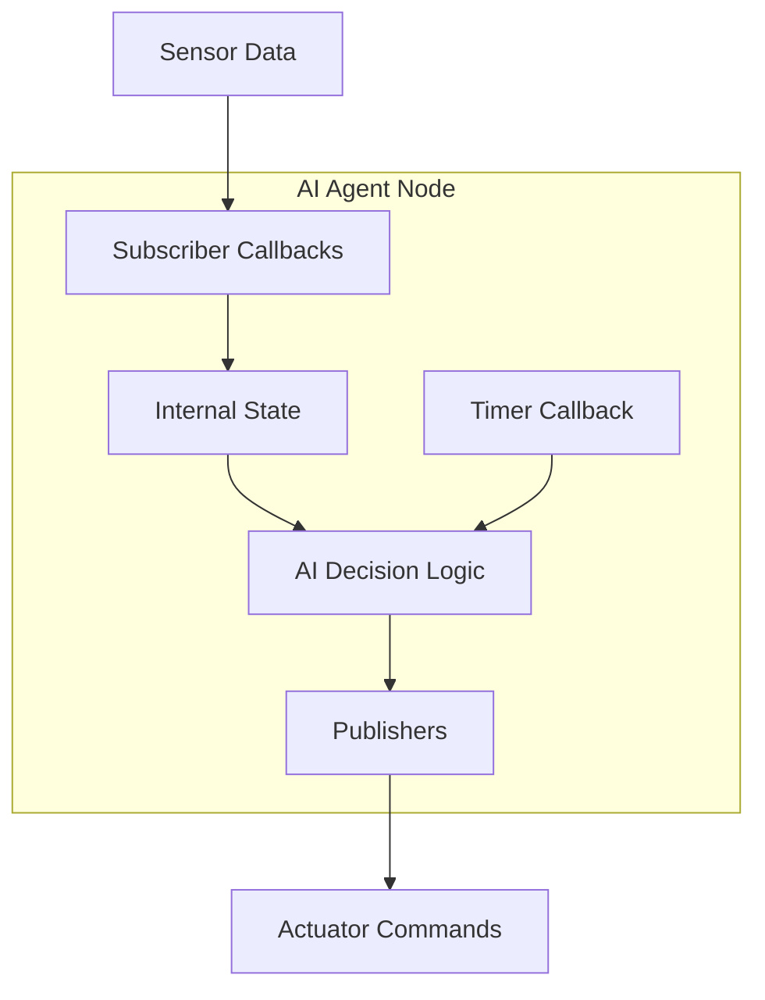
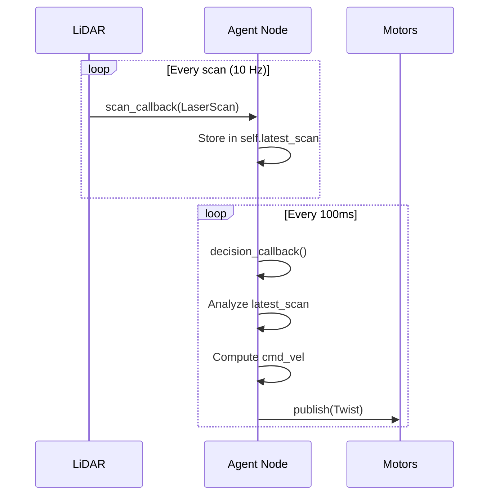

# Python Agents with rclpy

**Reading Time**: ~40-50 minutes | **Prerequisites**: Chapter 1 (ROS 2 concepts)

---

## Learning Objectives

By the end of this chapter, you will be able to:

1. Describe the structure of an rclpy node (initialization, callbacks, spin)
2. Explain how publishers and subscribers connect nodes in Python
3. Identify where AI decision logic executes within the rclpy callback model
4. Outline the lifecycle of an AI agent node from sensor input to command output
5. Recognize callback patterns for processing sensor data

---

## 2.1 rclpy Node Structure

In Chapter 1, we learned that **nodes** are the fundamental processing units in ROS 2. Now we'll see how to build them in Python using **rclpy** — the official ROS 2 Python client library.

### What is rclpy?

**rclpy** (ROS Client Library for Python) provides:
- Classes to create and manage nodes
- APIs for publishers, subscribers, services, and actions
- Callbacks for event-driven processing
- Integration with ROS 2 middleware

### The Minimal Node Structure

Every rclpy node follows this pattern:

```python
import rclpy
from rclpy.node import Node

class MinimalNode(Node):
    def __init__(self):
        super().__init__('minimal_node')  # Node name
        self.get_logger().info('Node started!')

def main(args=None):
    rclpy.init(args=args)           # Initialize ROS 2
    node = MinimalNode()            # Create node instance
    rclpy.spin(node)                # Keep node alive
    node.destroy_node()             # Cleanup
    rclpy.shutdown()                # Shutdown ROS 2

if __name__ == '__main__':
    main()
```

### The Four Essential Parts



| Part | Purpose | Code |
|------|---------|------|
| **Inherit from Node** | Get all node functionality | `class MyNode(Node):` |
| **Initialize** | Set node name, configure | `super().__init__('name')` |
| **Create Interfaces** | Set up communication | `create_publisher()`, etc. |
| **Spin** | Process callbacks continuously | `rclpy.spin(node)` |

### Understanding `spin()`

The `spin()` function is crucial — it's an infinite loop that:
- Waits for incoming messages
- Executes callbacks when data arrives
- Keeps the node running

Without `spin()`, your node would immediately exit.

:::tip Success Check
What are the four essential parts of an rclpy node? What happens if you forget to call `rclpy.spin()`?
:::

---

## 2.2 Publishers and Subscribers

Now let's implement the **topic-based communication** from Chapter 1 in Python.

### Creating a Publisher

A publisher sends messages to a topic:

```python
from std_msgs.msg import String

class PublisherNode(Node):
    def __init__(self):
        super().__init__('publisher_node')

        # Create publisher
        self.publisher = self.create_publisher(
            String,              # Message type
            'my_topic',          # Topic name
            10                   # QoS queue depth
        )

        # Timer to publish periodically
        self.timer = self.create_timer(1.0, self.publish_message)

    def publish_message(self):
        msg = String()
        msg.data = 'Hello, ROS 2!'
        self.publisher.publish(msg)
```

**Key elements:**
- `create_publisher(msg_type, topic, qos)` — sets up the publisher
- `publish(msg)` — sends a message
- Timer ensures periodic publishing

### Creating a Subscriber

A subscriber receives messages from a topic:

```python
from std_msgs.msg import String

class SubscriberNode(Node):
    def __init__(self):
        super().__init__('subscriber_node')

        # Create subscription
        self.subscription = self.create_subscription(
            String,                    # Message type
            'my_topic',                # Topic name
            self.message_callback,     # Callback function
            10                         # QoS queue depth
        )

    def message_callback(self, msg):
        # This runs when a message arrives
        self.get_logger().info(f'Received: {msg.data}')
```

**Key elements:**
- `create_subscription(msg_type, topic, callback, qos)` — sets up the subscriber
- **Callback function** — executed when a message arrives
- Message data accessed via `msg.data` (or appropriate field)

### Message Flow



### Connecting Nodes

When you run both nodes:
1. Publisher creates the topic if it doesn't exist
2. Subscriber connects to the topic
3. Each published message triggers the subscriber's callback

**Important**: Topics are typed. A subscriber to `/camera/image` expecting `sensor_msgs/Image` won't receive `std_msgs/String` messages.

:::tip Success Check
Trace the flow of a message from publisher to subscriber. What triggers the subscriber's callback function?
:::

---

## 2.3 Service Clients and Servers

While topics handle continuous data, **services** handle request-response interactions.

### Creating a Service Server

A server handles incoming requests:

```python
from example_interfaces.srv import AddTwoInts

class ServiceServerNode(Node):
    def __init__(self):
        super().__init__('service_server')

        # Create service server
        self.service = self.create_service(
            AddTwoInts,                # Service type
            'add_two_ints',            # Service name
            self.handle_request        # Handler callback
        )

    def handle_request(self, request, response):
        # Process request and fill response
        response.sum = request.a + request.b
        self.get_logger().info(
            f'Request: {request.a} + {request.b} = {response.sum}'
        )
        return response
```

**Key elements:**
- `create_service(srv_type, name, callback)` — registers the service
- Callback receives `request` and `response` objects
- Must return the filled `response`

### Creating a Service Client

A client sends requests:

```python
from example_interfaces.srv import AddTwoInts

class ServiceClientNode(Node):
    def __init__(self):
        super().__init__('service_client')
        self.client = self.create_client(
            AddTwoInts,
            'add_two_ints'
        )

    def call_service(self, a, b):
        # Wait for service to be available
        while not self.client.wait_for_service(timeout_sec=1.0):
            self.get_logger().info('Waiting for service...')

        # Create and send request
        request = AddTwoInts.Request()
        request.a = a
        request.b = b

        # Async call
        future = self.client.call_async(request)
        return future
```

### Service Call Flow



**When to use services:**
- One-time operations (spawn entity, get parameter)
- Configuration changes (set mode, enable motor)
- Queries that need confirmation

:::tip Success Check
How does the service call flow differ from topic publish-subscribe? When should you use a service instead of a topic?
:::

---

## 2.4 AI Agent Integration

Now we arrive at the key question: **Where does AI decision-making fit in the rclpy callback model?**

### The AI Agent Pattern

An AI agent follows the **sense → decide → act** loop:



### AI Agent in rclpy

In the callback model, AI logic executes in **callbacks** triggered by incoming data:



### Decision Points in the Callback Model

| Callback Type | AI Integration | Example |
|---------------|----------------|---------|
| **Subscriber callback** | React to new sensor data | Obstacle detected → stop |
| **Timer callback** | Periodic decision making | Every 100ms, re-plan path |
| **Service callback** | Respond to queries | Report current goal status |

### AI Decision Callback Example

Here's a pattern for an obstacle avoidance agent:

```python
from sensor_msgs.msg import LaserScan
from geometry_msgs.msg import Twist

class ObstacleAvoidanceAgent(Node):
    def __init__(self):
        super().__init__('obstacle_avoidance_agent')

        # Subscriber: sense
        self.scan_sub = self.create_subscription(
            LaserScan, '/scan', self.scan_callback, 10
        )

        # Publisher: act
        self.cmd_pub = self.create_publisher(
            Twist, '/cmd_vel', 10
        )

        # Internal state
        self.latest_scan = None

        # Timer for decision loop (10 Hz)
        self.create_timer(0.1, self.decision_callback)

    def scan_callback(self, msg):
        # Sense: store latest data
        self.latest_scan = msg

    def decision_callback(self):
        # Decide: process sensor data
        if self.latest_scan is None:
            return

        min_distance = min(self.latest_scan.ranges)

        # AI decision logic
        cmd = Twist()
        if min_distance < 0.5:  # Obstacle close
            cmd.angular.z = 0.5  # Turn
        else:
            cmd.linear.x = 0.2   # Move forward

        # Act: publish command
        self.cmd_pub.publish(cmd)
```

### Agent Structure Summary



**Key patterns:**
- **Subscriber callbacks** update internal state (non-blocking)
- **Timer callbacks** run decision logic periodically
- **Publishers** send commands to actuators
- State management bridges sensing and acting

:::tip Success Check
Design an AI agent node that:
1. Subscribes to `/camera/image` for visual input
2. Runs object detection every 200ms
3. Publishes to `/detected_objects`

What callbacks would you need? Where does the AI model run?
:::

---

## Chapter Summary

In this chapter, we learned how to implement ROS 2 nodes in Python:

| Concept | Implementation | Purpose |
|---------|----------------|---------|
| **Node Structure** | Class inheriting from `Node` | Foundation for all processing |
| **Publishers** | `create_publisher()` + `publish()` | Send data to topics |
| **Subscribers** | `create_subscription()` + callback | Receive and process data |
| **Services** | `create_service()` + handler | Handle request-response |
| **AI Integration** | Timer callbacks + state | Periodic decision making |

**Key takeaways:**
- rclpy provides the Python API for ROS 2
- All processing happens in callbacks triggered by `spin()`
- AI agents use subscriber callbacks for sensing, timer callbacks for deciding, and publishers for acting
- State management connects sensor callbacks to decision logic

---

## What's Next

In Chapter 3, we'll explore **URDF for humanoid robots**—how to describe the physical structure of your robot and visualize it in ROS 2.

---

## References

- [rclpy API Documentation](https://docs.ros.org/en/humble/p/rclpy/)
- [ROS 2 Python Tutorials](https://docs.ros.org/en/humble/Tutorials/Beginner-Client-Libraries/Writing-A-Simple-Py-Publisher-And-Subscriber.html)
- [Creating a Service](https://docs.ros.org/en/humble/Tutorials/Beginner-Client-Libraries/Writing-A-Simple-Py-Service-And-Client.html)
