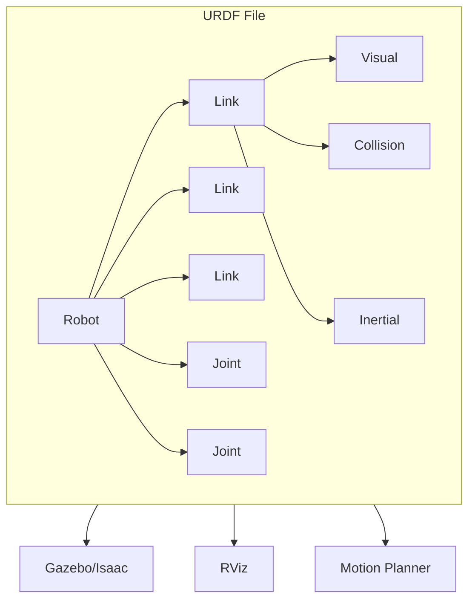
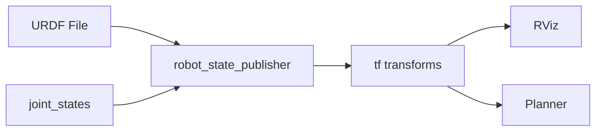
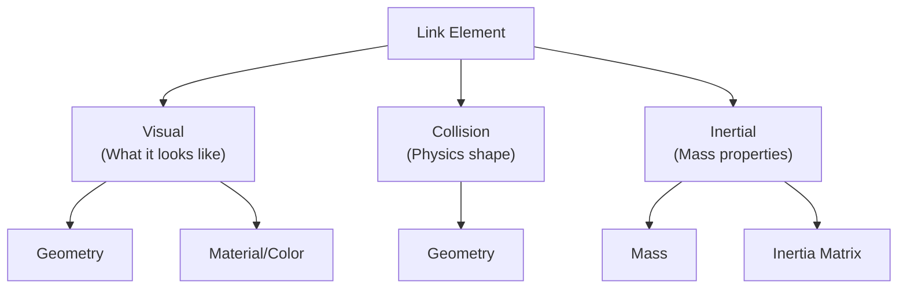
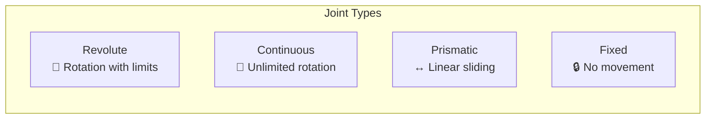
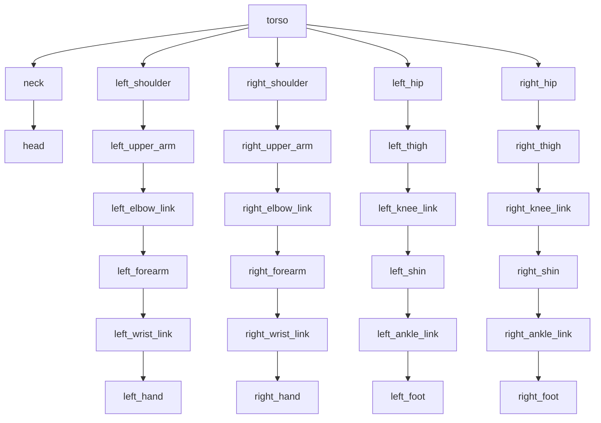

# URDF for Humanoid Robots

**Reading Time**: ~40-50 minutes | **Prerequisites**: Chapters 1-2 (ROS 2 concepts, rclpy)

---

## Learning Objectives

By the end of this chapter, you will be able to:

1. Explain the purpose of URDF for robot description and simulation
2. Identify link elements and their properties (visual, collision, inertial)
3. Describe joint types and their motion constraints
4. Interpret a URDF snippet representing a humanoid limb
5. Understand the kinematic chain structure of a humanoid robot

---

## 3.1 What is URDF?

In Chapters 1 and 2, we learned how ROS 2 nodes communicate via topics and services. But there's a fundamental question we haven't addressed: **How does the robot system know what the robot looks like?**

### The Robot Description Problem

A humanoid robot has:
- Dozens of **rigid body segments** (head, torso, arms, legs)
- Multiple **joints** connecting them (shoulders, elbows, knees)
- **Sensors** attached at various locations
- **Physical properties** (mass, dimensions, appearance)

This structural information must be shared across many systems:
- **Visualization**: RViz needs to render the robot
- **Simulation**: Gazebo needs to simulate physics
- **Planning**: Motion planners need kinematic chains
- **Control**: Controllers need joint limits

### Enter URDF

**URDF** (Unified Robot Description Format) is an XML specification that describes robot structure. It defines:
- **Links**: Rigid body segments
- **Joints**: Connections between links
- **Geometry**: Visual and collision shapes
- **Physical properties**: Mass, inertia



### URDF vs. Runtime Communication

| Aspect | URDF | ROS 2 Topics/Services |
|--------|------|----------------------|
| **Type** | Static description | Dynamic data |
| **Content** | Robot structure | Sensor data, commands |
| **Timing** | Load once at startup | Continuous during operation |
| **Format** | XML file | Serialized messages |

**Key insight**: URDF describes *what* the robot is; ROS 2 handles *what the robot does*.

### How URDF Connects to ROS 2

The `robot_state_publisher` node bridges URDF and ROS 2:

1. Reads URDF file at startup
2. Subscribes to `/joint_states` (current joint positions)
3. Computes transforms for all links
4. Publishes to `/tf` (coordinate frames)



:::tip Success Check
Why is URDF needed separately from ROS 2 communication? What information does URDF provide that topics don't?
:::

---

## 3.2 Links — The Robot's Skeleton

**Links** are the rigid body segments of a robot—analogous to bones in a skeleton.

### Link Elements

Every link has three property types:



### Visual Properties

Define how the link appears in visualization:

| Property | Description | Example |
|----------|-------------|---------|
| **Geometry** | Shape of the link | Box, cylinder, mesh |
| **Origin** | Position/rotation relative to link frame | `xyz="0 0 0.5"` |
| **Material** | Color and appearance | `rgba="1 0 0 1"` (red) |

### Collision Properties

Define the shape used for physics collision detection:

- Often **simpler** than visual geometry (faster computation)
- Common to use **primitive shapes** (box, cylinder) even if visual is a mesh
- Critical for simulation accuracy

### Inertial Properties

Define mass distribution for dynamics:

| Property | Description | Units |
|----------|-------------|-------|
| **Mass** | Total mass of link | kg |
| **Origin** | Center of mass position | meters |
| **Inertia** | 3x3 inertia matrix (6 unique values) | kg·m² |

### Link Definition Example

```xml
<link name="upper_arm">
  <!-- Visual: what we see -->
  <visual>
    <origin xyz="0 0 0.15" rpy="0 0 0"/>
    <geometry>
      <cylinder radius="0.04" length="0.30"/>
    </geometry>
    <material name="silver">
      <color rgba="0.8 0.8 0.8 1"/>
    </material>
  </visual>

  <!-- Collision: what physics uses -->
  <collision>
    <origin xyz="0 0 0.15" rpy="0 0 0"/>
    <geometry>
      <cylinder radius="0.04" length="0.30"/>
    </geometry>
  </collision>

  <!-- Inertial: mass properties -->
  <inertial>
    <mass value="1.5"/>
    <origin xyz="0 0 0.15"/>
    <inertia ixx="0.01" ixy="0" ixz="0"
             iyy="0.01" iyz="0" izz="0.002"/>
  </inertial>
</link>
```

### Geometry Types

| Type | Description | Use Case |
|------|-------------|----------|
| `<box>` | Rectangular prism | Torso, simple limbs |
| `<cylinder>` | Circular cylinder | Arms, legs |
| `<sphere>` | Ball shape | Joints, heads |
| `<mesh>` | External 3D model | Detailed appearance |

:::tip Success Check
What are the three property types of a URDF link? Why might collision geometry differ from visual geometry?
:::

---

## 3.3 Joints — Where Movement Happens

**Joints** connect links and define how they can move relative to each other.

### Joint Structure

```xml
<joint name="elbow" type="revolute">
  <parent link="upper_arm"/>
  <child link="forearm"/>
  <origin xyz="0 0 0.30" rpy="0 0 0"/>
  <axis xyz="0 1 0"/>
  <limit lower="-2.35" upper="0" effort="100" velocity="3.0"/>
</joint>
```

### Parent-Child Relationship

Joints create a **tree structure**:
- **Parent link**: The link "closer to" the robot base
- **Child link**: The link that moves relative to parent
- Every link except the root has exactly one parent joint

### Joint Types



| Type | Motion | Limits | Humanoid Example |
|------|--------|--------|------------------|
| **Revolute** | Rotation around axis | Has min/max angles | Elbow, knee, finger |
| **Continuous** | Rotation (unlimited) | No angle limits | Wheels (not common in humanoids) |
| **Prismatic** | Linear translation | Has min/max distance | Telescoping joints |
| **Fixed** | None | N/A | Sensor mounts, rigid connections |

### Joint Properties

| Property | Description | Example |
|----------|-------------|---------|
| **Origin** | Position of joint relative to parent | Where shoulder meets torso |
| **Axis** | Direction of motion | `xyz="0 1 0"` = rotate around Y |
| **Limits** | Constraints on motion | `-2.35` to `0` radians |
| **Effort** | Maximum force/torque | 100 Nm |
| **Velocity** | Maximum speed | 3.0 rad/s |

### Joint Definition Example

```xml
<!-- Knee joint: revolute with limits -->
<joint name="right_knee" type="revolute">
  <parent link="right_thigh"/>
  <child link="right_shin"/>

  <!-- Joint location relative to parent link -->
  <origin xyz="0 0 -0.40" rpy="0 0 0"/>

  <!-- Rotation axis: around Y (lateral) -->
  <axis xyz="0 1 0"/>

  <!-- Motion limits for a knee -->
  <limit lower="0"        <!-- Can't hyperextend -->
         upper="2.5"      <!-- ~143 degrees flexion -->
         effort="200"     <!-- Max torque -->
         velocity="5.0"/> <!-- Max speed -->

  <!-- Optional dynamics -->
  <dynamics damping="0.5" friction="0.1"/>
</joint>
```

### Choosing Joint Types for Humanoids

| Body Part | Joint Type | Reason |
|-----------|------------|--------|
| **Shoulder** | Revolute (3 joints) | Limited range, high torque |
| **Elbow** | Revolute | ~150° flexion range |
| **Wrist** | Revolute (2 joints) | Flexion + rotation |
| **Hip** | Revolute (3 joints) | 3-DOF ball joint approximation |
| **Knee** | Revolute | Hinge joint, no hyperextension |
| **Ankle** | Revolute (2 joints) | Plantar/dorsiflexion + inversion |
| **Neck** | Revolute (2-3 joints) | Pan + tilt |

:::tip Success Check
For a humanoid elbow joint, what type would you choose? What properties would you define?
:::

---

## 3.4 Humanoid Robot Structure

Now let's apply URDF concepts to a complete humanoid robot.

### Humanoid Topology

A humanoid robot is organized as a **tree structure** rooted at the torso:



### Kinematic Chains

A **kinematic chain** is a series of links and joints from base to end-effector:

| Chain | Links | Joints | DOF |
|-------|-------|--------|-----|
| **Left Arm** | shoulder → upper_arm → forearm → hand | 7 | 7 |
| **Right Leg** | hip → thigh → shin → foot | 6 | 6 |
| **Neck/Head** | neck → head | 2-3 | 2-3 |

**DOF** (Degrees of Freedom) = number of independent joint motions.

### Humanoid Arm URDF Fragment

```xml
<?xml version="1.0"?>
<robot name="humanoid_arm">

  <!-- Base: Torso (simplified) -->
  <link name="torso">
    <visual>
      <geometry><box size="0.3 0.4 0.5"/></geometry>
    </visual>
  </link>

  <!-- Shoulder Joint (simplified as single revolute) -->
  <joint name="right_shoulder_pitch" type="revolute">
    <parent link="torso"/>
    <child link="right_upper_arm"/>
    <origin xyz="0.2 0 0.2" rpy="0 0 0"/>
    <axis xyz="0 1 0"/>
    <limit lower="-3.14" upper="1.57" effort="100" velocity="2"/>
  </joint>

  <!-- Upper Arm -->
  <link name="right_upper_arm">
    <visual>
      <origin xyz="0 0 -0.15"/>
      <geometry><cylinder radius="0.04" length="0.30"/></geometry>
      <material name="blue"><color rgba="0.2 0.2 0.8 1"/></material>
    </visual>
    <collision>
      <origin xyz="0 0 -0.15"/>
      <geometry><cylinder radius="0.04" length="0.30"/></geometry>
    </collision>
    <inertial>
      <mass value="2.0"/>
      <origin xyz="0 0 -0.15"/>
      <inertia ixx="0.02" ixy="0" ixz="0" iyy="0.02" iyz="0" izz="0.003"/>
    </inertial>
  </link>

  <!-- Elbow Joint -->
  <joint name="right_elbow" type="revolute">
    <parent link="right_upper_arm"/>
    <child link="right_forearm"/>
    <origin xyz="0 0 -0.30" rpy="0 0 0"/>
    <axis xyz="0 1 0"/>
    <limit lower="-2.35" upper="0" effort="80" velocity="3"/>
  </joint>

  <!-- Forearm -->
  <link name="right_forearm">
    <visual>
      <origin xyz="0 0 -0.125"/>
      <geometry><cylinder radius="0.035" length="0.25"/></geometry>
      <material name="blue"><color rgba="0.2 0.2 0.8 1"/></material>
    </visual>
    <collision>
      <origin xyz="0 0 -0.125"/>
      <geometry><cylinder radius="0.035" length="0.25"/></geometry>
    </collision>
    <inertial>
      <mass value="1.5"/>
      <origin xyz="0 0 -0.125"/>
      <inertia ixx="0.01" ixy="0" ixz="0" iyy="0.01" iyz="0" izz="0.002"/>
    </inertial>
  </link>

  <!-- Wrist Joint -->
  <joint name="right_wrist" type="revolute">
    <parent link="right_forearm"/>
    <child link="right_hand"/>
    <origin xyz="0 0 -0.25" rpy="0 0 0"/>
    <axis xyz="0 1 0"/>
    <limit lower="-1.57" upper="1.57" effort="30" velocity="4"/>
  </joint>

  <!-- Hand (simplified) -->
  <link name="right_hand">
    <visual>
      <origin xyz="0 0 -0.05"/>
      <geometry><box size="0.08 0.04 0.10"/></geometry>
      <material name="silver"><color rgba="0.8 0.8 0.8 1"/></material>
    </visual>
  </link>

</robot>
```

### Connection to Simulation

URDF enables simulation in Gazebo and Isaac Sim:

1. **Load URDF**: Parser reads robot description
2. **Create physics bodies**: Each link becomes a rigid body
3. **Add joint constraints**: Joints constrain relative motion
4. **Apply properties**: Mass, inertia affect dynamics
5. **Spawn in world**: Robot appears in simulation

:::tip Success Check
Trace the kinematic chain from a humanoid's torso to its right hand. How many joints are involved? What type is each joint?
:::

---

## Chapter Summary

In this chapter, we explored URDF for robot description:

| Concept | Description | Key Points |
|---------|-------------|------------|
| **URDF** | XML robot description format | Static structure, loaded at startup |
| **Links** | Rigid body segments | Visual, collision, inertial properties |
| **Joints** | Connections between links | Type, axis, limits, dynamics |
| **Kinematic Chain** | Series of links/joints | Base to end-effector |

**Key takeaways:**
- URDF describes robot structure separate from ROS 2 runtime communication
- Links have visual, collision, and inertial properties for different purposes
- Joint types (revolute, continuous, prismatic, fixed) constrain motion
- Humanoids use primarily revolute joints with carefully tuned limits
- URDF enables visualization, simulation, and motion planning

---

## What's Next

This concludes Module 1: The Robotic Nervous System. You now understand:
- ROS 2 communication (topics, services, nodes)
- Python agents with rclpy
- Robot structure with URDF

In **Module 2**, we'll use this foundation to explore digital twins and simulation—where your URDF robot comes to life in Gazebo and Unity.

---

## References

- [URDF Specification](http://wiki.ros.org/urdf/XML)
- [URDF Tutorials](https://docs.ros.org/en/humble/Tutorials/Intermediate/URDF/URDF-Main.html)
- [robot_state_publisher](https://github.com/ros/robot_state_publisher)
- [Joint State Publisher](https://github.com/ros/joint_state_publisher)
