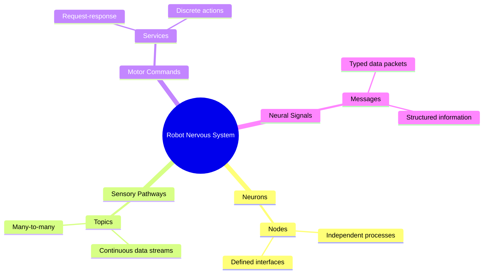
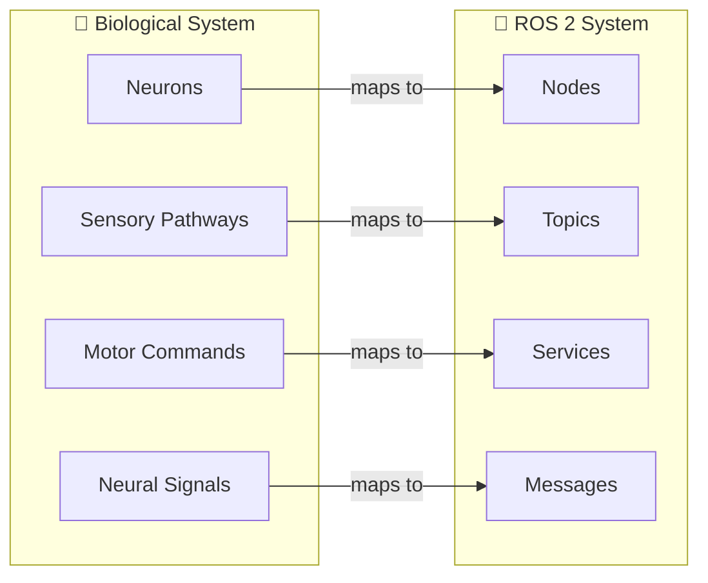
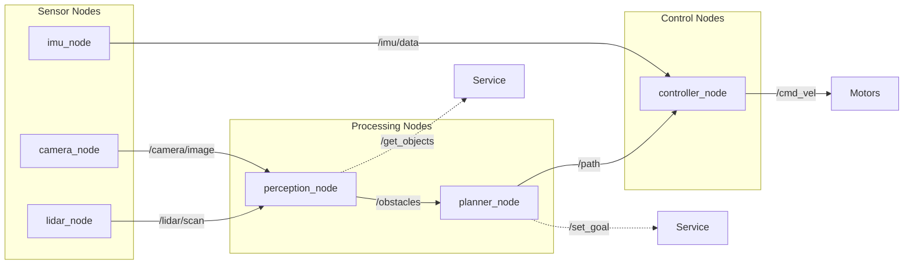
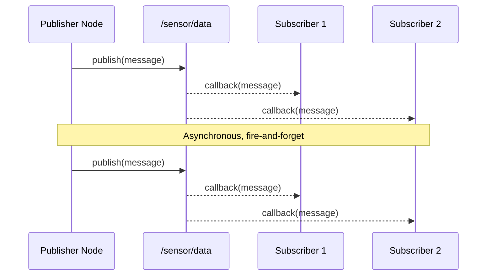
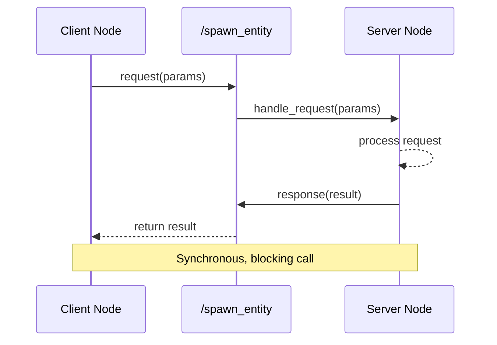
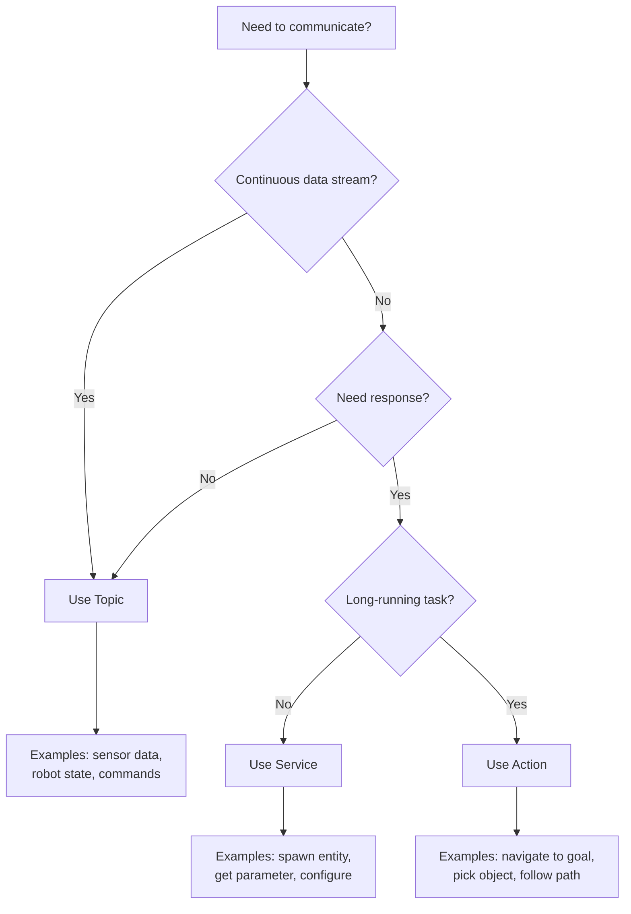

# Module 1 Assets: Diagrams and Code Snippets

This file contains reusable diagrams and code snippets for Module 1 chapters.

---

## D1.1: Nervous System Analogy



**Alternative flowchart version:**



---

## D1.2: ROS 2 Node Graph



---

## D1.3: Topic Publish-Subscribe Sequence



---

## D1.4: Service Request-Response Sequence



---

## D1.5: Communication Pattern Decision Flowchart



---

## C1.1: Topic Message Definition

```yaml
# Example: sensor_msgs/msg/LaserScan.msg
# Standard message for LiDAR data

Header header           # timestamp and frame
float32 angle_min       # start angle of scan [rad]
float32 angle_max       # end angle of scan [rad]
float32 angle_increment # angular step between measurements [rad]
float32 time_increment  # time between measurements [sec]
float32 scan_time       # time for complete scan [sec]
float32 range_min       # minimum range value [m]
float32 range_max       # maximum range value [m]
float32[] ranges        # range data [m]
float32[] intensities   # intensity data (optional)
```

---

## C1.2: Service Definition

```yaml
# Example: std_srvs/srv/SetBool.srv
# Standard service for toggling boolean state

# Request
bool data    # Desired state

---

# Response
bool success # Whether the call succeeded
string message # Status message
```

**Custom service example:**

```yaml
# example_interfaces/srv/SpawnRobot.srv

# Request
string robot_name
float64 x
float64 y
float64 theta

---

# Response
bool success
string status_message
int32 robot_id
```

---

## Usage Notes

- Copy Mermaid blocks directly into chapter markdown files
- Docusaurus will render Mermaid diagrams automatically
- Code snippets use YAML format for message/service definitions
- Adjust diagram labels and colors as needed for specific contexts
