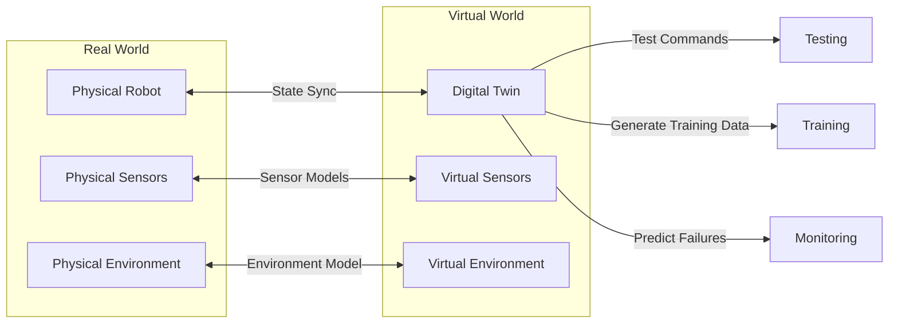
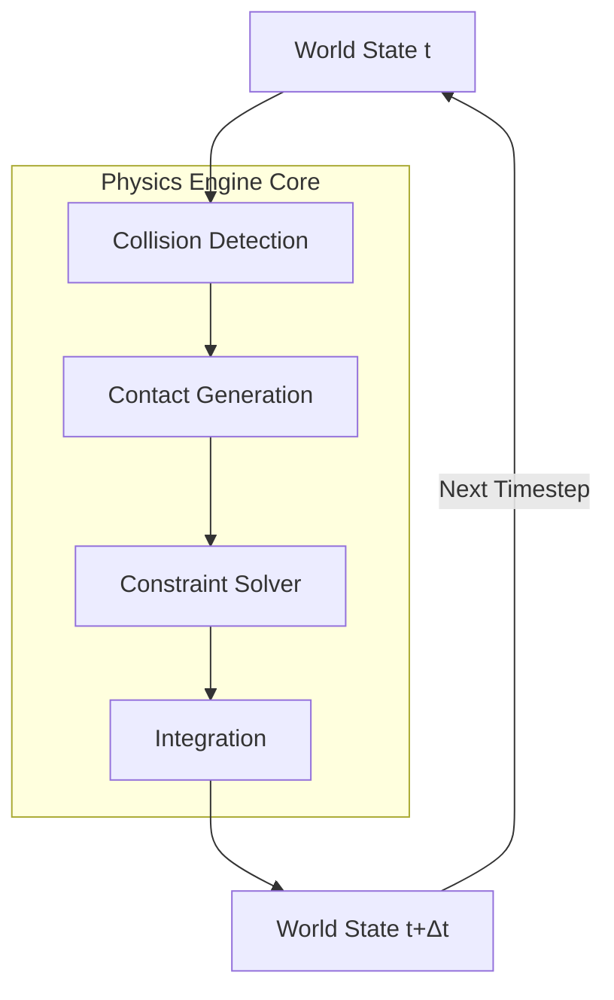
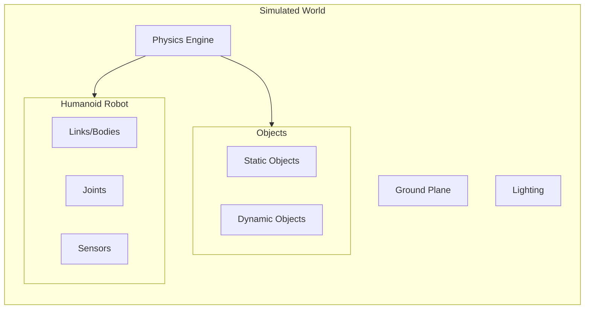
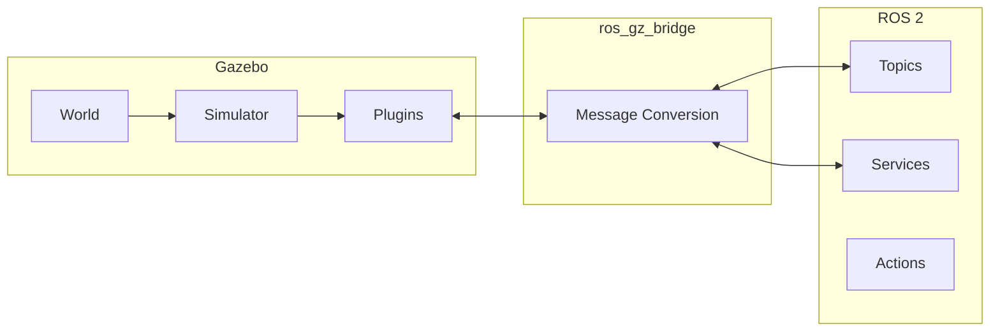
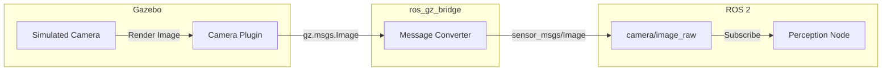

# Digital Twins and Physics Simulation with Gazebo

**Reading Time**: ~45-55 minutes | **Prerequisites**: Module 1 (ROS 2 basics)

---

## Learning Objectives

By the end of this chapter, you will be able to:

1. Define what a digital twin is and explain its purpose in robotics development
2. Identify the key physical phenomena simulated in a physics engine
3. Describe Gazebo's role as a ROS 2 robotics simulator
4. Explain how Gazebo integrates with ROS 2 via the ros_gz bridge
5. Articulate when simulation is appropriate vs. physical testing

---

## 1.1 What is a Digital Twin?

**Would you test a humanoid robot's balance on real hardware—knowing it might fall and break?**

That's a $100,000 mistake waiting to happen. Instead, roboticists build **digital twins**: virtual replicas of their robots that can fall a thousand times without a single scratch.

### Defining the Digital Twin

A **digital twin** is a virtual representation of a physical robot (or system) that mirrors its structure, behavior, and responses. The digital twin:

- Has the same **geometry** (links, joints, dimensions)
- Obeys the same **physics** (gravity, friction, collisions)
- Responds to the same **commands** (motor inputs, control signals)
- Produces the same **outputs** (sensor data, motion feedback)



### Why Digital Twins Matter

| Benefit | Description | Example |
|---------|-------------|---------|
| **Safety** | Test dangerous maneuvers without risk | Humanoid falling experiments |
| **Cost** | No hardware damage, no consumables | Thousands of grasping attempts |
| **Speed** | Run faster than real-time | 10 hours of walking in 1 hour |
| **Reproducibility** | Exact same conditions every time | Repeatable benchmarks |
| **Parallelization** | Run 100 simulations simultaneously | Hyperparameter search for controllers |

### The Digital Twin Lifecycle

Digital twins aren't just for testing—they support the entire development lifecycle:

1. **Design**: Prototype robot morphology before building hardware
2. **Simulate**: Test control algorithms, edge cases, failure modes
3. **Deploy**: Transfer learned behaviors to physical robot
4. **Monitor**: Compare real robot to expected digital twin behavior (anomaly detection)

### Real-World Example: Humanoid Gait Development

Developing a bipedal walking controller requires:
- Testing thousands of step variations
- Handling recovery from pushes and trips
- Validating balance across different terrains

In simulation, you can:
- Run 10,000 walking cycles overnight
- Systematically push the robot at various angles
- Test on ice, gravel, and slopes—all without building physical test surfaces

:::tip Success Check
Can you explain to a non-technical colleague what a digital twin is and why a robotics company would invest in building one? What are two specific benefits?
:::

---

## 1.2 Physics Simulation Fundamentals

The heart of any digital twin is the **physics engine**—software that computes how objects move, collide, and interact. Understanding what gets simulated helps you interpret simulation results correctly.

### What Gets Simulated?

A physics engine models these fundamental phenomena:

| Phenomenon | Description | Robotics Relevance |
|------------|-------------|-------------------|
| **Gravity** | Downward force on all objects | Balance, falling, weight distribution |
| **Rigid Body Dynamics** | Mass, inertia, force response | Motor torque, joint motion |
| **Collisions** | Objects contacting each other | Grasping, walking, obstacles |
| **Friction** | Resistance between surfaces | Foot grip, object manipulation |
| **Constraints** | Joints limiting relative motion | Articulated robot structure |

### The Physics Engine Pipeline

Every simulation timestep, the physics engine runs through this pipeline:



**Pipeline stages:**

1. **Collision Detection**: Find pairs of objects that might be touching
2. **Contact Generation**: Compute exact contact points and normals
3. **Constraint Solver**: Calculate forces that satisfy joint limits and prevent penetration
4. **Integration**: Update positions and velocities based on forces

### Time Stepping: The Accuracy-Speed Trade-off

Physics engines simulate in discrete **timesteps** (e.g., 1 ms):

| Timestep | Accuracy | Speed | Use Case |
|----------|----------|-------|----------|
| 0.1 ms | Very high | Slow | Precise contact dynamics |
| 1 ms | Good | Moderate | General robotics |
| 10 ms | Lower | Fast | Quick iteration, RL training |

**Key insight**: Smaller timesteps = more accurate but slower. Controllers that work at 10 ms timesteps may fail on real hardware with its continuous physics.

### Fidelity Spectrum

Simulations vary in what they model:

| Fidelity Level | What's Modeled | Complexity |
|----------------|----------------|------------|
| **Kinematic** | Positions only (no forces) | Low |
| **Rigid Body** | Mass, inertia, collisions | Medium |
| **Soft Body** | Deformable objects | High |
| **Fluid/Cloth** | Complex material physics | Very High |

Most robotics simulations use **rigid body** physics—sufficient for arms, legs, and grasping rigid objects.

### Why Physics Accuracy Matters

A controller tuned in simulation may fail on real hardware if physics don't match:

- **Friction mismatch**: Robot slips when it expects grip
- **Inertia errors**: Arm overshoots targets
- **Contact instability**: Grasps that work in sim drop objects in reality

This **simulation-to-reality gap** (sim-to-real) is a fundamental challenge we'll address throughout this book.

:::tip Success Check
List five physical phenomena that a robotics physics engine simulates. For each, give one example of how inaccuracy would affect a humanoid robot.
:::

---

## 1.3 The Simulated World

A robot doesn't exist in isolation—it operates within an **environment**. In simulation, we construct a **world** that contains the robot, objects, terrain, and physics parameters.

### World Components



| Component | Description | Example |
|-----------|-------------|---------|
| **Physics Engine** | Defines solver, timestep, gravity | DART engine, 1ms step, -9.81 m/s² |
| **Ground Plane** | Flat surface for robot to stand on | Infinite plane at z=0 |
| **Static Objects** | Immovable geometry | Walls, tables, terrain |
| **Dynamic Objects** | Objects affected by physics | Cups, balls, doors |
| **Robot Model** | The humanoid digital twin | Links, joints, sensors |
| **Lighting** | For camera rendering | Sun light, ambient light |

### Static vs. Dynamic Objects

| Property | Static Objects | Dynamic Objects |
|----------|----------------|-----------------|
| **Moves** | No | Yes |
| **Has mass** | No (infinite) | Yes |
| **Physics cost** | Low | Higher |
| **Use for** | Environment structure | Manipulated objects |

### SDF: Simulation Description Format

Gazebo uses **SDF** (Simulation Description Format) to describe worlds. Here's an excerpt:

```xml
<?xml version="1.0" ?>
<sdf version="1.8">
  <world name="humanoid_world">
    <!-- Physics Configuration -->
    <physics name="1ms" type="dart">
      <max_step_size>0.001</max_step_size>
      <real_time_factor>1.0</real_time_factor>
    </physics>

    <!-- Gravity -->
    <gravity>0 0 -9.81</gravity>

    <!-- Lighting -->
    <light type="directional" name="sun">
      <pose>0 0 10 0 0 0</pose>
    </light>

    <!-- Ground Plane -->
    <include>
      <uri>model://ground_plane</uri>
    </include>

    <!-- Humanoid Robot -->
    <include>
      <uri>model://humanoid_robot</uri>
      <pose>0 0 1.0 0 0 0</pose>
    </include>
  </world>
</sdf>
```

**Key elements:**
- `<physics>`: Engine type and timestep
- `<gravity>`: Direction and magnitude
- `<include>`: References to models (robot, ground)
- `<pose>`: Position and orientation (x, y, z, roll, pitch, yaw)

:::tip Success Check
Looking at the SDF snippet above, can you identify: (1) the physics timestep, (2) the gravity direction, and (3) the robot's starting height?
:::

---

## 1.4 Gazebo for ROS 2 Robotics

**Gazebo** is the standard simulation platform for ROS 2 robotics. It's open-source, feature-rich, and designed specifically for robot development.

### What is Gazebo?

Gazebo is a **3D robotics simulator** that provides:

- **Physics simulation**: Multiple engine options (DART, Bullet, ODE)
- **Sensor simulation**: Cameras, LiDAR, IMU, depth sensors
- **ROS 2 integration**: Native topic/service bridge
- **Visualization**: 3D rendering of robots and environments
- **Plugin system**: Extensible for custom behaviors

### Gazebo Strengths

| Strength | Description |
|----------|-------------|
| **ROS 2 Native** | First-class integration with ros_gz packages |
| **Physics Options** | Switch between DART, Bullet, ODE engines |
| **Sensor Plugins** | Built-in camera, LiDAR, IMU, contact sensors |
| **Community** | Large ecosystem of models, tutorials, support |
| **Open Source** | Free to use, modify, and extend |

### Gazebo Limitations

| Limitation | Impact | Workaround |
|------------|--------|------------|
| **Visual Quality** | Less realistic than Unity/Unreal | Use Unity for HRI scenarios |
| **Complex Scenes** | Performance degrades with many objects | Simplify environments |
| **Soft Bodies** | Limited deformable object support | Use specialized tools |
| **Learning Curve** | SDF and plugins require study | Follow tutorials |

### Gazebo Version Landscape

| Version | Release | Support | Recommendation |
|---------|---------|---------|----------------|
| Gazebo Harmonic | 2023 | LTS (2028) | **Production use** |
| Gazebo Ionic | 2024 | Latest | New features, testing |
| Gazebo Classic | Legacy | EOL | Migrate away |

**Note**: "Gazebo" now refers to the new versions (formerly "Ignition Gazebo"). "Gazebo Classic" is the legacy simulator.

### Typical Gazebo Workflow

1. **Create/Import Model**: Define robot in URDF or SDF
2. **Build World**: Add environment, objects, physics settings
3. **Launch Simulation**: Start Gazebo with world file
4. **Run ROS 2 Nodes**: Controllers, perception, planning
5. **Analyze Results**: Visualize, log, iterate

:::tip Success Check
What are three strengths and two limitations of Gazebo? When might you choose a different simulator?
:::

---

## 1.5 Gazebo-ROS 2 Integration

Gazebo simulates physics and sensors, but your robot's brain runs as ROS 2 nodes. The **ros_gz bridge** connects these two worlds.

### The ros_gz Bridge

The bridge translates between:
- **Gazebo topics** (using Gazebo Transport)
- **ROS 2 topics** (using DDS)



### Common Topic Bridges

| Gazebo Topic | ROS 2 Topic | Message Type |
|--------------|-------------|--------------|
| `/camera/image` | `/camera/image_raw` | `sensor_msgs/Image` |
| `/lidar/scan` | `/scan` | `sensor_msgs/LaserScan` |
| `/imu` | `/imu/data` | `sensor_msgs/Imu` |
| `/joint_states` | `/joint_states` | `sensor_msgs/JointState` |
| `/cmd_vel` | `/cmd_vel` | `geometry_msgs/Twist` |

### Bridge Configuration

You can configure the bridge via YAML or launch file:

```python
# launch/gz_bridge.launch.py
from launch import LaunchDescription
from launch_ros.actions import Node

def generate_launch_description():
    bridge = Node(
        package='ros_gz_bridge',
        executable='parameter_bridge',
        arguments=[
            '/camera/image@sensor_msgs/msg/Image@gz.msgs.Image',
            '/scan@sensor_msgs/msg/LaserScan@gz.msgs.LaserScan',
            '/cmd_vel@geometry_msgs/msg/Twist@gz.msgs.Twist',
        ],
        output='screen'
    )
    return LaunchDescription([bridge])
```

**Syntax**: `/topic@ros_type@gz_type`
- Bidirectional by default
- Use `[` and `]` for unidirectional (e.g., `@[` for Gazebo→ROS only)

### Data Flow: Sensor to ROS 2 Node

Let's trace a camera image from simulation to perception:



1. Gazebo renders the camera view
2. Camera plugin publishes to Gazebo topic
3. Bridge converts gz.msgs.Image → sensor_msgs/Image
4. ROS 2 topic `/camera/image_raw` receives the image
5. Perception node subscribes and processes

### Debugging Integration

When data isn't flowing:

1. **Check Gazebo topics**: `gz topic -l` (list topics)
2. **Check ROS 2 topics**: `ros2 topic list`
3. **Verify bridge config**: Is the topic mapped?
4. **Check message types**: Must match exactly
5. **Inspect data**: `ros2 topic echo /camera/image_raw`

:::tip Success Check
Trace the path of a LiDAR scan from Gazebo to a ROS 2 obstacle detection node. What components does it pass through? What message type conversions occur?
:::

---

## Chapter Summary

In this chapter, we explored digital twins and physics simulation:

| Concept | Description | Key Points |
|---------|-------------|------------|
| **Digital Twin** | Virtual replica of physical robot | Safety, cost, speed, reproducibility |
| **Physics Engine** | Computes forces, collisions, motion | Collision → Contact → Solve → Integrate |
| **Simulated World** | Container for robot and environment | SDF format, gravity, objects |
| **Gazebo** | Standard ROS 2 simulator | Open-source, multi-physics, sensor plugins |
| **ros_gz Bridge** | Connects Gazebo to ROS 2 | Topic/service translation |

**Key takeaways:**
- Digital twins enable safe, fast, repeatable robot development
- Physics engines simulate gravity, collisions, friction, and constraints
- Gazebo is the standard ROS 2 simulator with native integration
- The ros_gz bridge translates between Gazebo and ROS 2 topics

---

## What's Next

In Chapter 2, we'll explore **Unity** as an alternative simulation platform—when visual fidelity and human-robot interaction scenarios demand more than Gazebo can offer.

---

## References

- [Gazebo Documentation](https://gazebosim.org/docs)
- [ros_gz Bridge](https://github.com/gazebosim/ros_gz)
- [SDF Specification](http://sdformat.org/spec)
- [Gazebo Tutorials](https://gazebosim.org/docs/harmonic/tutorials)
