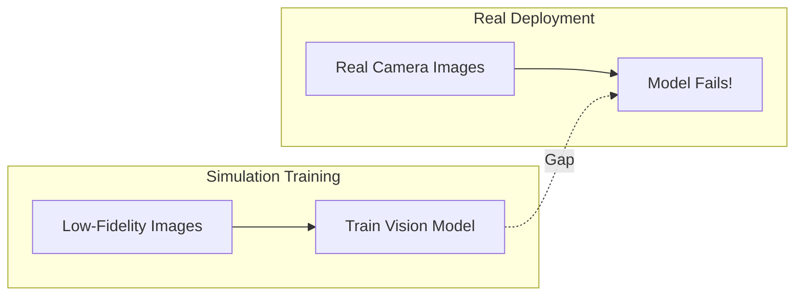
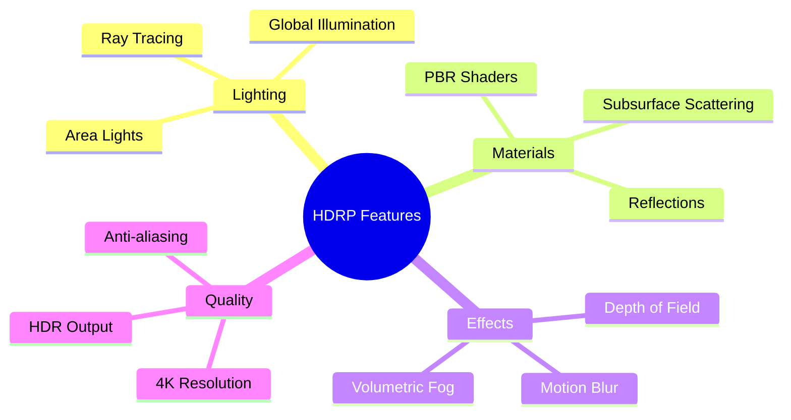
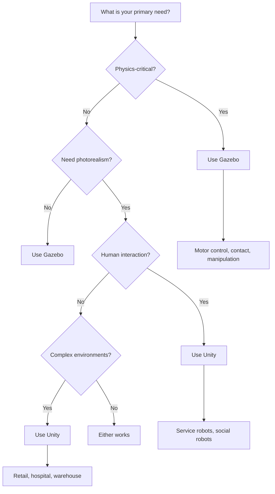
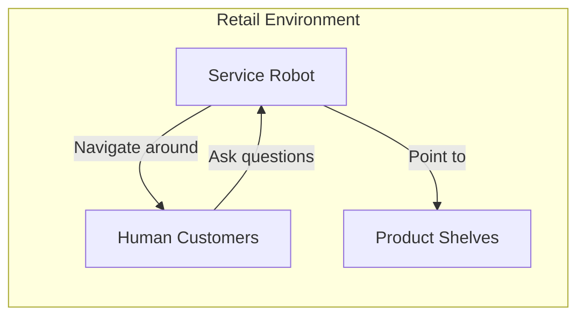
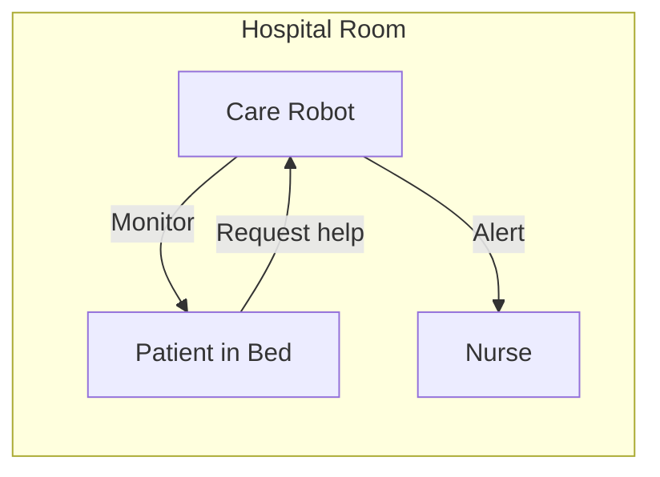
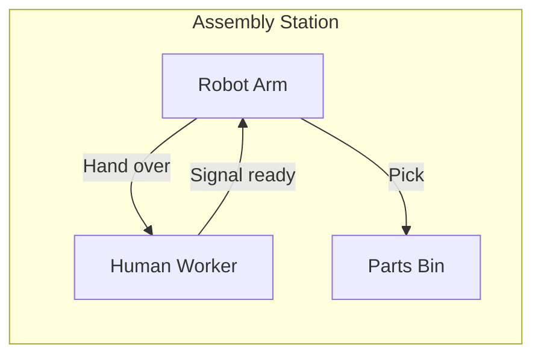
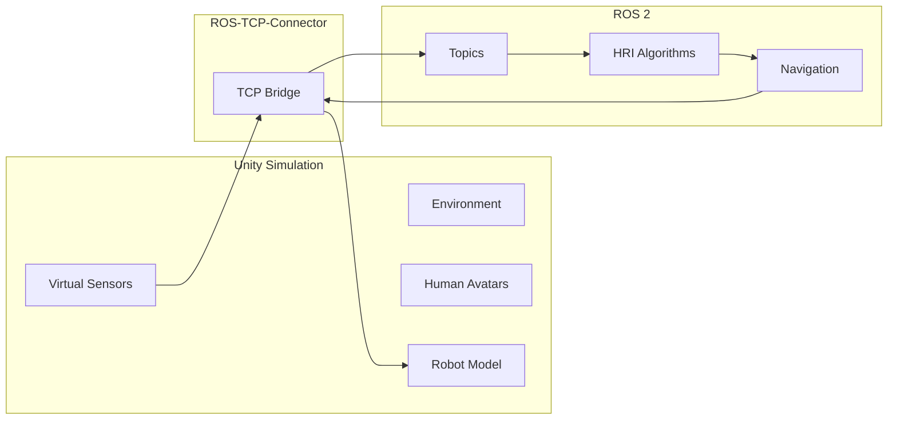

# High-Fidelity Rendering and Human-Robot Interaction in Unity

**Reading Time**: ~40-50 minutes | **Prerequisites**: Chapter 1 (Gazebo concepts)

---

## Learning Objectives

By the end of this chapter, you will be able to:

1. Explain why visual fidelity matters for perception testing
2. Describe Unity's strengths for robotics simulation
3. Compare Gazebo and Unity using a decision framework
4. Identify human-robot interaction scenarios enabled by Unity
5. Understand how Unity integrates with ROS 2

---

## 2.1 Why Visual Fidelity Matters

In Chapter 1, we learned that Gazebo excels at **physics simulation**. But what if your robot relies on **cameras** for perception? The visual quality of simulation becomes critical.

### The Perception Challenge

Modern robots use vision-based AI for:
- **Object detection**: "Is there a cup on the table?"
- **Semantic segmentation**: "Which pixels are floor vs. obstacle?"
- **Depth estimation**: "How far away is that person?"
- **Human recognition**: "Is that gesture a wave or pointing?"

These algorithms are trained on **images**. If simulation images look nothing like reality, the AI fails when deployed.

### The Visual Sim-to-Real Gap

| Visual Aspect | Low Fidelity | High Fidelity | Impact on AI |
|---------------|--------------|---------------|--------------|
| **Lighting** | Uniform, flat | Shadows, reflections | Shadow detection errors |
| **Textures** | Plain colors | Realistic materials | Texture-based recognition fails |
| **Humans** | Absent or blocky | Realistic avatars | HRI algorithms fail |
| **Environment** | Simple geometry | Complex scenes | Cluttered scene handling |

### When Physics Isn't Enough

Gazebo prioritizes physics accuracy, but:
- Basic rendering (OpenGL) lacks photorealism
- No advanced lighting effects (ray tracing, global illumination)
- Limited human avatar support
- Simpler environment design tools

**For perception-heavy robots, visual fidelity directly impacts deployment success.**

:::tip Success Check
Why might a perception engineer choose Unity over Gazebo? Give two specific scenarios where visual fidelity matters more than physics accuracy.
:::

---

## 2.2 Unity for Robotics

**Unity** is a commercial game engine that has been adapted for robotics simulation, offering high-fidelity rendering and extensive tooling.

### What is Unity?

Unity is a **real-time 3D development platform** originally designed for games but now used across industries:
- Film and animation
- Architecture visualization
- Training simulators
- **Robotics simulation**

### Unity Robotics Hub

Unity provides official robotics packages:

| Package | Purpose |
|---------|---------|
| **Unity Robotics Hub** | Central package for robotics features |
| **URDF Importer** | Import robot descriptions |
| **ROS-TCP-Connector** | Connect to ROS 2 |
| **Articulation Bodies** | Physics for articulated robots |

### High Definition Render Pipeline (HDRP)

Unity's **HDRP** provides photorealistic rendering:

### Unity Strengths for Robotics

| Strength | Description | Robotics Benefit |
|----------|-------------|------------------|
| **Photorealistic rendering** | HDRP, ray tracing, PBR materials | Realistic camera simulation |
| **Human avatars** | Rigged characters, animations, crowds | HRI scenario testing |
| **Asset ecosystem** | Thousands of pre-built environments | Quick scene creation |
| **Cross-platform** | Windows, Linux, cloud rendering | Flexible deployment |
| **Visual scripting** | Timeline, Cinemachine, UI toolkit | Rapid prototyping |

### URDF Import

Unity can import URDF files directly:
1. Add robot URDF to project
2. Unity creates GameObject hierarchy
3. Joints become ArticulationBody components
4. Materials and meshes imported automatically

This allows the same robot description used in Gazebo to work in Unity.

:::tip Success Check
List three Unity capabilities that are specifically valuable for robotics simulation. Why aren't these typically available in Gazebo?
:::

---

## 2.3 Gazebo vs Unity Decision Framework

When should you use Gazebo? When Unity? Here's a decision framework to guide your choice.

### Comparison Matrix

| Criterion | Gazebo | Unity | Notes |
|-----------|--------|-------|-------|
| **Physics Accuracy** | ⭐⭐⭐⭐⭐ | ⭐⭐⭐ | Gazebo has multiple physics engines |
| **ROS 2 Integration** | ⭐⭐⭐⭐⭐ | ⭐⭐⭐ | Gazebo is native; Unity needs bridge |
| **Visual Fidelity** | ⭐⭐⭐ | ⭐⭐⭐⭐⭐ | Unity HDRP far superior |
| **Human Avatars** | ⭐⭐ | ⭐⭐⭐⭐⭐ | Unity excels at humans |
| **Environment Design** | ⭐⭐⭐ | ⭐⭐⭐⭐⭐ | Unity asset store, tools |
| **Learning Curve** | ⭐⭐⭐ | ⭐⭐⭐ | Both require study |
| **Cost** | Free | Free (Personal) | Unity has license tiers |
| **Community (Robotics)** | ⭐⭐⭐⭐⭐ | ⭐⭐⭐ | Gazebo is standard |

### Decision Flowchart

### When to Use Gazebo

Choose Gazebo when:
- **Physics accuracy is paramount**: Contact forces, manipulation, locomotion tuning
- **Native ROS 2 integration needed**: Seamless topic/service bridging
- **Open source is required**: No licensing concerns
- **Robotics community support**: More tutorials, examples, models

**Examples**: Robot arm manipulation, legged locomotion, contact-rich tasks

### When to Use Unity

Choose Unity when:
- **Visual perception is primary**: Training vision models, synthetic data
- **Humans are in the scene**: HRI research, social robotics
- **Complex environments needed**: Retail stores, hospitals, homes
- **Visual presentation matters**: Demos, stakeholder communication

**Examples**: Service robots, perception training, HRI research

### When to Use Both

Many projects benefit from **both** platforms at different stages:

| Phase | Platform | Purpose |
|-------|----------|---------|
| **Control Development** | Gazebo | Tune controllers with accurate physics |
| **Perception Training** | Unity | Generate photorealistic synthetic data |
| **HRI Testing** | Unity | Test with human avatars |
| **Integration Testing** | Gazebo | Full system with ROS 2 |

:::tip Success Check
For each scenario, recommend Gazebo or Unity:
1. Training a grasping controller for a robot arm
2. Testing a service robot's response to human gestures
3. Generating synthetic data for object detection
4. Tuning walking gait parameters for a biped
5. Creating a demo video for stakeholders
:::

---

## 2.4 Human-Robot Interaction Scenarios

Unity's greatest strength for robotics is enabling **Human-Robot Interaction (HRI)** simulation—testing how robots behave around humans.

### What is HRI?

**Human-Robot Interaction** studies how humans and robots share:
- Physical space (navigation around people)
- Tasks (collaborative assembly)
- Communication (voice, gesture, gaze)
- Social dynamics (trust, comfort, acceptance)

### HRI Simulation Requirements

Testing HRI scenarios requires:

| Requirement | Why | Unity Capability |
|-------------|-----|------------------|
| **Realistic humans** | Test person detection, tracking | Rigged avatars, diverse appearances |
| **Natural motion** | Test behavior prediction | Motion capture animations |
| **Crowds** | Test navigation in crowds | Crowd simulation tools |
| **Gestures** | Test gesture recognition | Hand tracking, pose estimation ground truth |
| **Environments** | Test in realistic spaces | Asset store environments |

### HRI Scenario Examples

#### Service Robot in Retail

**Testing needs:**
- Navigate crowded aisles without collisions
- Recognize when customer is approaching
- Respond to voice queries and gestures
- Maintain comfortable distance (proxemics)

#### Healthcare Assistant

**Testing needs:**
- Recognize patient state and distress
- Navigate cluttered hospital room
- Coordinate with medical staff
- Handle emergency scenarios safely

#### Collaborative Manufacturing

**Testing needs:**
- Safe handover of objects
- Recognize worker gestures (ready, wait, stop)
- Avoid collisions during shared tasks
- Maintain predictable, legible motion

### Unity-ROS 2 Integration for HRI

Unity connects to ROS 2 for HRI simulation:

**Data flow:**
1. Unity renders scene with humans
2. Virtual cameras capture images
3. Images sent to ROS 2 via TCP bridge
4. HRI algorithms process (person detection, tracking)
5. Navigation commands return to Unity
6. Robot moves in simulation

### Testing Safety and Social Acceptability

Unity enables testing aspects that physical testing can't safely cover:

| Test Type | Description | Why Simulation |
|-----------|-------------|----------------|
| **Collision scenarios** | What if robot bumps human? | Can't test safely on real people |
| **Proxemics** | Is robot too close for comfort? | Consistent measurement |
| **Edge cases** | Human falls, crowd panic | Dangerous to stage |
| **Cultural variations** | Different personal space norms | Difficult to recruit diverse groups |

:::tip Success Check
Describe three HRI scenarios where Unity simulation is essential. What specific Unity features enable each scenario?
:::

---

## Chapter Summary

In this chapter, we explored Unity as a high-fidelity simulation platform:

| Concept | Description | Key Points |
|---------|-------------|------------|
| **Visual Fidelity** | Photorealistic rendering | HDRP, ray tracing, PBR materials |
| **Unity for Robotics** | Game engine for simulation | URDF import, ROS-TCP-Connector |
| **Gazebo vs Unity** | Decision framework | Physics → Gazebo, Visuals → Unity |
| **HRI Simulation** | Human-robot interaction | Avatars, animations, social scenarios |

**Key takeaways:**
- Visual fidelity matters for perception-based robots
- Unity provides photorealistic rendering Gazebo can't match
- Choose platform based on primary need: physics (Gazebo) or visuals (Unity)
- Unity enables HRI simulation with realistic human avatars
- Many projects benefit from both platforms at different stages

---

## What's Next

In Chapter 3, we'll explore **simulated sensors**—how LiDAR, depth cameras, and IMUs are modeled in simulation and bridged to ROS 2.

---

## References

- [Unity Robotics Hub](https://github.com/Unity-Technologies/Unity-Robotics-Hub)
- [ROS-TCP-Connector](https://github.com/Unity-Technologies/ROS-TCP-Connector)
- [Unity HDRP Documentation](https://docs.unity3d.com/Packages/com.unity.render-pipelines.high-definition@latest)
- [URDF Importer for Unity](https://github.com/Unity-Technologies/URDF-Importer)
