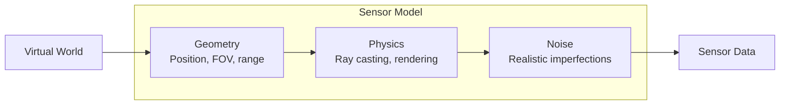
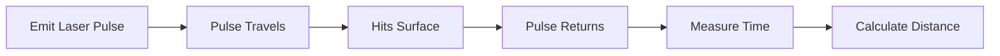
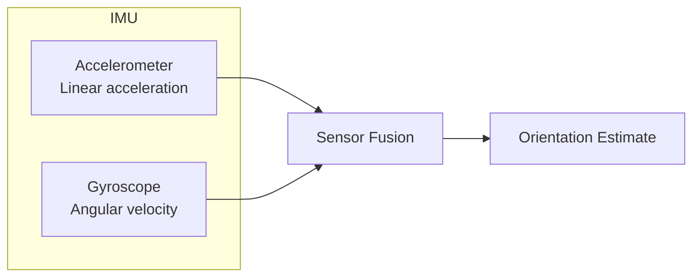
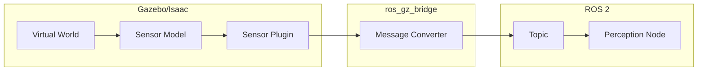
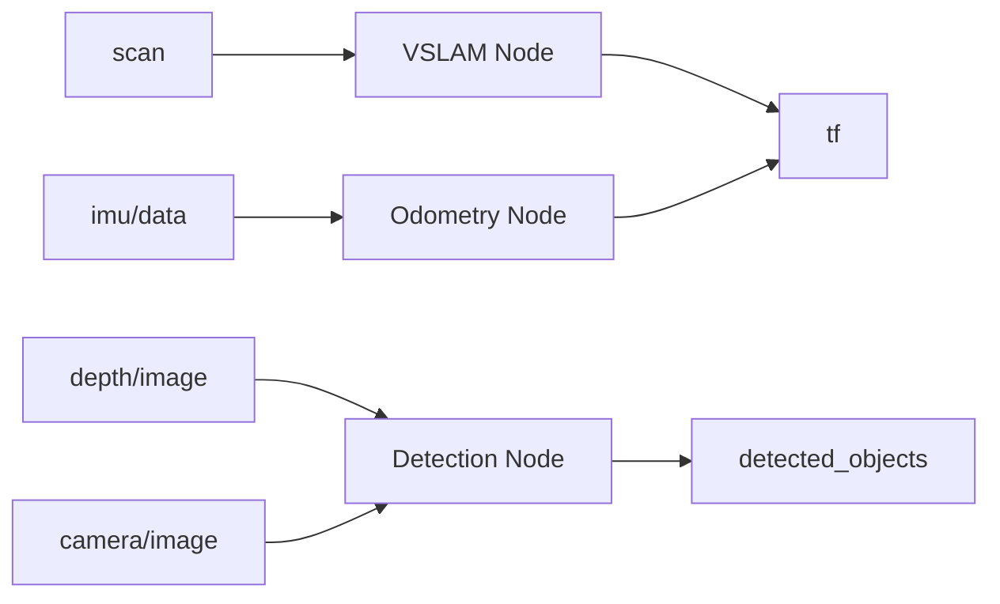

# Simulated Sensors for Perception

**Reading Time**: ~45-55 minutes | **Prerequisites**: Chapters 1-2 (Gazebo, Unity), Module 1 (ROS 2 topics)

---

## Learning Objectives

By the end of this chapter, you will be able to:

1. Explain the purpose and components of sensor models in simulation
2. Describe LiDAR sensor output (point clouds) and key parameters
3. Describe depth camera output (depth images) and key parameters
4. Describe IMU output (acceleration, angular velocity) and noise characteristics
5. Trace the data flow from simulated sensor to ROS 2 topic

---

## 3.1 Sensor Models Overview

In Chapters 1-2, we learned about digital twins and simulation platforms. Now we address a critical question: **How does a simulated robot perceive its virtual environment?**

### Why Simulate Sensors?

Real sensors are expensive, fragile, and limited to one robot. Simulated sensors provide:

| Benefit | Description |
|---------|-------------|
| **Cost savings** | No hardware purchase required |
| **Parallel testing** | Run 100 robots simultaneously |
| **Perfect ground truth** | Know exact values for comparison |
| **Safe failure testing** | Crash without consequences |
| **Controllable conditions** | Exact lighting, weather, scenarios |

### Sensor Model Components

A simulated sensor has three aspects:



| Component | Description | Example |
|-----------|-------------|---------|
| **Geometry** | Where sensor is, what it can see | FOV: 90°, Range: 0.1-10m |
| **Physics** | How sensor data is computed | Ray casting for LiDAR |
| **Noise** | Realistic imperfections | Gaussian noise, dropout |

### Realism Factors

| Factor | Description | Impact |
|--------|-------------|--------|
| **Noise** | Random measurement errors | Models real sensor variance |
| **Bias** | Systematic offset | Calibration requirements |
| **Dropout** | Missing measurements | Edge cases, reflective surfaces |
| **Latency** | Time delay | Control loop stability |
| **Resolution** | Data density | Perception algorithm performance |

### Common Simulated Sensors

| Sensor | Output | Typical Use |
|--------|--------|-------------|
| **RGB Camera** | Color images | Object detection, recognition |
| **Depth Camera** | Per-pixel distances | Close-range perception |
| **LiDAR** | 3D point clouds | Mapping, navigation |
| **IMU** | Acceleration, rotation | Balance, orientation |
| **Force/Torque** | Contact forces | Manipulation feedback |

### Sensor Placement on Humanoids

| Location | Sensor | Purpose |
|----------|--------|---------|
| **Head** | RGB cameras, depth | Vision, person tracking |
| **Chest** | RGB-D camera | Manipulation view |
| **Base/Torso** | IMU | Balance, orientation |
| **Feet** | Force sensors | Ground contact |
| **Hands** | Tactile sensors | Grasp feedback |

:::tip Success Check
List four factors that affect sensor simulation realism. Why is it important to model noise rather than having perfect measurements?
:::

---

## 3.2 LiDAR Simulation

**LiDAR** (Light Detection and Ranging) measures distances by emitting laser pulses and timing their returns.

### How LiDAR Works



**Equation**: `distance = (speed_of_light × time) / 2`

### Point Cloud Output

LiDAR produces a **point cloud**—a set of 3D points representing detected surfaces:

```
Point Cloud Example:
  Point 1: (1.23, 0.45, 0.12) intensity: 0.8
  Point 2: (1.25, 0.44, 0.11) intensity: 0.7
  Point 3: (2.10, -0.30, 0.50) intensity: 0.9
  ... (thousands of points)
```

**ROS 2 Message**: `sensor_msgs/PointCloud2`

| Field | Description |
|-------|-------------|
| `header` | Timestamp and frame ID |
| `height`, `width` | Organization (1 × N for unorganized) |
| `fields` | Description of data (x, y, z, intensity) |
| `data` | Binary point data |

### Key LiDAR Parameters

| Parameter | Description | Typical Range |
|-----------|-------------|---------------|
| **Range (min/max)** | Detection distance | 0.1 - 100 m |
| **Horizontal FOV** | Angular coverage | 180° - 360° |
| **Vertical FOV** | Vertical coverage | 30° - 45° |
| **Angular resolution** | Angle between rays | 0.1° - 1° |
| **Update rate** | Scans per second | 10 - 20 Hz |
| **Channels/planes** | Vertical layers | 16, 32, 64, 128 |

### LiDAR Sensor SDF

```xml
<sensor name="lidar" type="gpu_lidar">
  <topic>/humanoid/lidar/scan</topic>
  <update_rate>10</update_rate>

  <lidar>
    <scan>
      <horizontal>
        <samples>640</samples>
        <min_angle>-1.5707</min_angle>  <!-- -90° -->
        <max_angle>1.5707</max_angle>   <!-- +90° -->
      </horizontal>
      <vertical>
        <samples>16</samples>
        <min_angle>-0.26</min_angle>    <!-- -15° -->
        <max_angle>0.26</max_angle>     <!-- +15° -->
      </vertical>
    </scan>
    <range>
      <min>0.1</min>
      <max>30.0</max>
    </range>
    <noise>
      <type>gaussian</type>
      <mean>0.0</mean>
      <stddev>0.01</stddev>  <!-- 1cm noise -->
    </noise>
  </lidar>
</sensor>
```

### Humanoid LiDAR Use Cases

| Use Case | Configuration |
|----------|---------------|
| **Navigation** | Wide horizontal FOV, moderate range |
| **Obstacle detection** | Fast update rate, near-field focus |
| **Mapping** | High resolution, 360° coverage |

:::tip Success Check
What is a point cloud? What parameters would you adjust to increase LiDAR range? What's the trade-off?
:::

---

## 3.3 Depth Camera Simulation

**Depth cameras** produce images where each pixel contains a distance value, enabling dense 3D perception at close range.

### How Depth Cameras Work

Two main technologies:

| Technology | Method | Range |
|------------|--------|-------|
| **Structured Light** | Project pattern, analyze distortion | 0.3 - 5m |
| **Time of Flight (ToF)** | Measure light round-trip time | 0.3 - 10m |
| **Stereo** | Triangulate from two cameras | 0.5 - 20m |

### Depth Image Output

A depth image is a 2D array where each pixel = distance:

```
Depth Image (4x4 example):
  1.2  1.3  1.4  1.5
  1.1  0.8  0.9  1.4    ← Object at 0.8m
  1.0  0.7  0.8  1.3
  1.2  1.3  1.4  1.5
```

**ROS 2 Message**: `sensor_msgs/Image` (with depth encoding)

| Encoding | Description | Precision |
|----------|-------------|-----------|
| `32FC1` | 32-bit float, meters | High |
| `16UC1` | 16-bit unsigned, millimeters | Medium |

### Key Depth Camera Parameters

| Parameter | Description | Typical Range |
|-----------|-------------|---------------|
| **Resolution** | Image width × height | 640×480, 1280×720 |
| **Horizontal FOV** | Field of view | 60° - 90° |
| **Range (min/max)** | Depth detection | 0.3 - 10 m |
| **Update rate** | Frames per second | 30 - 90 Hz |
| **Noise model** | Depth-dependent noise | Increases with distance |

### Depth Camera SDF

```xml
<sensor name="depth_camera" type="depth_camera">
  <topic>/humanoid/depth</topic>
  <update_rate>30</update_rate>

  <camera>
    <horizontal_fov>1.047</horizontal_fov>  <!-- 60° -->
    <image>
      <width>640</width>
      <height>480</height>
      <format>R_FLOAT32</format>
    </image>
    <clip>
      <near>0.3</near>
      <far>10.0</far>
    </clip>
    <noise>
      <type>gaussian</type>
      <mean>0.0</mean>
      <stddev>0.005</stddev>  <!-- 5mm noise -->
    </noise>
  </camera>
</sensor>
```

### Depth vs. LiDAR Comparison

| Aspect | Depth Camera | LiDAR |
|--------|--------------|-------|
| **Output** | Dense image | Sparse point cloud |
| **Range** | Short (0.3-10m) | Long (1-100m) |
| **Resolution** | High (640×480 = 307K points) | Lower (16K-100K points) |
| **Cost** | Low ($100-500) | High ($500-10K+) |
| **Best for** | Close manipulation | Navigation, mapping |

### Humanoid Depth Camera Use Cases

| Location | Use Case |
|----------|----------|
| **Head** | Face detection, person tracking |
| **Chest** | Tabletop manipulation |
| **Hands** | Grasp planning, object inspection |

:::tip Success Check
How does depth image encoding (32FC1 vs 16UC1) affect precision? When would you choose a depth camera over LiDAR?
:::

---

## 3.4 IMU Simulation

**IMU** (Inertial Measurement Unit) measures motion forces—critical for balance and orientation in humanoid robots.

### IMU Components

An IMU combines two sensors:



| Sensor | Measures | Units |
|--------|----------|-------|
| **Accelerometer** | Linear acceleration (3-axis) | m/s² |
| **Gyroscope** | Angular velocity (3-axis) | rad/s |
| **Magnetometer** (optional) | Magnetic field | μT |

### IMU Output

**ROS 2 Message**: `sensor_msgs/Imu`

| Field | Description |
|-------|-------------|
| `header` | Timestamp and frame |
| `orientation` | Quaternion (from fusion, optional) |
| `angular_velocity` | Rotation rates (rad/s) |
| `linear_acceleration` | Accelerations (m/s²) |
| `*_covariance` | Uncertainty matrices |

### Key IMU Parameters

| Parameter | Description | Typical Range |
|-----------|-------------|---------------|
| **Update rate** | Samples per second | 100 - 1000 Hz |
| **Accelerometer range** | Max measurable | ±2g to ±16g |
| **Gyroscope range** | Max measurable | ±250 to ±2000 °/s |
| **Noise** | Random variation | Device-specific |
| **Bias** | Systematic offset | Drifts over time |

### IMU Noise Characteristics

IMU simulation must model realistic imperfections:

| Noise Type | Description | Effect |
|------------|-------------|--------|
| **White noise** | Random variation each sample | Jitter in readings |
| **Bias** | Constant offset | Accumulating error |
| **Bias instability** | Slowly changing bias | Long-term drift |
| **Random walk** | Integrated noise | Growing uncertainty |

### IMU Sensor SDF

```xml
<sensor name="imu" type="imu">
  <topic>/humanoid/imu</topic>
  <update_rate>200</update_rate>

  <imu>
    <angular_velocity>
      <x>
        <noise type="gaussian">
          <mean>0</mean>
          <stddev>0.001</stddev>  <!-- rad/s noise -->
        </noise>
      </x>
      <y><noise type="gaussian"><mean>0</mean><stddev>0.001</stddev></noise></y>
      <z><noise type="gaussian"><mean>0</mean><stddev>0.001</stddev></noise></z>
    </angular_velocity>

    <linear_acceleration>
      <x>
        <noise type="gaussian">
          <mean>0</mean>
          <stddev>0.05</stddev>  <!-- m/s² noise -->
        </noise>
      </x>
      <y><noise type="gaussian"><mean>0</mean><stddev>0.05</stddev></noise></y>
      <z><noise type="gaussian"><mean>0</mean><stddev>0.05</stddev></noise></z>
    </linear_acceleration>
  </imu>
</sensor>
```

### Humanoid IMU Use Cases

| Application | Requirement |
|-------------|-------------|
| **Balance control** | Fast update rate (≥200 Hz) |
| **Fall detection** | Reliable accelerometer |
| **Orientation estimation** | Low-drift gyroscope |
| **Gait stabilization** | Both components, fused |

:::tip Success Check
What two components make up an IMU? Why is bias modeling important for humanoid balance control?
:::

---

## 3.5 Sensor-to-ROS 2 Pipeline

How does simulated sensor data reach your perception algorithms?

### The Complete Pipeline



### Pipeline Stages

| Stage | Component | Output |
|-------|-----------|--------|
| 1. **World** | Virtual environment | Scene state |
| 2. **Sensor Model** | Simulated sensor | Raw measurements |
| 3. **Plugin** | Gazebo plugin | Gazebo message |
| 4. **Bridge** | ros_gz_bridge | ROS 2 message |
| 5. **Topic** | ROS 2 topic | Available to nodes |
| 6. **Node** | Perception node | Processed data |

### Topic Naming Conventions

| Sensor | Topic Pattern | Example |
|--------|---------------|---------|
| LiDAR | `/robot/lidar/scan` | `/humanoid/lidar/scan` |
| Depth | `/robot/depth/image` | `/humanoid/depth/image_raw` |
| RGB | `/robot/camera/image` | `/humanoid/camera/rgb` |
| IMU | `/robot/imu/data` | `/humanoid/imu/data` |

### Message Type Summary

| Sensor | ROS 2 Message | Key Fields |
|--------|---------------|------------|
| **LiDAR** | `sensor_msgs/PointCloud2` | points, intensity |
| **Depth Camera** | `sensor_msgs/Image` | depth values per pixel |
| **RGB Camera** | `sensor_msgs/Image` | color values per pixel |
| **IMU** | `sensor_msgs/Imu` | accel, gyro, orientation |

### Verifying Sensor Data

Debug tools for checking sensor data:

| Tool | Command | Purpose |
|------|---------|---------|
| **List topics** | `ros2 topic list` | See available sensors |
| **Echo data** | `ros2 topic echo /scan` | View raw data |
| **Check rate** | `ros2 topic hz /scan` | Verify update frequency |
| **Visualize** | RViz2 | See point clouds, images |

### Connection to Perception

Once on ROS 2 topics, sensor data flows to perception algorithms:



:::tip Success Check
Trace a LiDAR scan from Gazebo world to a SLAM node. What components does it pass through? What message type is used?
:::

---

## Chapter Summary

In this chapter, we explored simulated sensors for perception:

| Sensor | Output | ROS 2 Message | Key Parameters |
|--------|--------|---------------|----------------|
| **LiDAR** | Point cloud | `PointCloud2` | Range, resolution, FOV, noise |
| **Depth Camera** | Depth image | `Image` | Resolution, FOV, range |
| **IMU** | Accel + Gyro | `Imu` | Rate, noise, bias |

**Key takeaways:**
- Sensor models include geometry, physics, and noise components
- LiDAR provides sparse but long-range 3D data
- Depth cameras provide dense short-range depth
- IMUs measure motion for balance and orientation
- Sensor data flows through plugins and bridges to ROS 2 topics

---

## What's Next

This concludes Module 2: The Digital Twin. You now understand:
- Digital twin concepts and physics simulation
- Gazebo vs. Unity platform selection
- Simulated sensors for perception

In **Module 3**, we'll use this sensor data for AI perception, VSLAM, and navigation with NVIDIA Isaac.

---

## References

- [Gazebo Sensors](https://gazebosim.org/docs/harmonic/sensors)
- [ROS 2 Sensor Messages](https://docs.ros.org/en/humble/p/sensor_msgs/)
- [PointCloud2 Message](http://docs.ros.org/en/melodic/api/sensor_msgs/html/msg/PointCloud2.html)
- [IMU Message](http://docs.ros.org/en/melodic/api/sensor_msgs/html/msg/Imu.html)
