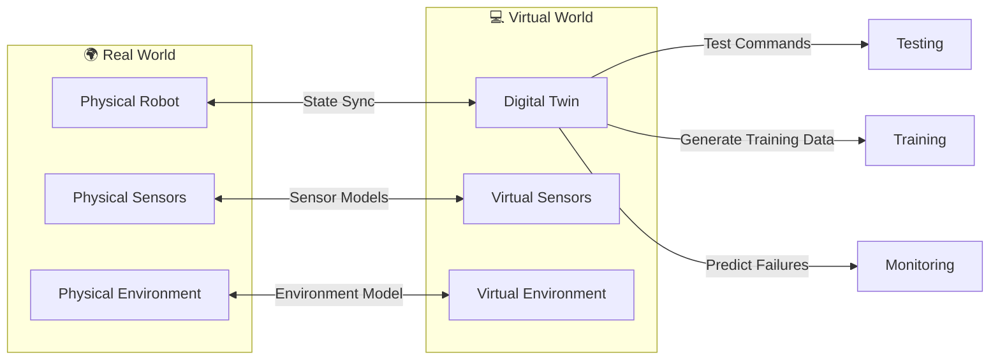
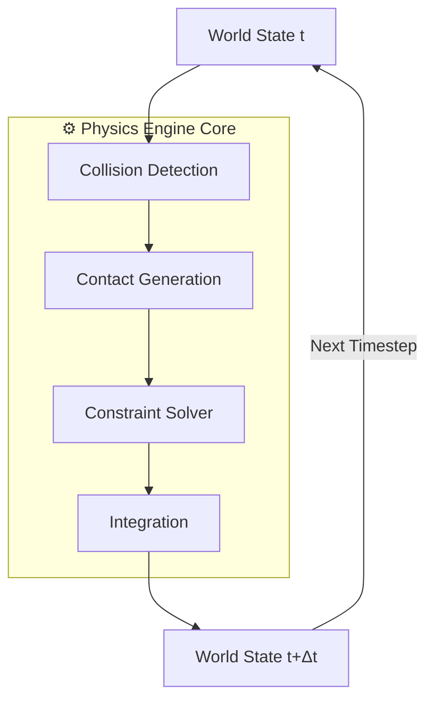
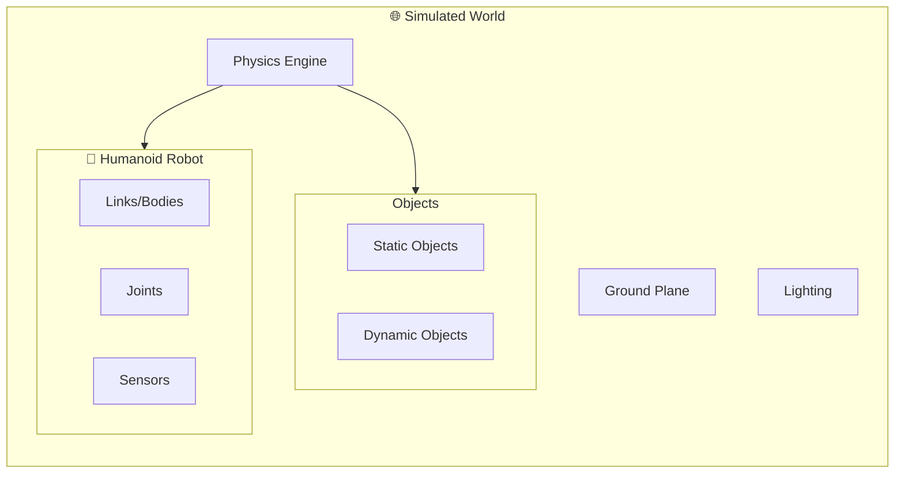
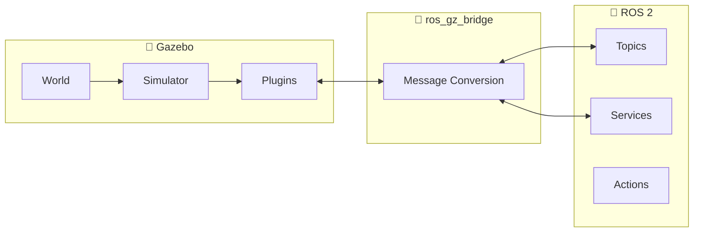
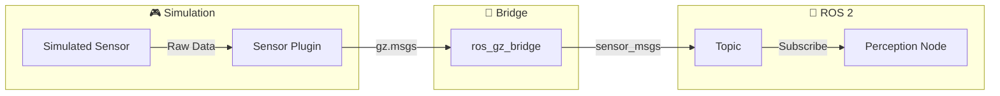
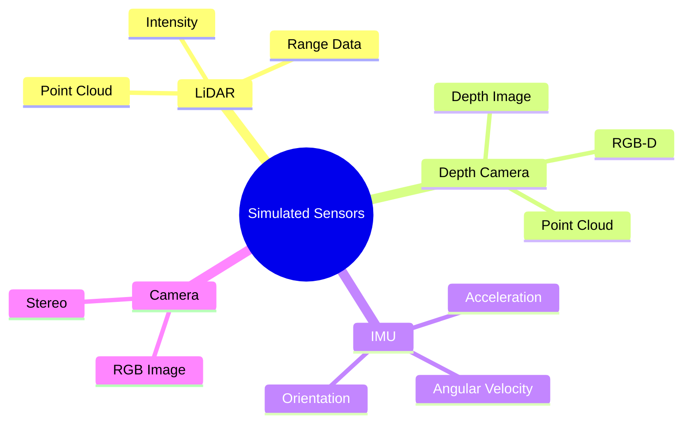

# Module 2 Assets: Digital Twin & Simulation

**Purpose**: Reusable Mermaid diagrams and code snippets for Module 2 chapters.

---

## Diagrams

### D2.1: Digital Twin Concept



### D2.2: Physics Engine Pipeline



### D2.3: Simulated World Structure



### D2.4: Gazebo vs Unity Decision Framework

| Criterion | Gazebo | Unity | Choose When |
|-----------|--------|-------|-------------|
| **Physics Accuracy** | ⭐⭐⭐⭐⭐ | ⭐⭐⭐ | Physics: Gazebo |
| **ROS 2 Integration** | ⭐⭐⭐⭐⭐ | ⭐⭐⭐ | Native ROS: Gazebo |
| **Visual Fidelity** | ⭐⭐⭐ | ⭐⭐⭐⭐⭐ | Rendering: Unity |
| **HRI Scenarios** | ⭐⭐ | ⭐⭐⭐⭐⭐ | Humans: Unity |
| **Learning Curve** | ⭐⭐⭐ | ⭐⭐⭐⭐ | Quick Start: Unity |
| **Cost** | Free | Free (Personal) | Budget: Either |

### D2.5: Gazebo-ROS 2 Bridge Architecture



### D2.6: Sensor to ROS 2 Pipeline



### D2.7: Sensor Types Overview



---

## Code Snippets

### C2.1: SDF World Structure (Concept)

```xml
<?xml version="1.0" ?>
<sdf version="1.8">
  <world name="humanoid_world">
    <!-- Physics Configuration -->
    <physics name="1ms" type="dart">
      <max_step_size>0.001</max_step_size>
      <real_time_factor>1.0</real_time_factor>
    </physics>

    <!-- Environment -->
    <light type="directional" name="sun">
      <pose>0 0 10 0 0 0</pose>
    </light>

    <!-- Ground Plane -->
    <include>
      <uri>https://fuel.gazebosim.org/1.0/OpenRobotics/models/Ground Plane</uri>
    </include>

    <!-- Humanoid Robot Model -->
    <include>
      <uri>model://humanoid_robot</uri>
      <pose>0 0 1.0 0 0 0</pose>
    </include>
  </world>
</sdf>
```

### C2.2: ros_gz_bridge Launch (Concept)

```python
# launch/gz_bridge.launch.py
from launch import LaunchDescription
from launch_ros.actions import Node

def generate_launch_description():
    bridge = Node(
        package='ros_gz_bridge',
        executable='parameter_bridge',
        parameters=[{
            'config_file': 'bridge_config.yaml'
        }],
        output='screen'
    )
    return LaunchDescription([bridge])
```

### C2.3: LiDAR Sensor SDF (Concept)

```xml
<sensor name="lidar" type="gpu_lidar">
  <topic>/humanoid/lidar</topic>
  <update_rate>10</update_rate>
  <lidar>
    <scan>
      <horizontal>
        <samples>640</samples>
        <min_angle>-1.5707</min_angle>
        <max_angle>1.5707</max_angle>
      </horizontal>
    </scan>
    <range>
      <min>0.1</min>
      <max>10.0</max>
    </range>
  </lidar>
</sensor>
```

### C2.4: Depth Camera SDF (Concept)

```xml
<sensor name="depth_camera" type="depth_camera">
  <topic>/humanoid/depth</topic>
  <update_rate>30</update_rate>
  <camera>
    <horizontal_fov>1.047</horizontal_fov>
    <image>
      <width>640</width>
      <height>480</height>
      <format>R_FLOAT32</format>
    </image>
    <clip>
      <near>0.1</near>
      <far>10.0</far>
    </clip>
  </camera>
</sensor>
```

### C2.5: IMU Sensor SDF (Concept)

```xml
<sensor name="imu" type="imu">
  <topic>/humanoid/imu</topic>
  <update_rate>100</update_rate>
  <imu>
    <angular_velocity>
      <x><noise type="gaussian">
        <mean>0</mean>
        <stddev>0.01</stddev>
      </noise></x>
    </angular_velocity>
    <linear_acceleration>
      <x><noise type="gaussian">
        <mean>0</mean>
        <stddev>0.1</stddev>
      </noise></x>
    </linear_acceleration>
  </imu>
</sensor>
```

---

## Message Type Reference

| Sensor | Gazebo Message | ROS 2 Message |
|--------|---------------|---------------|
| LiDAR | `gz.msgs.LaserScan` | `sensor_msgs/msg/LaserScan` |
| Point Cloud | `gz.msgs.PointCloudPacked` | `sensor_msgs/msg/PointCloud2` |
| Depth Camera | `gz.msgs.Image` | `sensor_msgs/msg/Image` |
| IMU | `gz.msgs.IMU` | `sensor_msgs/msg/Imu` |
| RGB Camera | `gz.msgs.Image` | `sensor_msgs/msg/Image` |

---

**Usage**: Import these diagrams and snippets into chapter markdown files using MDX imports or copy-paste.
