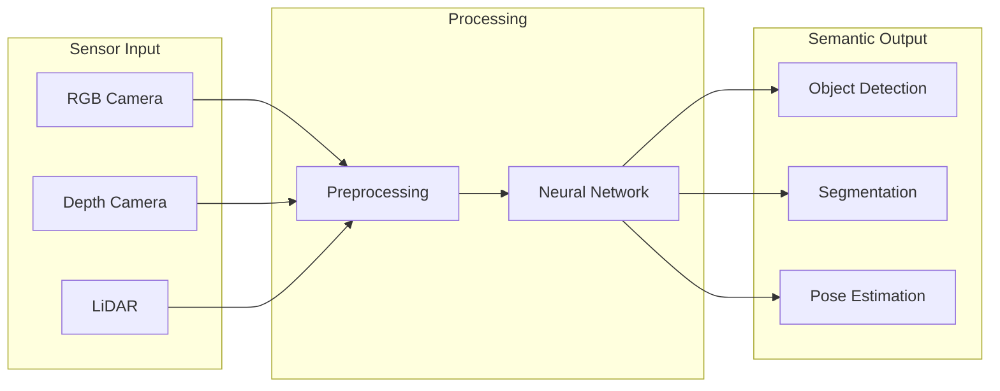
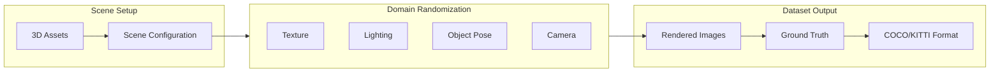
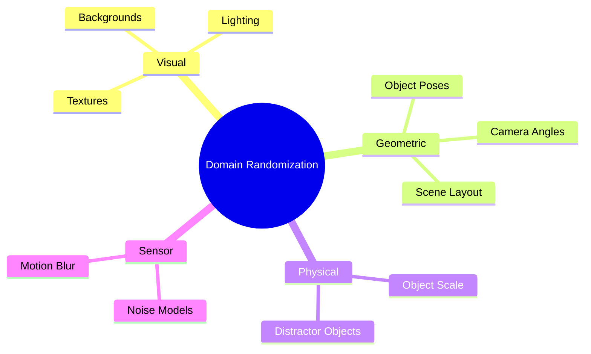
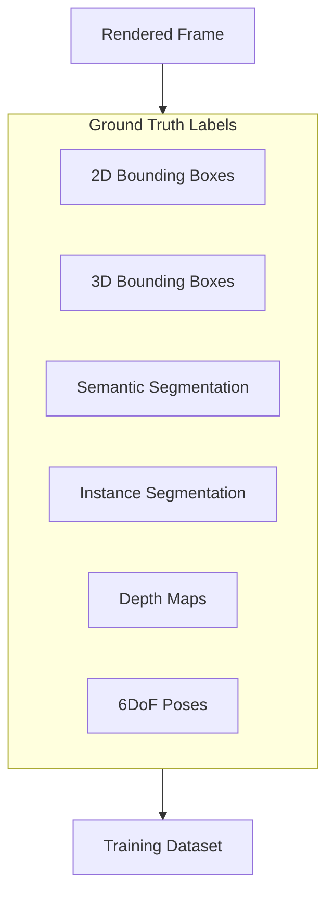
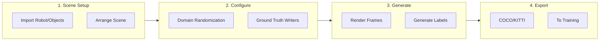

# Perception and Synthetic Data with Isaac Sim

**Reading Time**: ~50-60 minutes | **Prerequisites**: Modules 1-2 (ROS 2 basics, simulation concepts)

---

## Learning Objectives

By the end of this chapter, you will be able to:

1. Explain the AI perception pipeline from sensor input to semantic output
2. Describe the synthetic data generation process and its benefits
3. Identify types of domain randomization and their purposes
4. List ground truth label types that Isaac Sim generates automatically
5. Understand Isaac Sim's role in the perception training workflow

---

## 1.1 AI Perception for Robots

**How does a humanoid robot "see" a cup on a table and know it can be grasped?**

This seemingly simple task requires **perception**—the process of transforming raw sensor data into meaningful understanding. Perception is the foundation of robot intelligence, enabling everything from navigation to manipulation to human interaction.

### What is Perception?

Perception converts **sensor signals** into **semantic understanding**:

- **Input**: Raw pixels, point clouds, depth values
- **Output**: "There's a red cup at position (1.2, 0.5, 0.8) in the robot's frame"



### Core Perception Tasks

| Task | Input | Output | Example |
|------|-------|--------|---------|
| **Object Detection** | RGB image | Bounding boxes + labels | "Cup at (x₁,y₁,x₂,y₂)" |
| **Semantic Segmentation** | RGB image | Pixel-wise class labels | "These pixels are floor" |
| **Instance Segmentation** | RGB image | Per-object masks | "Pixels of cup #1 vs cup #2" |
| **Depth Estimation** | RGB or stereo | Per-pixel depth | "This pixel is 1.5m away" |
| **Pose Estimation** | RGB-D | 6DoF object pose | "Cup orientation: (roll, pitch, yaw)" |

### Why Humanoids Need Perception

Every intelligent behavior depends on understanding the environment:

| Capability | Perception Requirement |
|------------|----------------------|
| **Navigation** | Obstacle detection, terrain classification |
| **Manipulation** | Object detection, pose estimation, grasp planning |
| **Human Interaction** | Person detection, gesture recognition, face identification |
| **Safety** | Hazard detection, distance estimation |

### The Perception Pipeline

A typical perception system processes data through these stages:

1. **Acquisition**: Camera captures 640×480 RGB image at 30 Hz
2. **Preprocessing**: Normalize, resize, convert to tensor
3. **Inference**: Neural network processes in ~30 ms
4. **Postprocessing**: Non-max suppression, confidence thresholding
5. **Output**: List of detected objects with positions

**Real-world example**: A humanoid approaching a table sees an RGB image, runs object detection, and outputs: "Detected: cup (conf: 0.95) at bbox (120, 80, 180, 200), bottle (conf: 0.88) at bbox (300, 100, 350, 250)."

:::tip Success Check
List four different perception tasks and describe what each outputs. For a humanoid fetching a drink, which perception tasks would be required?
:::

---

## 1.2 Why Synthetic Data?

Modern perception systems are powered by **deep learning**—neural networks that learn from thousands or millions of labeled examples. But where do these examples come from?

### The Real-World Data Challenge

Collecting real-world training data is **expensive, slow, and limited**:

| Challenge | Description | Impact |
|-----------|-------------|--------|
| **Cost** | Cameras, environments, labelers | $50K+ for modest dataset |
| **Scale** | Need 10,000+ labeled images | Weeks of collection |
| **Diversity** | Can't capture every scenario | Model fails on edge cases |
| **Labeling** | Human annotation is slow | 10 min per complex image |
| **Safety** | Can't stage dangerous situations | No training for emergencies |

### The Synthetic Data Solution

**Synthetic data** is computer-generated training data with automatic ground truth:



### Benefits of Synthetic Data

| Benefit | Description | Example |
|---------|-------------|---------|
| **Free & Fast** | Generate millions of images overnight | 100,000 images in hours |
| **Automatic Labels** | Perfect ground truth from rendering | Pixel-perfect segmentation |
| **Infinite Variation** | Random combinations of scenarios | Every lighting condition |
| **Safe Scenarios** | Create dangerous situations safely | Robot falling, collisions |
| **Privacy** | No real humans in training data | GDPR-compliant datasets |

### Real vs. Synthetic Data Comparison

| Aspect | Real Data | Synthetic Data |
|--------|-----------|----------------|
| **Collection Cost** | High ($$$) | Low (compute only) |
| **Labeling** | Manual, error-prone | Automatic, perfect |
| **Diversity** | Limited by capture | Unlimited variation |
| **Scale** | Weeks to collect | Hours to generate |
| **Privacy** | Real people | No privacy concerns |
| **Domain Gap** | None | Requires bridging |

### The Sim-to-Real Gap

Models trained purely on synthetic data often perform worse on real images. This **sim-to-real gap** exists because:

- Synthetic textures look different from real materials
- Lighting in simulation differs from real-world illumination
- Object geometry is simplified
- Sensor noise isn't perfectly modeled

**Domain randomization** (next section) is the key technique to bridge this gap.

:::tip Success Check
Explain three advantages of synthetic data over real-world data collection. What is the main disadvantage, and how is it addressed?
:::

---

## 1.3 Domain Randomization

**Domain randomization** is the technique of varying simulation parameters during data generation to produce robust models that generalize to the real world.

### The Core Idea

Instead of making simulation look *exactly* like reality (which is impossible), we make it look like *many different versions* of reality. If a model sees cups under hundreds of lighting conditions, it learns to recognize cups regardless of lighting.



### Randomization Types

#### Texture Randomization
Vary the appearance of object surfaces:
- Material colors and patterns
- Surface roughness and reflectivity
- Background textures

**Effect**: Model learns object *shape*, not specific textures.

#### Lighting Randomization
Vary illumination parameters:
- Light position, intensity, color
- Number of light sources
- Ambient vs. directional lighting
- Shadows and highlights

**Effect**: Model handles diverse lighting conditions.

#### Pose Randomization
Vary object and camera positions:
- Object translation and rotation
- Camera viewpoint and distance
- Scene layout and occlusions

**Effect**: Model recognizes objects from any angle.

#### Camera Randomization
Vary sensor parameters:
- Field of view
- Focal length
- Image resolution

**Effect**: Model transfers across different cameras.

#### Distractor Randomization
Add irrelevant objects to scenes:
- Random background objects
- Clutter on surfaces
- Visual noise

**Effect**: Model focuses on relevant objects, ignores distractors.

### Randomization Strategy

| Parameter | Range | Rationale |
|-----------|-------|-----------|
| Light intensity | 500-2000 lux | Cover indoor lighting range |
| Object rotation | 0-360° all axes | See from every angle |
| Camera height | 1.0-1.8m | Human viewpoint variation |
| Background | 100+ textures | Prevent overfitting to backgrounds |

### Finding the Right Balance

- **Too little randomization**: Model memorizes synthetic artifacts
- **Too much randomization**: Training becomes noisy, convergence slow
- **Sweet spot**: Enough variation to generalize, not so much that learning fails

**Rule of thumb**: Start with moderate randomization, increase if real-world performance lags.

:::tip Success Check
A model trained to detect cups works well in simulation but fails in a real kitchen with fluorescent lighting. Which type of domain randomization would most likely help?
:::

---

## 1.4 Ground Truth Labels

In supervised learning, **ground truth** labels tell the model what the correct answer is. In synthetic data generation, these labels come *free*—the simulator knows exactly where every object is.

### What is Ground Truth?

Ground truth is the "correct answer" for each training example:
- For object detection: bounding boxes and class labels
- For segmentation: pixel-wise masks
- For depth: per-pixel distance values

In real data collection, humans must manually draw these labels—slow, expensive, and error-prone. In simulation, labels are generated automatically from the scene description.

### Label Types from Isaac Sim

Isaac Sim can generate these ground truth types automatically:



| Label Type | Description | Use Case |
|------------|-------------|----------|
| **2D Bounding Boxes** | Rectangle around object in image | Object detection (YOLO, Faster R-CNN) |
| **3D Bounding Boxes** | Cuboid in 3D space | Autonomous driving, robotics |
| **Semantic Segmentation** | Class label per pixel | Scene understanding |
| **Instance Segmentation** | Object ID per pixel | Distinguishing same-class objects |
| **Depth Maps** | Distance per pixel | Depth estimation, obstacle avoidance |
| **Surface Normals** | Surface orientation per pixel | Grasp planning, 3D reconstruction |
| **Optical Flow** | Motion vectors between frames | Video understanding, tracking |

### Label Formats

Isaac Sim exports to standard formats:

| Format | Description | Common Use |
|--------|-------------|------------|
| **COCO** | JSON with annotations | Detection, segmentation |
| **KITTI** | Text files with 3D boxes | Autonomous driving |
| **Custom** | User-defined schema | Domain-specific needs |

### Why Synthetic Labels are Better

| Aspect | Human Labels | Synthetic Labels |
|--------|--------------|------------------|
| **Accuracy** | ~95% (human error) | 100% (from renderer) |
| **Consistency** | Varies by labeler | Perfectly consistent |
| **Speed** | 10-30 min/image | Instant |
| **3D information** | Requires depth sensor | Always available |
| **Occlusion handling** | Difficult | Exact visibility known |

:::tip Success Check
Match each perception task to its ground truth label type:
1. Object detection → ?
2. Scene understanding → ?
3. Distinguishing two cups → ?
4. Obstacle avoidance → ?
:::

---

## 1.5 Isaac Sim Workflow

**NVIDIA Isaac Sim** is a high-fidelity robotics simulator built on Omniverse, designed specifically for perception training and robot development.

### What is Isaac Sim?

Isaac Sim provides:
- **Physically accurate rendering**: Ray-traced graphics for realistic images
- **Physics simulation**: PhysX for dynamics
- **Robot support**: Import URDF/MJCF, simulate sensors
- **Synthetic data generation**: Replicator for automated dataset creation
- **ROS 2 integration**: Native bridge to ROS 2 topics

### The Synthetic Data Generation Workflow



### Workflow Steps

#### Step 1: Scene Setup
- Import robot model (URDF/USD)
- Add environment (room, table, objects)
- Position camera(s) for data capture

#### Step 2: Configure Randomization
- Define what parameters to randomize
- Set ranges and distributions
- Configure number of samples

#### Step 3: Generate Data
- Replicator renders frames with variations
- Ground truth extracted automatically
- Data saved to disk

#### Step 4: Export and Train
- Convert to training format
- Load in PyTorch/TensorFlow
- Train perception model

### Replicator: The Synthetic Data Engine

Isaac Sim's **Replicator** automates data generation:

```python
# Conceptual synthetic data generation with Isaac Sim Replicator
import omni.replicator.core as rep

# Create randomized scene
with rep.new_layer():
    # Camera setup
    camera = rep.create.camera(
        position=(0, 0, 2),
        look_at=(0, 0, 0)
    )

    # Domain randomization
    with rep.trigger.on_frame(num_frames=1000):
        rep.randomizer.rotation(
            rep.get.prim("/World/Cup"),
            distribution="uniform",
            min=(-180, -180, -180),
            max=(180, 180, 180)
        )
        rep.randomizer.light(
            intensity=(500, 2000)
        )

    # Output configuration
    rep.WriterRegistry.get("BasicWriter")(
        output_dir="/data/synthetic",
        rgb=True,
        bounding_box_2d_tight=True,
        semantic_segmentation=True
    )
```

**Key concepts:**
- `rep.trigger.on_frame`: Run randomization each frame
- `rep.randomizer`: Apply variations to scene elements
- `WriterRegistry`: Configure output data types

### Integration with Deep Learning

After generation, data flows to training:

1. **Isaac Sim** generates 50,000 images with labels
2. **Data loader** reads COCO-format annotations
3. **PyTorch/TensorFlow** trains detection model
4. **Trained model** deployed to robot perception node

### Isaac Sim in the Big Picture

| Component | Role | Output |
|-----------|------|--------|
| Isaac Sim | Generate training data | Labeled image dataset |
| Deep Learning Framework | Train perception model | Trained weights |
| Isaac ROS | Deploy model on robot | Real-time inference |

:::tip Success Check
Outline the five main steps in using Isaac Sim to create a synthetic dataset for object detection. What makes this workflow faster than collecting real-world data?
:::

---

## Chapter Summary

In this chapter, we explored AI perception and synthetic data generation:

| Concept | Description | Key Points |
|---------|-------------|------------|
| **Perception** | Sensor data → semantic understanding | Detection, segmentation, depth |
| **Synthetic Data** | Computer-generated training data | Free labels, infinite variation |
| **Domain Randomization** | Vary simulation parameters | Textures, lighting, poses, camera |
| **Ground Truth** | Perfect labels from simulation | 2D/3D boxes, masks, depth |
| **Isaac Sim** | High-fidelity simulator for perception | Replicator for data generation |

**Key takeaways:**
- Perception enables all intelligent robot behaviors
- Synthetic data solves the labeling bottleneck
- Domain randomization bridges the sim-to-real gap
- Isaac Sim automates the entire data generation pipeline

---

## What's Next

In Chapter 2, we'll explore **Visual SLAM with Isaac ROS**—using perception to build maps and localize your humanoid in the environment.

---

## References

- [NVIDIA Isaac Sim Documentation](https://docs.omniverse.nvidia.com/isaacsim/latest/)
- [Isaac Sim Replicator](https://docs.omniverse.nvidia.com/replicator/latest/)
- [Domain Randomization for Sim-to-Real Transfer](https://arxiv.org/abs/1703.06907)
- [COCO Dataset Format](https://cocodataset.org/#format-data)
