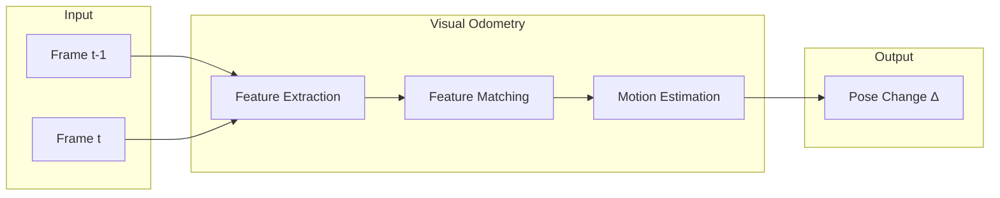
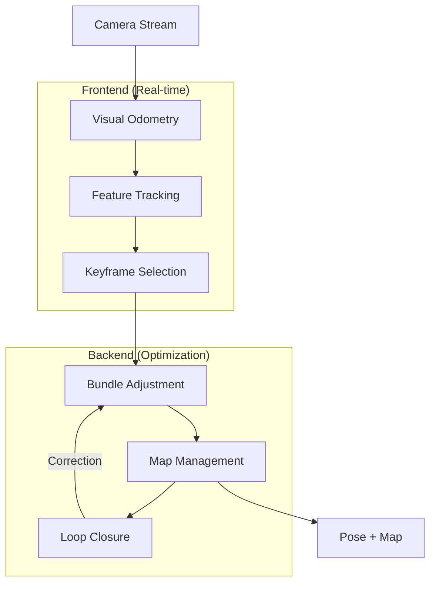
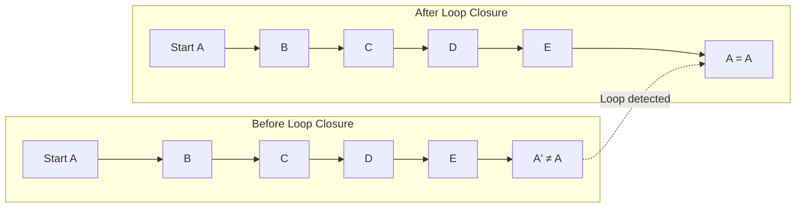
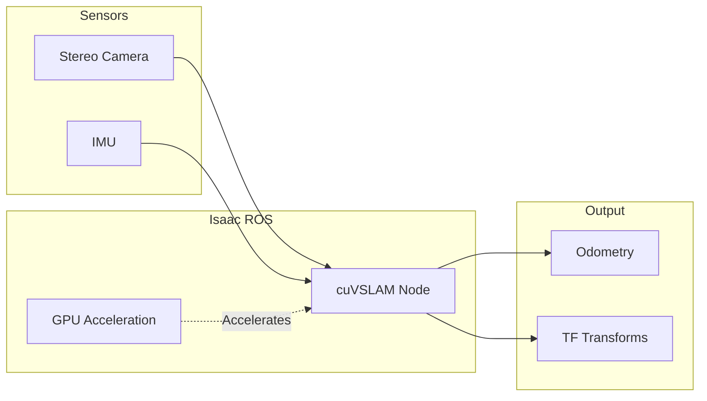
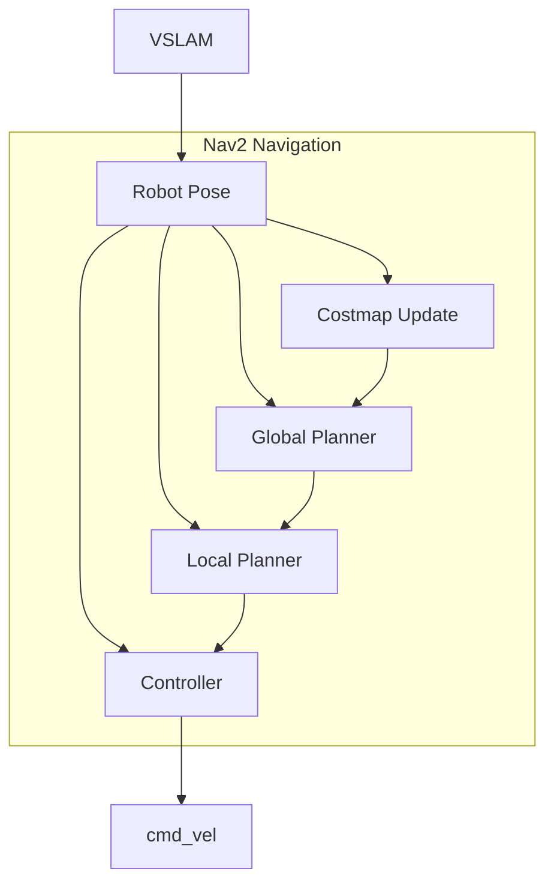
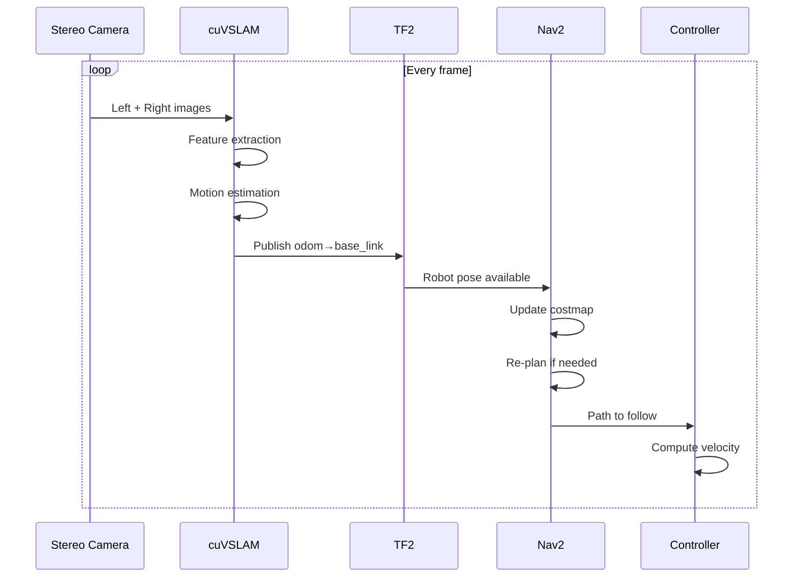

# Visual SLAM with Isaac ROS

**Reading Time**: ~45-55 minutes | **Prerequisites**: Chapter 1 (perception concepts), Module 2 (camera simulation)

---

## Learning Objectives

By the end of this chapter, you will be able to:

1. Explain visual odometry concepts (feature extraction, tracking, pose estimation)
2. Describe the difference between visual odometry and full SLAM
3. Explain loop closure and why it corrects drift
4. Understand Isaac ROS VSLAM acceleration and integration
5. Describe how VSLAM output feeds into navigation

---

## 2.1 Visual Odometry Concepts

In Chapter 1, we learned how perception transforms sensor data into understanding. Now we apply perception to a fundamental robotics problem: **knowing where the robot is**.

### What is Visual Odometry?

**Visual Odometry (VO)** estimates the robot's pose change by analyzing sequential camera images. As the robot moves, the camera sees the world from different viewpoints. By tracking how the scene changes, we can compute how the robot moved.



### The Visual Odometry Pipeline

| Stage | Description | Output |
|-------|-------------|--------|
| **Feature Extraction** | Find distinctive points in image | Keypoints + descriptors |
| **Feature Matching** | Track features across frames | Correspondences |
| **Motion Estimation** | Compute camera movement | Rotation + translation |
| **Pose Update** | Integrate into trajectory | Updated robot pose |

### Feature Extraction

**Features** are distinctive points in an image—corners, blobs, or edges that are easy to find and track:

| Feature Type | Description | Pros | Cons |
|--------------|-------------|------|------|
| **ORB** | Oriented FAST + BRIEF | Fast, free | Less robust |
| **SIFT** | Scale-Invariant Features | Very robust | Slow, patented |
| **SURF** | Speeded Up SIFT | Balance | Patented |
| **SuperPoint** | Learned features | Best quality | GPU required |

Each feature has:
- **Keypoint**: Location (x, y) in the image
- **Descriptor**: Numerical fingerprint for matching

### Feature Matching

Given features in two frames, matching finds correspondences:

```
Frame t-1: Feature A at (100, 200)
Frame t:   Feature A at (105, 198)
           → Feature moved 5 pixels right, 2 pixels up
```

Good matching requires:
- Similar descriptors (feature looks the same)
- Geometric consistency (motion is physically plausible)
- Outlier rejection (some matches are wrong)

### Motion Estimation

From matched features, we compute how the camera moved:

1. **Essential Matrix**: Encodes rotation and translation (up to scale)
2. **RANSAC**: Robust estimation that ignores outliers
3. **Decomposition**: Extract R (rotation) and t (translation)

**Result**: "Between frame t-1 and t, the camera rotated 2° left and moved 5cm forward."

### Why Visual Odometry?

| Advantage | Description |
|-----------|-------------|
| **Passive sensing** | No active emission (unlike LiDAR) |
| **Rich information** | Images contain texture, color, geometry |
| **Works indoors/outdoors** | No GPS required |
| **Low cost** | Cameras are inexpensive |

### The Drift Problem

Visual odometry has a fundamental limitation: **drift accumulates**.

Each pose estimate has small errors. Over time, these add up:
- After 100m of travel, you might be off by 5m
- This error grows without bound

**Drift cannot be eliminated by visual odometry alone—we need SLAM.**

:::tip Success Check
Trace data through the visual odometry pipeline: What are the four stages? What does each stage output?
:::

---

## 2.2 From Visual Odometry to Full SLAM

**SLAM** (Simultaneous Localization and Mapping) extends visual odometry with two crucial additions: **mapping** and **loop closure**.

### VO vs. SLAM

| Aspect | Visual Odometry | Full SLAM |
|--------|----------------|-----------|
| **Drift** | Unbounded | Corrected by loop closure |
| **Map** | No persistent map | Builds and maintains map |
| **Memory** | Fixed/low | Grows with exploration |
| **Use case** | Short paths | Long-term navigation |

### What SLAM Adds



### Map Building

SLAM maintains a **map** of visual landmarks:
- **Keyframes**: Reference images at key locations
- **Landmarks**: 3D positions of tracked features
- **Pose Graph**: Robot poses connected by motion constraints

### Loop Closure: The Magic Ingredient

**Loop closure** recognizes when the robot returns to a previously visited location:

```
Robot travels: A → B → C → D → E → back to A
Without loop closure: Position drifts, A' ≠ A
With loop closure: Recognize "I've been here!" → correct entire trajectory
```



### How Loop Closure Works

1. **Place Recognition**: "Does current view match any keyframe?"
   - Bag-of-words: Describe images with visual vocabulary
   - Embedding similarity: Compare learned feature vectors

2. **Constraint Addition**: If match found, add constraint to pose graph
   - "Current pose ≈ keyframe pose"

3. **Global Optimization**: Re-optimize entire trajectory
   - Distribute error across all poses
   - Result: Consistent, drift-free map

### SLAM Map Types

| Type | Description | Use Case |
|------|-------------|----------|
| **Sparse** | Only feature landmarks | Localization |
| **Semi-dense** | Edges and high-gradient regions | Some planning |
| **Dense** | Full 3D reconstruction | Detailed mapping |

**Trade-off**: Denser maps need more compute and memory.

:::tip Success Check
Explain why loop closure is essential for long-term robot operation. What would happen to a delivery robot navigating a building for hours without loop closure?
:::

---

## 2.3 Isaac ROS VSLAM

**Isaac ROS** is NVIDIA's collection of GPU-accelerated ROS 2 packages for robotics. **cuVSLAM** is their visual SLAM implementation.

### What is Isaac ROS?

Isaac ROS provides:
- **GPU acceleration**: CUDA-optimized algorithms
- **ROS 2 integration**: Standard topics and services
- **Optimized for Jetson**: Runs on embedded hardware
- **Perception focus**: VSLAM, depth estimation, segmentation

### cuVSLAM: GPU-Accelerated Visual SLAM

**cuVSLAM** is NVIDIA's stereo visual SLAM:



### Performance Benefits

| Metric | CPU VSLAM | cuVSLAM | Improvement |
|--------|-----------|---------|-------------|
| **Frame rate** | 15-20 fps | 60+ fps | 3-4x |
| **Latency** | 50-100 ms | 10-20 ms | 5x |
| **Power** | ~30W (CPU) | ~10W (Jetson) | 3x efficiency |

### Input Requirements

cuVSLAM requires:
- **Stereo camera**: Left + right images (synchronized)
- **IMU** (optional but recommended): Accelerometer + gyroscope
- **Calibration**: Camera intrinsics and stereo extrinsics

### Output Topics

| Topic | Message Type | Description |
|-------|--------------|-------------|
| `/visual_slam/tracking/odometry` | `nav_msgs/Odometry` | Robot pose and velocity |
| `/visual_slam/status` | `isaac_ros_visual_slam_interfaces/VisualSlamStatus` | Tracking quality |
| `/tf` | TF2 transforms | `odom` → `base_link` |

### Configuration (Conceptual)

```yaml
# Isaac ROS VSLAM parameters (conceptual)
isaac_ros_visual_slam:
  ros__parameters:
    # Enable stereo mode
    enable_slam_visualization: true
    enable_observations_view: true
    enable_landmarks_view: true

    # Image processing
    rectified_images: true
    denoise_input_images: false

    # IMU fusion
    enable_imu_fusion: true
    gyro_noise_density: 0.000244
    accel_noise_density: 0.001862

    # Performance tuning
    num_cameras: 2
    camera_optical_frames: ["camera_left", "camera_right"]
```

### When to Use Isaac ROS VSLAM

| Scenario | Recommendation |
|----------|----------------|
| **Jetson platform** | Highly recommended—native optimization |
| **Real-time required** | Yes—low latency critical |
| **Stereo available** | Yes—requires stereo or RGB-D |
| **CPU-only system** | Consider ORB-SLAM3 instead |

:::tip Success Check
List three benefits of GPU-accelerated VSLAM over CPU implementations. When would you choose Isaac ROS VSLAM?
:::

---

## 2.4 VSLAM Output and Navigation Integration

VSLAM provides **localization**—but that's just the beginning. The output feeds into the navigation stack for path planning and control.

### VSLAM Output Topics

cuVSLAM publishes several key topics:

| Output | Type | Purpose |
|--------|------|---------|
| **Odometry** | `nav_msgs/Odometry` | Pose + velocity |
| **TF Transform** | `geometry_msgs/TransformStamped` | `odom` → `base_link` |
| **Tracking Status** | Custom message | Quality indicator |
| **Map** (optional) | Visualization markers | Debugging |

### The TF Tree

ROS 2 uses **TF2** to track coordinate frame relationships:

```
map
 └── odom
      └── base_link
           ├── camera_link
           ├── lidar_link
           └── imu_link
```

VSLAM publishes the `odom → base_link` transform, telling the system:
- "The robot's base is at (x, y, z) relative to where it started"

### How Nav2 Uses Localization

The navigation stack (Nav2) needs localization for:



| Component | Why It Needs Pose |
|-----------|-------------------|
| **Costmap** | Know which cells the robot occupies |
| **Global Planner** | Compute path from current pose to goal |
| **Local Planner** | Track path relative to current pose |
| **Controller** | Feedback for velocity control |

### VSLAM vs. Other Localization Methods

| Method | Pros | Cons | Best For |
|--------|------|------|----------|
| **VSLAM** | Works without pre-built map | Drift, feature-dependent | New environments |
| **AMCL** | Very accurate with good map | Needs pre-built map | Known environments |
| **GPS** | Global reference | No indoor, low accuracy | Outdoor only |
| **Wheel Odometry** | Simple, always available | Slips, drifts | Short-term, backup |

### Choosing Localization for Humanoids

Humanoid robots have unique challenges:
- **No wheels**: Can't use wheel odometry
- **Dynamic motion**: Running, turning creates motion blur
- **Height changes**: Crouching, reaching change camera viewpoint

**Recommendation**: Visual SLAM (with IMU fusion) is often the best choice for humanoids—it works across all these conditions.

### Data Flow: Complete Pipeline



:::tip Success Check
Trace the data flow from camera images to robot motion. How does VSLAM output reach the navigation controller?
:::

---

## Chapter Summary

In this chapter, we explored Visual SLAM for robot localization:

| Concept | Description | Key Points |
|---------|-------------|------------|
| **Visual Odometry** | Pose from sequential images | Features → matching → motion |
| **SLAM** | VO + mapping + loop closure | Corrects drift, builds map |
| **Loop Closure** | Recognize revisited places | Essential for long-term operation |
| **Isaac ROS VSLAM** | GPU-accelerated SLAM | cuVSLAM on Jetson, 60+ fps |
| **Nav2 Integration** | Localization for planning | TF transforms, odometry |

**Key takeaways:**
- Visual odometry estimates motion from image features but drifts over time
- SLAM adds mapping and loop closure to correct drift
- Isaac ROS cuVSLAM provides GPU-accelerated VSLAM for real-time robotics
- VSLAM output feeds directly into Nav2 for path planning
- For humanoids, visual SLAM with IMU fusion is often the best localization choice

---

## What's Next

In Chapter 3, we'll explore **Nav2 path planning**—using localization to navigate from A to B while avoiding obstacles.

---

## References

- [Isaac ROS Visual SLAM](https://nvidia-isaac-ros.github.io/repositories_and_packages/isaac_ros_visual_slam/index.html)
- [cuVSLAM Documentation](https://docs.nvidia.com/isaac/packages/visual_slam/doc/cuvslam.html)
- [ORB-SLAM3](https://github.com/UZ-SLAMLab/ORB_SLAM3) (alternative implementation)
- [Visual Odometry Tutorial](https://avisingh599.github.io/vision/visual-odometry-full/)
