# Path Planning with Nav2

**Reading Time**: ~50-60 minutes | **Prerequisites**: Chapters 1-2 (Isaac Sim, VSLAM), Module 1 (ROS 2 topics)

---

## Learning Objectives

By the end of this chapter, you will be able to:

1. Describe the Nav2 navigation stack architecture and components
2. Explain costmaps and their role in obstacle representation
3. Differentiate between global and local planning
4. Understand behavior trees for navigation decision logic
5. Identify humanoid-specific navigation considerations

---

## 3.1 Nav2 Architecture Overview

In Chapter 2, we learned how VSLAM provides robot localization. Now we address the next critical question: **How does a robot plan and execute paths through its environment?**

### What is Nav2?

**Nav2** (Navigation2) is the ROS 2 navigation framework—the standard stack for autonomous robot navigation. It provides:

| Capability | Description |
|------------|-------------|
| **Path planning** | Computing routes from A to B |
| **Obstacle avoidance** | Avoiding static and dynamic obstacles |
| **Recovery behaviors** | Handling stuck situations |
| **Flexible architecture** | Plugin-based customization |

### Nav2 Architecture

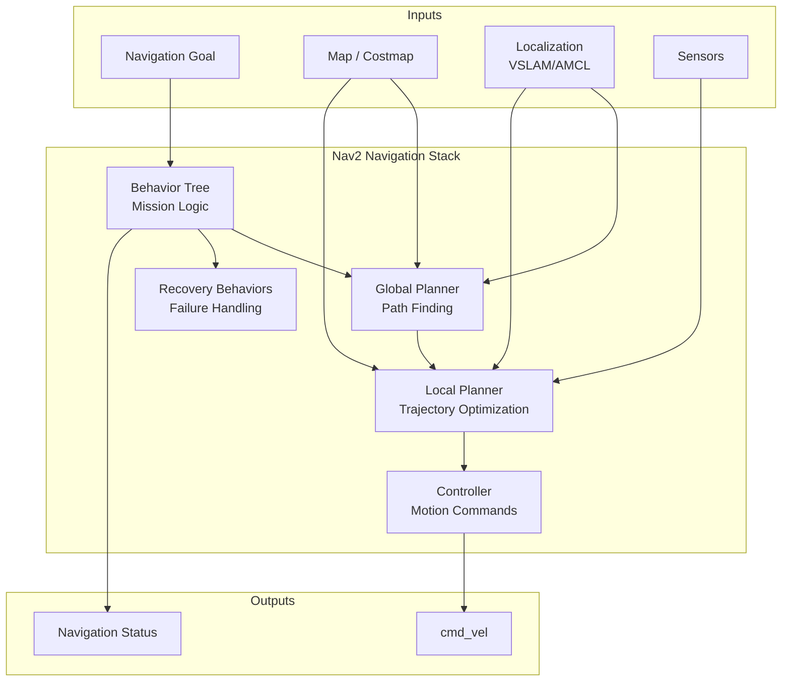

### Core Components

| Component | Role | Input | Output |
|-----------|------|-------|--------|
| **Behavior Tree** | Orchestrates navigation | Goal, status | Commands to planners |
| **Global Planner** | Finds overall path | Start, goal, costmap | Path (waypoints) |
| **Local Planner** | Follows path smoothly | Path, local costmap | Velocity commands |
| **Controller** | Sends motor commands | Velocities | /cmd_vel messages |
| **Recovery** | Handles failures | Stuck status | Recovery actions |

### Navigation Flow

A typical navigation request follows this sequence:

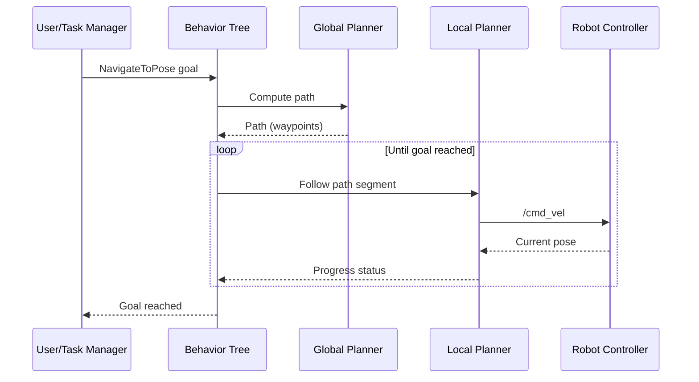

### Nav2 Goal Concept

Navigation goals are specified as **target poses**:

| Field | Description | Example |
|-------|-------------|---------|
| `position.x` | X coordinate in map | 5.0 meters |
| `position.y` | Y coordinate in map | 3.0 meters |
| `orientation` | Facing direction (quaternion) | Facing east |
| `frame_id` | Reference frame | "map" |

:::tip Success Check
Name the five main Nav2 components and their roles. What is the relationship between the global planner and local planner?
:::

---

## 3.2 Costmaps and Obstacle Representation

Planning requires knowing where the robot can and cannot go. **Costmaps** provide this information.

### What is a Costmap?

A **costmap** is a 2D grid where each cell contains a traversability cost:

```
Costmap (5x5 example, values 0-254):
  0   0   0   0   0
  0   0  127 254  0     ← 254 = obstacle
  0   0  127 254  0     ← 127 = inflation zone
  0   0   50  50  0     ← 50 = elevated cost
  0   0   0   0   0     ← 0 = free space
```

### Cost Values

| Value | Meaning | Robot Behavior |
|-------|---------|----------------|
| **0** | Free space | Can traverse freely |
| **1-252** | Elevated cost | Traversable but discouraged |
| **253** | Inscribed obstacle | Robot footprint touches |
| **254** | Lethal obstacle | Cannot traverse |
| **255** | Unknown | Not yet observed |

### Costmap Layers

Costmaps are built from multiple **layers** that combine:

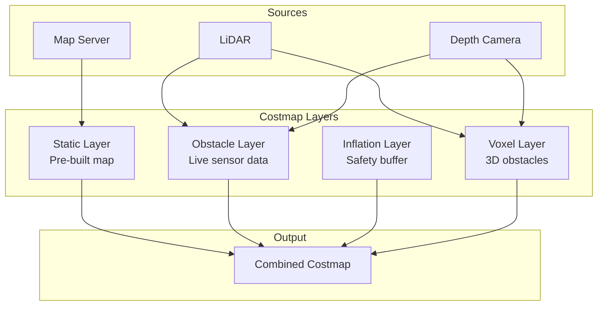

### Layer Details

| Layer | Source | Purpose | Updates |
|-------|--------|---------|---------|
| **Static** | Pre-built map | Known obstacles (walls) | At startup |
| **Obstacle** | Live sensors | Dynamic obstacles | Continuously |
| **Inflation** | Other layers | Safety buffer | After obstacle updates |
| **Voxel** | 3D sensors | Height-aware obstacles | Continuously |

### Inflation Layer

The inflation layer adds a **safety buffer** around obstacles:

```
Without inflation:        With inflation:
  .  .  .  .  .            .  .  +  +  +
  .  .  .  X  .            .  +  +  X  +
  .  .  .  X  .     →      .  +  +  X  +
  .  .  .  .  .            .  .  +  +  +
  .  .  .  .  .            .  .  .  .  .

X = obstacle, + = inflation zone, . = free
```

This prevents the robot from planning paths too close to obstacles.

### Costmap Configuration

```yaml
# Costmap layer configuration
global_costmap:
  global_costmap:
    ros__parameters:
      update_frequency: 1.0
      publish_frequency: 1.0
      robot_radius: 0.3
      resolution: 0.05
      plugins: ["static_layer", "obstacle_layer", "inflation_layer"]

      static_layer:
        plugin: "nav2_costmap_2d::StaticLayer"
        map_subscribe_transient_local: True

      obstacle_layer:
        plugin: "nav2_costmap_2d::ObstacleLayer"
        observation_sources: scan
        scan:
          topic: /scan
          max_obstacle_height: 2.0

      inflation_layer:
        plugin: "nav2_costmap_2d::InflationLayer"
        cost_scaling_factor: 3.0
        inflation_radius: 0.55
```

### 2D vs. 3D Costmaps for Humanoids

| Aspect | 2D Costmap | 3D Costmap (Voxel) |
|--------|------------|---------------------|
| **Representation** | Single plane at height | Full volumetric grid |
| **Use case** | Wheeled robots | Humanoids, manipulators |
| **Overhead** | Low | Higher |
| **Needed when** | Flat terrain | Variable height obstacles |

Humanoids need 3D awareness for body clearance at different heights.

:::tip Success Check
Explain the three main costmap layers and their data sources. Why is the inflation layer important for safe navigation?
:::

---

## 3.3 Global and Local Planning

Nav2 uses a **two-level planning approach** for efficient and reactive navigation.

### Why Two Levels?

| Level | Scope | Characteristics |
|-------|-------|-----------------|
| **Global** | Full environment | Efficient but slow to update |
| **Local** | Immediate surroundings | Fast and reactive |

Single-level planning would either be too slow (global everywhere) or short-sighted (local everywhere).

### Global Planner

The global planner computes an **overall path** from start to goal:

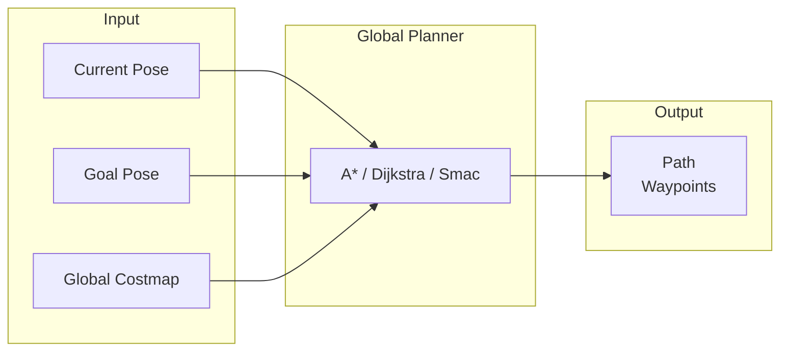

**Common Global Planners**:

| Planner | Algorithm | Best For |
|---------|-----------|----------|
| **NavFn** | Dijkstra/A* | Simple environments |
| **Smac 2D** | State lattice A* | Non-holonomic robots |
| **Smac Hybrid-A*** | Hybrid state A* | Cars, Ackermann |
| **Theta*** | Any-angle A* | Smooth paths |

### Local Planner

The local planner generates **smooth trajectories** while avoiding dynamic obstacles:

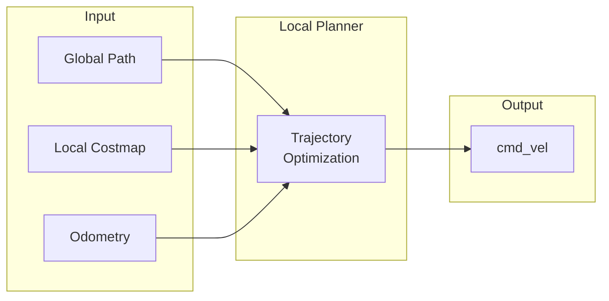

**Common Local Planners**:

| Planner | Approach | Characteristics |
|---------|----------|-----------------|
| **DWB** | Dynamic Window | Samples velocities, scores paths |
| **TEB** | Timed Elastic Band | Optimizes trajectory timing |
| **MPPI** | Model Predictive | Parallel trajectory sampling |
| **RPP** | Regulated Pure Pursuit | Path following with regulation |

### Planning to Control Flow

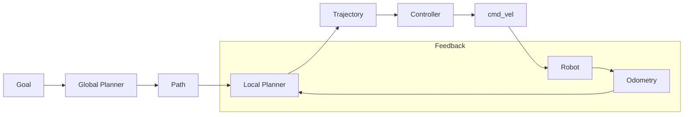

### When Replanning Occurs

**Global replanning** happens when:
- Path is blocked by new obstacle
- Goal changes
- Significant localization jump
- Timeout on progress

**Local replanning** is **continuous**:
- Every control cycle (10-20 Hz)
- Reacts to dynamic obstacles instantly

### Planner Configuration

```yaml
# Nav2 planner configuration
planner_server:
  ros__parameters:
    planner_plugins: ["GridBased"]
    GridBased:
      plugin: "nav2_navfn_planner/NavfnPlanner"
      tolerance: 0.5
      use_astar: true
      allow_unknown: true

controller_server:
  ros__parameters:
    controller_plugins: ["FollowPath"]
    FollowPath:
      plugin: "dwb_core::DWBLocalPlanner"
      min_vel_x: 0.0
      max_vel_x: 0.5
      max_vel_theta: 1.0
```

:::tip Success Check
What triggers global replanning vs. local replanning? Why is continuous local replanning necessary?
:::

---

## 3.4 Behavior Trees for Navigation

**Behavior trees** orchestrate navigation logic, handling both normal operation and failures.

### What are Behavior Trees?

A **behavior tree** is a hierarchical decision structure that:
- Organizes complex behaviors into simple nodes
- Handles sequencing and fallback logic
- Manages failure recovery automatically

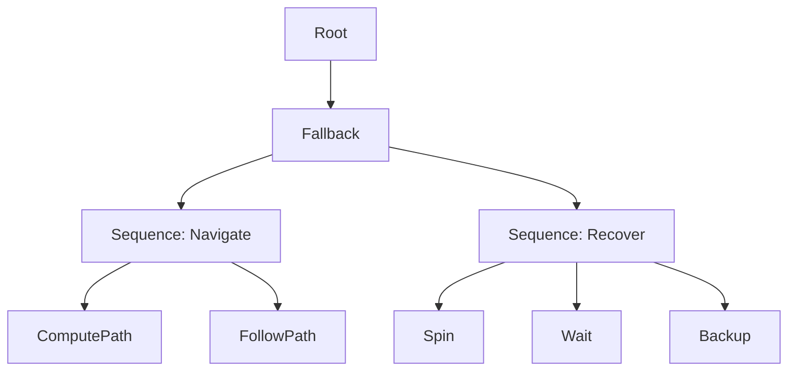

### Node Types

| Type | Symbol | Behavior |
|------|--------|----------|
| **Sequence** | → | Execute children in order; fail if any fails |
| **Fallback** | ? | Try children until one succeeds |
| **Action** | ◯ | Execute a task (call ROS 2 action) |
| **Condition** | ◇ | Check a state (return success/failure) |
| **Decorator** | ◈ | Modify child behavior (retry, invert) |

### Nav2 Default Behavior Tree

The default Nav2 behavior tree follows this structure:

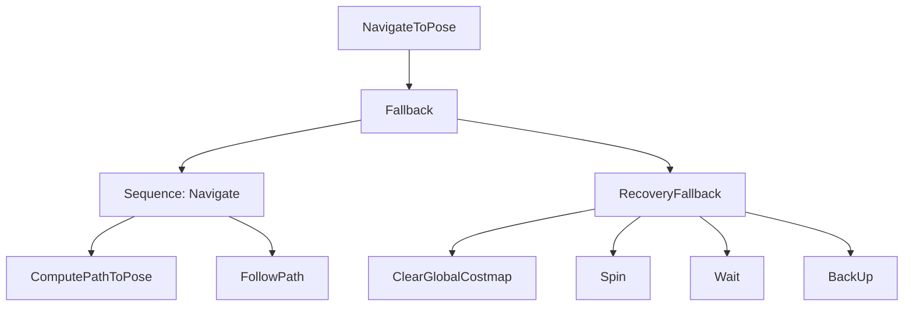

### Recovery Behaviors

When navigation fails, recovery behaviors attempt to resolve the situation:

| Recovery | Action | When Used |
|----------|--------|-----------|
| **Spin** | Rotate in place | Stuck, clear sensor view |
| **Backup** | Move backward | Path blocked ahead |
| **Wait** | Pause and wait | Temporary obstacle |
| **Clear Costmap** | Reset costmap | Stale obstacle data |

### Execution Flow

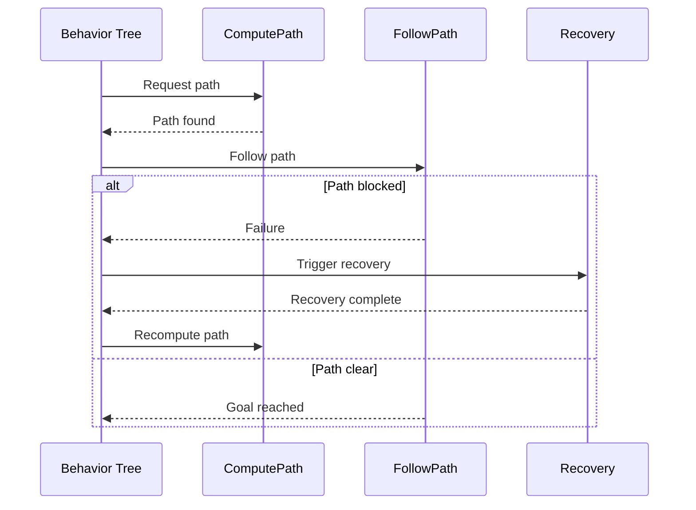

### Customizing for Humanoids

Humanoid robots may need custom behavior trees:

| Standard Behavior | Humanoid Adaptation |
|-------------------|---------------------|
| Spin in place | May cause balance issues—use slow rotation |
| Backup | Ensure stable reverse walking |
| Clear costmap | Include 3D voxel layer clearing |
| Wait | Maintain balance pose |

:::tip Success Check
Describe the difference between Sequence and Fallback nodes. When do recovery behaviors activate?
:::

---

## 3.5 Humanoid Navigation Considerations

Nav2 was designed for wheeled robots. **Humanoid robots** present unique challenges.

### Humanoid vs. Wheeled Navigation

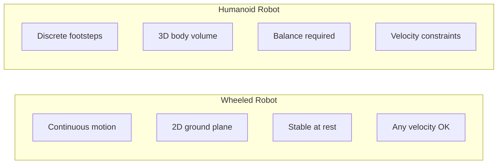

| Aspect | Wheeled Robot | Humanoid Robot |
|--------|---------------|----------------|
| **Motion** | Continuous rolling | Discrete stepping |
| **Stability** | Inherently stable | Active balance required |
| **Path following** | Direct velocity | Footstep placement |
| **Clearance** | Single height | Full body volume |
| **Velocity limits** | Motor limits | Stability limits |

### Humanoid-Specific Challenges

**1. Bipedal Stability Constraints**
- Cannot stop instantly mid-step
- Must maintain center of mass over support polygon
- Balance disturbances affect path execution

**2. Discrete Footstep Placement**
- Cannot follow arbitrary paths directly
- Need footstep planning layer
- Step length and width constraints

**3. 3D Body Clearance**
- Body extends at different heights
- Shoulders/head may hit obstacles
- Need volumetric costmap checking

**4. Balance During Motion**
- Velocity changes affect balance
- Turning requires careful coordination
- Uneven terrain increases difficulty

### Adaptations for Humanoid Nav2

| Standard Nav2 | Humanoid Adaptation |
|---------------|---------------------|
| cmd_vel to base | cmd_vel to footstep planner |
| 2D costmap | 3D voxel costmap |
| Any velocity | Stability-aware velocity limits |
| Direct path following | Footstep sequence generation |
| Fast recovery rotations | Slow, balanced rotations |

### Footstep Planning Layer

Between Nav2 and the robot controller:

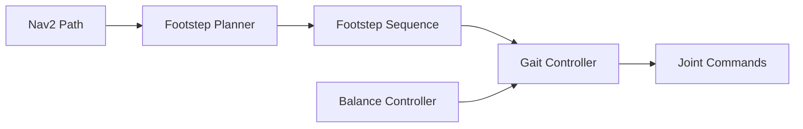

**Footstep planner responsibilities**:
- Convert path to footstep sequence
- Respect step length/width limits
- Check stability at each step
- Handle stepping over obstacles

### 3D Costmap Requirements

| Humanoid Body Part | Height Check | Why Important |
|--------------------|--------------|---------------|
| Feet | Ground level | Stepping surface |
| Knees | ~0.5m | Low obstacles |
| Hips/Hands | ~1m | Furniture level |
| Chest/Shoulders | ~1.3m | Doorways, shelves |
| Head | ~1.7m | Overhead obstacles |

### What Works vs. What Needs Adaptation

| Works with Nav2 | Needs Adaptation |
|-----------------|------------------|
| Goal specification | Path following |
| Global planning | Local planning output |
| Costmap concept | Costmap dimensionality |
| Recovery logic | Recovery motions |
| Behavior trees | Leaf node actions |

### Future Directions

| Research Area | Challenge |
|---------------|-----------|
| **Integrated stepping** | Combine path planning with footstep optimization |
| **Terrain awareness** | Handle stairs, slopes, uneven ground |
| **Whole-body planning** | Coordinate locomotion with manipulation |
| **Learning-based** | Neural network motion policies |

:::tip Success Check
List three humanoid navigation challenges. What additional planning layer do humanoids need between Nav2 and joint control?
:::

---

## Chapter Summary

In this chapter, we explored path planning with Nav2:

| Component | Purpose | Key Concept |
|-----------|---------|-------------|
| **Nav2 Architecture** | Navigation framework | Layered planning + behavior trees |
| **Costmaps** | Obstacle representation | Multi-layer traversability grid |
| **Global Planner** | Path finding | A*, Dijkstra to goal |
| **Local Planner** | Trajectory optimization | Dynamic obstacle avoidance |
| **Behavior Trees** | Navigation logic | Sequence, fallback, recovery |
| **Humanoid Considerations** | Bipedal adaptation | Footstep planning, 3D costmaps |

**Key takeaways:**
- Nav2 provides the standard ROS 2 navigation stack
- Costmaps combine multiple layers for traversability information
- Two-level planning balances efficiency and reactivity
- Behavior trees orchestrate navigation with automatic recovery
- Humanoids require additional footstep planning and 3D awareness

---

## What's Next

This concludes Module 3: The AI-Robot Brain. You now understand:
- AI perception and synthetic data with Isaac Sim
- Visual SLAM for localization with Isaac ROS
- Path planning and navigation with Nav2

In **Module 4**, we'll add high-level reasoning with Vision-Language-Action systems, then integrate everything in the Capstone chapter.

---

## References

- [Nav2 Documentation](https://navigation.ros.org/)
- [Nav2 Tutorials](https://navigation.ros.org/tutorials/index.html)
- [Costmap 2D](https://navigation.ros.org/configuration/packages/configuring-costmaps.html)
- [Nav2 Behavior Trees](https://navigation.ros.org/behavior_trees/index.html)
