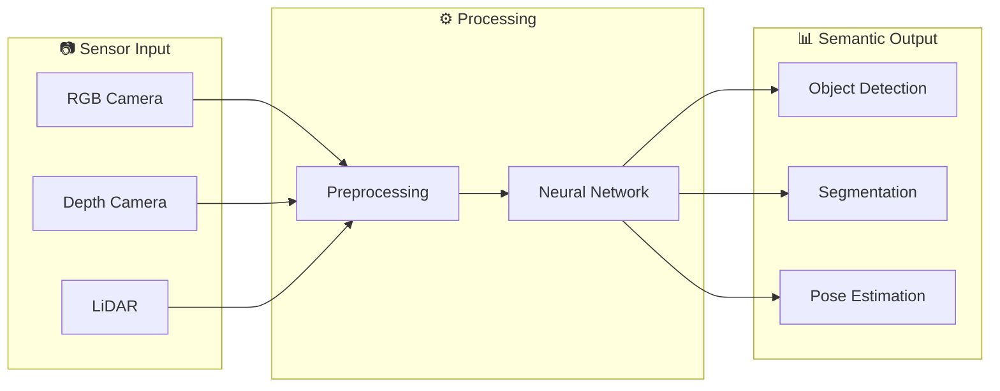
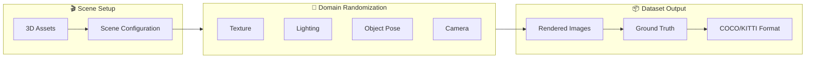
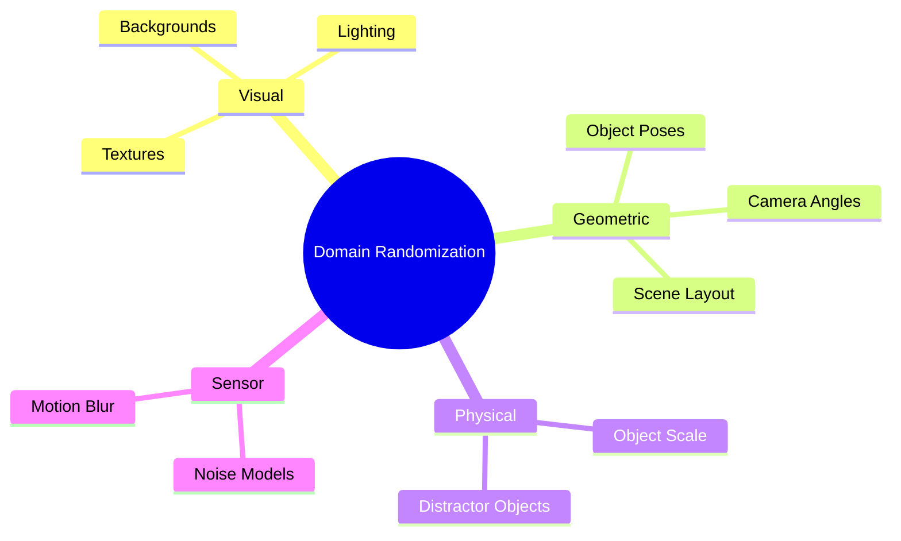
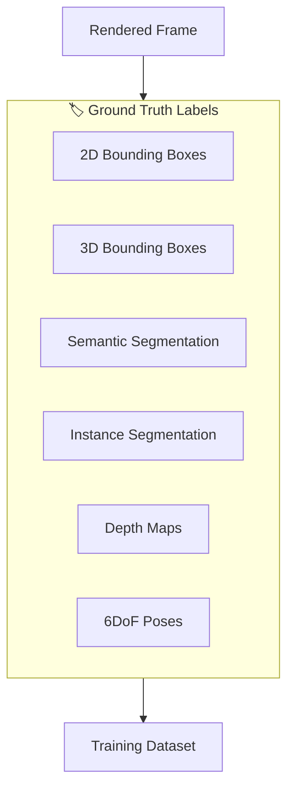
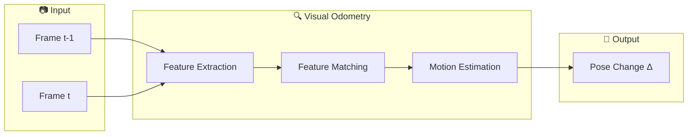
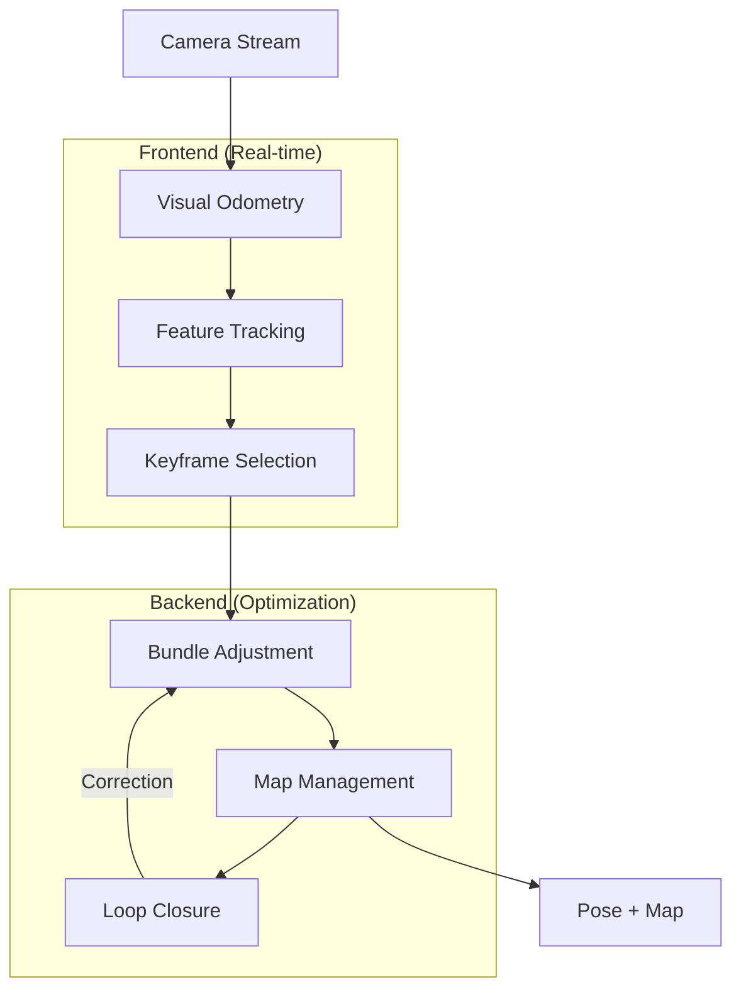
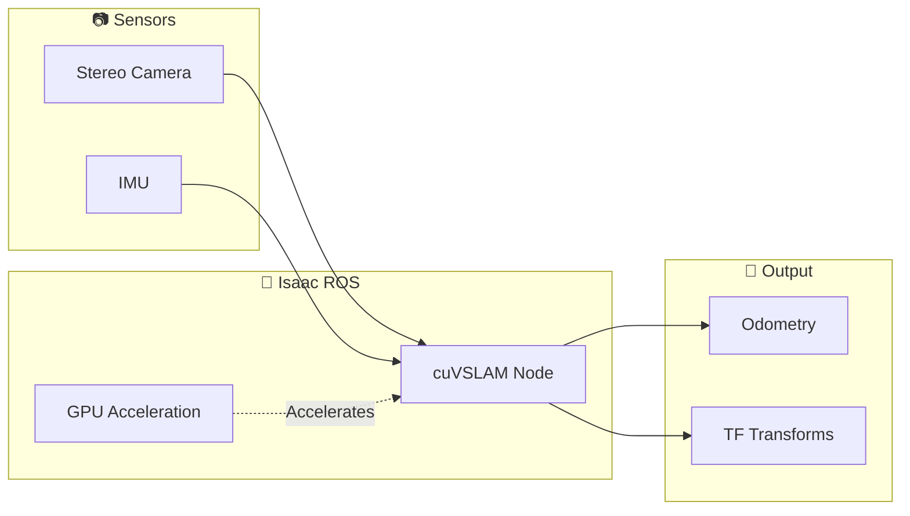
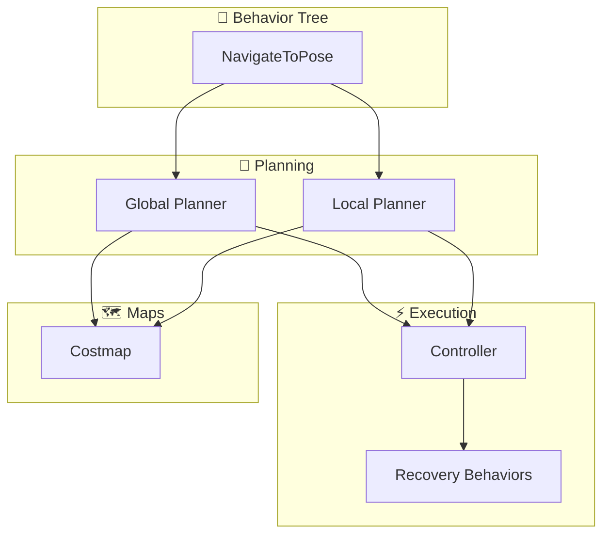
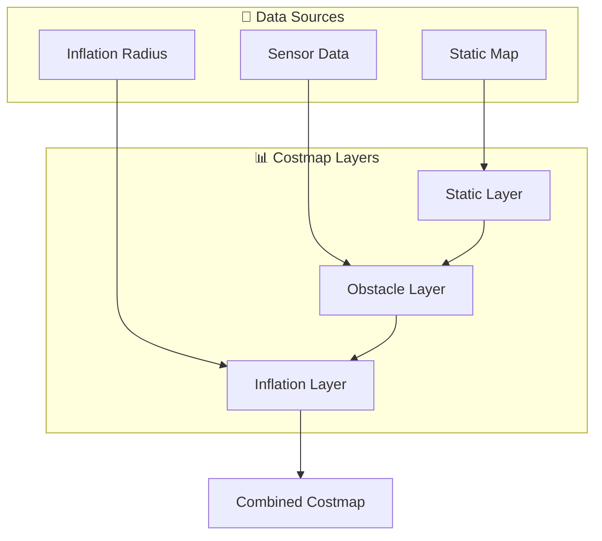
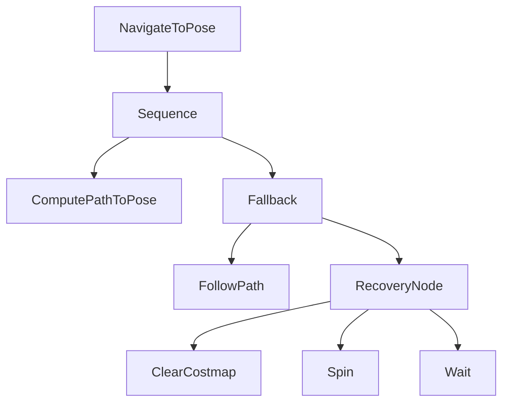

# Module 3 Assets: NVIDIA Isaac Perception & Navigation

**Purpose**: Reusable Mermaid diagrams and code snippets for Module 3 chapters.

---

## Diagrams

### D3.1: Perception Pipeline Flow



### D3.2: Synthetic Data Generation Pipeline



### D3.3: Domain Randomization Types



### D3.4: Ground Truth Types



### D3.5: Visual Odometry Pipeline



### D3.6: VSLAM Architecture



### D3.7: Isaac ROS VSLAM Integration



### D3.8: Nav2 Architecture Overview



### D3.9: Costmap Layer Composition



### D3.10: Global vs Local Planning


### D3.11: Navigation Behavior Tree



---

## Code Snippets

### C3.1: Isaac Sim Replicator Concept

```python
# Conceptual synthetic data generation with Isaac Sim Replicator
import omni.replicator.core as rep

# Create randomized scene
with rep.new_layer():
    # Camera setup
    camera = rep.create.camera(
        position=(0, 0, 2),
        look_at=(0, 0, 0)
    )

    # Domain randomization
    with rep.trigger.on_frame(num_frames=1000):
        rep.randomizer.rotation(
            rep.get.prim("/World/Object"),
            distribution="uniform",
            min=(-180, -180, -180),
            max=(180, 180, 180)
        )
        rep.randomizer.light(
            intensity=(500, 2000)
        )

    # Output configuration
    rep.WriterRegistry.get("BasicWriter")(
        output_dir="/data/synthetic",
        rgb=True,
        bounding_box_2d_tight=True,
        semantic_segmentation=True
    )
```

### C3.2: Isaac ROS VSLAM Launch Concept

```yaml
# config/vslam_params.yaml
isaac_ros_visual_slam:
  ros__parameters:
    enable_slam_visualization: true
    enable_observations_view: true
    enable_landmarks_view: true
    denoise_input_images: false
    rectified_images: true
    enable_imu_fusion: true
    gyro_noise_density: 0.000244
    gyro_random_walk: 0.000019
    accel_noise_density: 0.001862
    accel_random_walk: 0.003
    calibration_frequency: 200.0
```

### C3.3: Nav2 Parameters Concept

```yaml
# config/nav2_params.yaml
bt_navigator:
  ros__parameters:
    default_bt_xml_filename: "navigate_to_pose_w_replanning_and_recovery.xml"

global_costmap:
  ros__parameters:
    update_frequency: 1.0
    publish_frequency: 1.0
    robot_radius: 0.3
    resolution: 0.05
    plugins: ["static_layer", "obstacle_layer", "inflation_layer"]

local_costmap:
  ros__parameters:
    update_frequency: 5.0
    publish_frequency: 2.0
    robot_radius: 0.3
    resolution: 0.05
    plugins: ["obstacle_layer", "inflation_layer"]
```

### C3.4: Costmap Layer Configuration Concept

```yaml
# Costmap layer configuration
static_layer:
  plugin: "nav2_costmap_2d::StaticLayer"
  map_subscribe_transient_local: true

obstacle_layer:
  plugin: "nav2_costmap_2d::ObstacleLayer"
  observation_sources: scan depth
  scan:
    topic: /scan
    max_obstacle_height: 2.0
    clearing: true
    marking: true
  depth:
    topic: /depth/points
    max_obstacle_height: 2.0

inflation_layer:
  plugin: "nav2_costmap_2d::InflationLayer"
  cost_scaling_factor: 3.0
  inflation_radius: 0.55
```

---

## Key Technology Reference

| Component | Technology | Purpose |
|-----------|------------|---------|
| Synthetic Data | Isaac Sim + Replicator | Generate training data with ground truth |
| VSLAM | Isaac ROS cuVSLAM | GPU-accelerated visual SLAM |
| Navigation | Nav2 | Path planning and execution |
| Costmap | Nav2 Costmap 2D | Obstacle representation |
| Behavior | Nav2 BT Navigator | Decision logic for navigation |

---

**Usage**: Import these diagrams and snippets into chapter markdown files using MDX imports or copy-paste.
