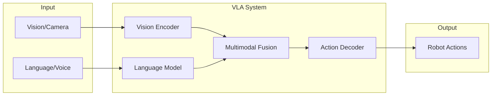
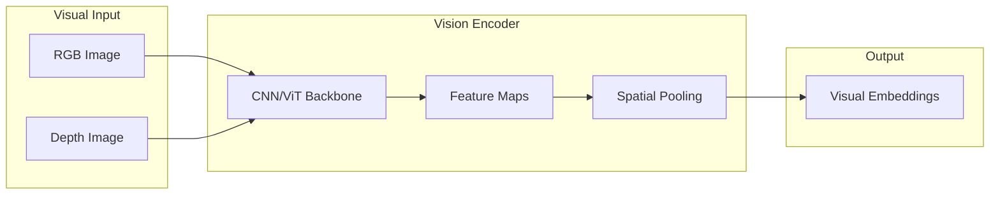
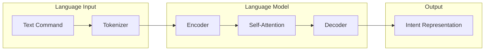
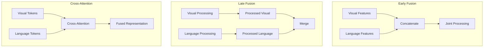
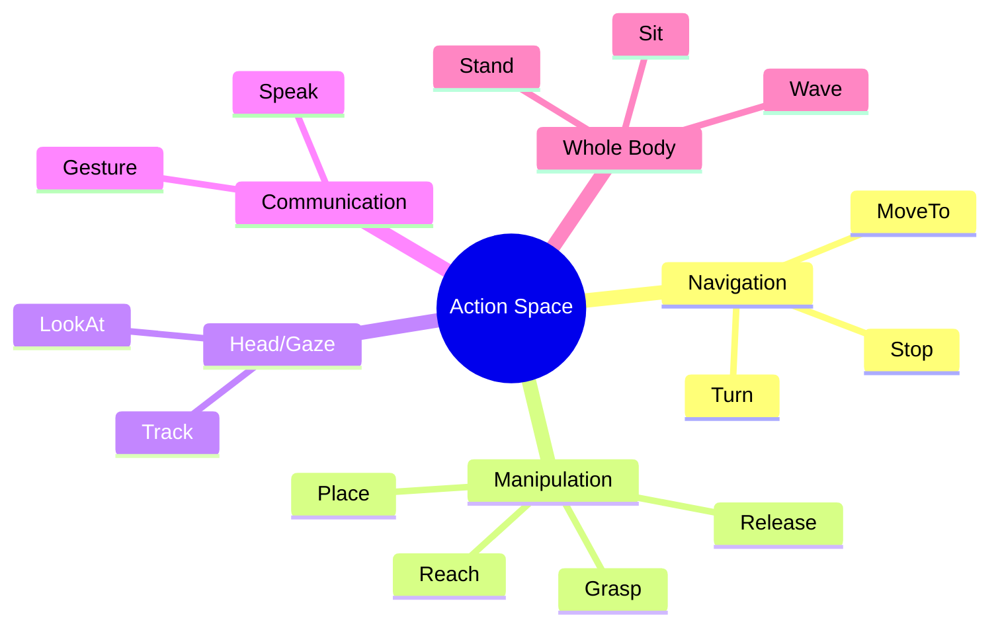
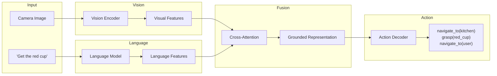

# VLA Architecture: Vision-Language-Action Systems

**Reading Time**: ~45-60 minutes | **Prerequisites**: Modules 1-3, basic neural network understanding

---

## Learning Objectives

By the end of this chapter, you will be able to:

1. Explain why VLA systems are more powerful than single-modality approaches for robot control
2. Identify the three core components of VLA architecture (vision encoder, language model, action decoder)
3. Describe how multimodal fusion combines visual and language inputs
4. Diagram a VLA system showing data flow from inputs to action outputs

---

## 1.1 Introduction to Vision-Language-Action Systems

**"Get me the red cup from the kitchen counter."**

This simple sentence contains an enormous amount of information: a goal (fetch something), a target object (red cup), its properties (red, cup-shaped), and a location (kitchen counter). For a human, executing this is trivial. For a robot, it requires integrating **vision** (to find the cup), **language** (to understand the command), and **action** (to physically retrieve it).

**Vision-Language-Action (VLA)** systems are AI architectures that combine these three modalities into a unified framework for robot control.

### Why VLA Matters

Traditional robots are programmed with explicit rules: "If sensor X reads Y, do Z." This works for structured environments but fails in the real world where:

- Objects vary in appearance
- Instructions are ambiguous
- Situations are unpredictable

VLA systems change this paradigm:

| Traditional Approach | VLA Approach |
|---------------------|--------------|
| Hardcoded object templates | Learns to recognize objects from vision |
| Fixed command vocabulary | Understands natural language |
| Predefined action sequences | Generates flexible action plans |
| Brittle to variation | Robust to novel situations |

### The Robot Brain Analogy

A VLA system is like a robot's **brain** that integrates perception and reasoning:



| Component | Role | Biological Analogy |
|-----------|------|-------------------|
| **Vision Encoder** | Process visual information | Visual cortex |
| **Language Model** | Understand instructions | Language centers |
| **Multimodal Fusion** | Combine information | Association cortex |
| **Action Decoder** | Generate motor commands | Motor cortex |

### Historical Context: From Scripts to Language-Guided Autonomy

```
1980s: Scripted Robots
       ↓ "If obstacle, turn left"
1990s: Sensor-Based Control
       ↓ Reactive behaviors
2000s: Planned Autonomy
       ↓ SLAM, path planning
2010s: Learning-Based Control
       ↓ Deep RL, imitation learning
2020s: Language-Guided VLA
       → Natural instruction understanding
```

The key breakthrough: **Large Language Models** (LLMs) now understand human intent, and **Vision Transformers** can encode visual scenes. Combining them enables robots that truly understand what you want.

### Three Advantages of VLA Systems

1. **Natural Interaction**: Humans give instructions in plain language, not code
2. **Generalization**: Learn concepts that transfer to novel objects and scenes
3. **Flexibility**: Handle open-ended tasks without explicit programming

:::tip Success Check
Explain to a colleague why a VLA system is more capable than a traditional programmed robot. What are three specific advantages?
:::

---

## 1.2 Vision Encoding: Seeing the World

The first component of a VLA system is the **vision encoder**—the module that transforms raw camera images into representations the system can reason about.

### What Does a Vision Encoder Do?

The encoder converts a **high-dimensional image** (millions of pixels) into a **compact representation** (hundreds of features) that captures the essential visual information:



**Example transformation**:
- Input: 640×480×3 RGB image = 921,600 values
- Output: 768-dimensional embedding vector

### Vision Encoder Architectures

Two dominant approaches exist:

#### CNN-Based (ResNet, EfficientNet)

**How it works**: Convolutional layers progressively extract features:
- Early layers: edges, colors
- Middle layers: textures, parts
- Late layers: objects, scenes

**Strengths**: Fast, well-understood, efficient
**Weaknesses**: Limited receptive field, less global reasoning

#### Transformer-Based (ViT, CLIP)

**How it works**: Image split into patches, processed as tokens:
- Patches treated like words in a sentence
- Self-attention captures global relationships
- Learns from massive image-text datasets

**Strengths**: Better global understanding, strong transfer learning
**Weaknesses**: Higher compute requirements

### Visual Embeddings

The output of a vision encoder is a set of **visual embeddings**—vector representations that capture visual content:

| Property | Description |
|----------|-------------|
| **Semantic** | Similar objects have similar embeddings |
| **Spatial** | Some architectures preserve location information |
| **Hierarchical** | Different layers capture different abstraction levels |

### Connection to Module 3: Perception

Vision encoders are the **front-end** of perception systems:

- **Object detection**: Vision encoder + detection head
- **VLA system**: Vision encoder + fusion + action decoder

The same pre-trained vision encoder (e.g., CLIP) can be used for both, but VLA systems use the embeddings for reasoning rather than just classification.

:::tip Success Check
Describe the role of a vision encoder in a VLA system. What is the input and output? Why is converting an image to embeddings useful for robot reasoning?
:::

---

## 1.3 Language Processing: Understanding Commands

The second component is the **language model**—the module that transforms natural language instructions into representations the system can act upon.

### What Does the Language Model Do?

The language model converts **variable-length text** into **semantic representations** that capture meaning:



**Example transformation**:
- Input: "Pick up the red cup"
- Output: Embedding capturing `{action: pickup, target: cup, attribute: red}`

### The Transformer Architecture

Modern language models use the **Transformer** architecture:

| Component | Function |
|-----------|----------|
| **Tokenizer** | Split text into tokens (words/subwords) |
| **Embeddings** | Convert tokens to vectors |
| **Self-Attention** | Relate tokens to each other |
| **Feed-Forward** | Process each position |
| **Output Layer** | Generate predictions or embeddings |

**Key insight**: Self-attention allows the model to understand that "it" in "Pick up the cup and bring it here" refers to "the cup."

### Why LLMs Enable Flexible Robot Instructions

Large Language Models (GPT-4, LLaMA, etc.) trained on internet text understand:

| Capability | Example |
|------------|---------|
| **Intent parsing** | "Get me a drink" → `{action: fetch, target: drink}` |
| **Reference resolution** | "The one on the left" → specific object |
| **Implicit knowledge** | "Drinks" usually means "from the refrigerator" |
| **Paraphrase handling** | "Fetch" = "Get" = "Bring" = "Grab" |

Without LLMs, robots would need explicit programming for every possible phrasing. With LLMs, natural variation is handled automatically.

### Language Embeddings

Like vision encoders, language models produce **embeddings**:

| Property | Description |
|----------|-------------|
| **Semantic similarity** | "Pick up" and "Grab" have similar embeddings |
| **Compositional** | "Red cup" combines "red" and "cup" meanings |
| **Contextual** | Same word has different embeddings in different contexts |

:::tip Success Check
Explain how a language model helps a robot understand "Grab the mug" and "Pick up the cup" as similar commands. What representation does it produce?
:::

---

## 1.4 Multimodal Fusion: Combining Sight and Language

Neither vision nor language alone is sufficient for robot control. The robot needs to know *what it sees* (vision) and *what to do* (language), and crucially, how they relate. **Multimodal fusion** combines these information streams.

### Why Fusion is Necessary

Consider: "Pick up the red cup."

- **Vision alone**: Sees a red cup, blue cup, and plate
- **Language alone**: Understands "pick up red cup" semantically
- **Neither alone knows**: Which visual object matches "red cup"

Fusion connects language references to visual observations—a process called **grounding**.

### Fusion Approaches

Three main strategies exist for combining modalities:



#### Early Fusion

**How it works**: Concatenate raw features from both modalities, process together

**Pros**: Deep integration, joint feature learning
**Cons**: High computational cost, needs aligned data

#### Late Fusion

**How it works**: Process each modality separately, combine final representations

**Pros**: Efficient, can use pre-trained uni-modal models
**Cons**: Limited interaction between modalities

#### Cross-Attention Fusion

**How it works**: One modality "attends" to the other through attention mechanisms

**Pros**: Flexible, grounded reasoning, state-of-the-art performance
**Cons**: Complex architecture, requires careful design

### Cross-Attention: The Modern Approach

Most VLA systems use **cross-attention** where language tokens query visual tokens:

1. Language: "red cup" produces query vectors
2. Vision: Scene produces key-value vectors for each region
3. Attention: "Red cup" query attends to matching visual region
4. Output: Grounded representation (language + where it is visually)

**Result**: The system knows not just that a red cup exists, but *where* it is in the visual field.

### Grounded Reasoning

After fusion, the system has a **grounded representation**:

| Information | Source |
|-------------|--------|
| What action to take | Language instruction |
| What object is involved | Language + visual match |
| Where the object is | Visual spatial information |
| Scene context | Visual scene understanding |

This grounded representation enables the action decoder to generate appropriate motor commands.

:::tip Success Check
A robot sees three objects: a red cup, a blue cup, and a plate. It receives the command "Pick up the red cup." Explain how multimodal fusion enables the robot to know *which* object to target.
:::

---

## 1.5 Action Decoding: From Understanding to Doing

The final component transforms the fused understanding into **executable robot actions**. The action decoder bridges AI reasoning and physical robot control.

### What Does the Action Decoder Do?

The action decoder takes the grounded multimodal representation and outputs actions the robot can execute:



### Action Output Types

VLA systems can output actions in different formats:

| Output Type | Description | Example |
|-------------|-------------|---------|
| **Discrete Tokens** | Symbolic action names | "NAVIGATE", "GRASP" |
| **Continuous Control** | Direct motor commands | Joint velocities, end-effector pose |
| **Hybrid** | Token selects action type, continuous params | "NAVIGATE(x=1.2, y=0.5)" |

### The Action Primitive Catalog

Rather than directly controlling joints, VLA systems typically output **action primitives**—higher-level operations:

| Primitive | Parameters | ROS 2 Interface |
|-----------|------------|-----------------|
| `navigate_to` | pose, tolerance | `nav2_msgs/NavigateToPose` |
| `look_at` | point, duration | Joint trajectory |
| `grasp` | object_id, force | Custom action |
| `release` | - | Custom action |
| `reach` | pose, velocity | MoveIt action |
| `speak` | text | Text-to-speech service |

### Connection to ROS 2

Action primitives map to ROS 2 action servers (covered in detail in Chapter 2):

```
VLA Output: "navigate_to(kitchen)"
     ↓
ROS 2: Send NavigateToPose action goal
     ↓
Nav2: Execute path planning and control
     ↓
Robot: Physically moves to kitchen
```

This architecture separates **reasoning** (what to do) from **execution** (how to do it), enabling modular development.

### The Complete VLA Pipeline

Putting it all together:



**Pipeline trace**:
1. **Input**: Camera sees kitchen scene, voice says "Get me a drink"
2. **Vision Encoder**: Extracts features from scene (objects, layout)
3. **Language Model**: Parses "Get me a drink" → fetch intent
4. **Cross-Attention Fusion**: Grounds "drink" to visible cup/bottle
5. **Action Decoder**: Outputs [navigate_to(kitchen), grasp(cup), navigate_to(user)]
6. **Execution**: ROS 2 actions execute plan on robot

:::tip Success Check
Draw a diagram showing how a VLA system processes "Pick up the apple" from camera input and text to robot action. Label all major components and show data flow.
:::

---

## Chapter Summary

In this chapter, we explored Vision-Language-Action system architecture:

| Component | Function | Input → Output |
|-----------|----------|----------------|
| **Vision Encoder** | Extract visual features | Image → Embeddings |
| **Language Model** | Parse instructions | Text → Semantic vectors |
| **Multimodal Fusion** | Ground language in vision | Both → Grounded representation |
| **Action Decoder** | Generate robot actions | Grounded rep → Action primitives |

**Key takeaways:**

1. VLA systems integrate vision and language for flexible robot control
2. Vision encoders (CNN/ViT) transform images into reasoneable representations
3. Language models enable natural instruction understanding
4. Multimodal fusion (especially cross-attention) grounds language in visual perception
5. Action decoders translate understanding into executable robot commands via ROS 2

---

## What's Next

In Chapter 2, we'll dive into the **voice-to-action pipeline**—tracing how a spoken command like "Fetch the cup" becomes a sequence of ROS 2 action calls that move the robot.

---

## References

- [RT-2: Vision-Language-Action Models](https://robotics-transformer2.github.io/) - Google DeepMind
- [PaLM-E: An Embodied Multimodal Language Model](https://palm-e.github.io/) - Google Research
- [CLIP: Learning Transferable Visual Models](https://openai.com/research/clip) - OpenAI
- [Vision Transformer (ViT)](https://arxiv.org/abs/2010.11929) - Google Research
- [Attention Is All You Need](https://arxiv.org/abs/1706.03762) - Transformer architecture
