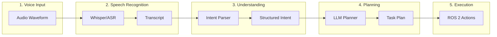
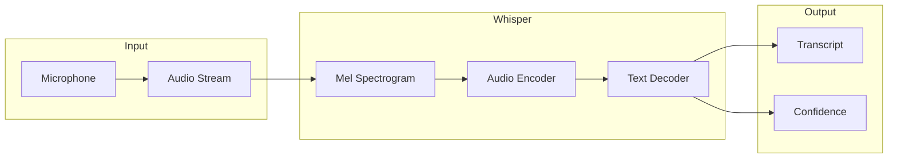
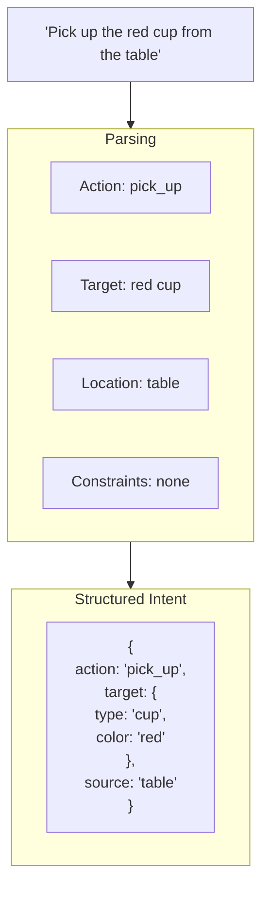
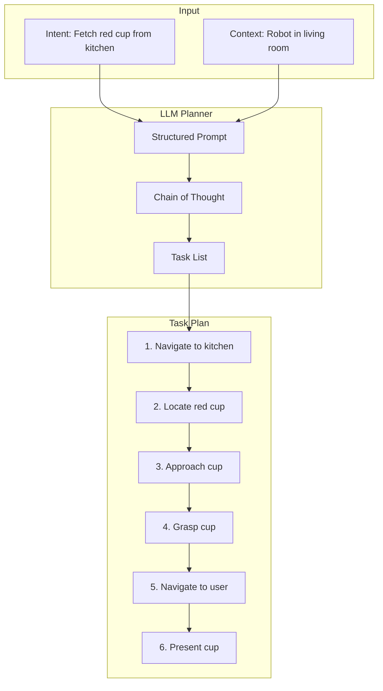
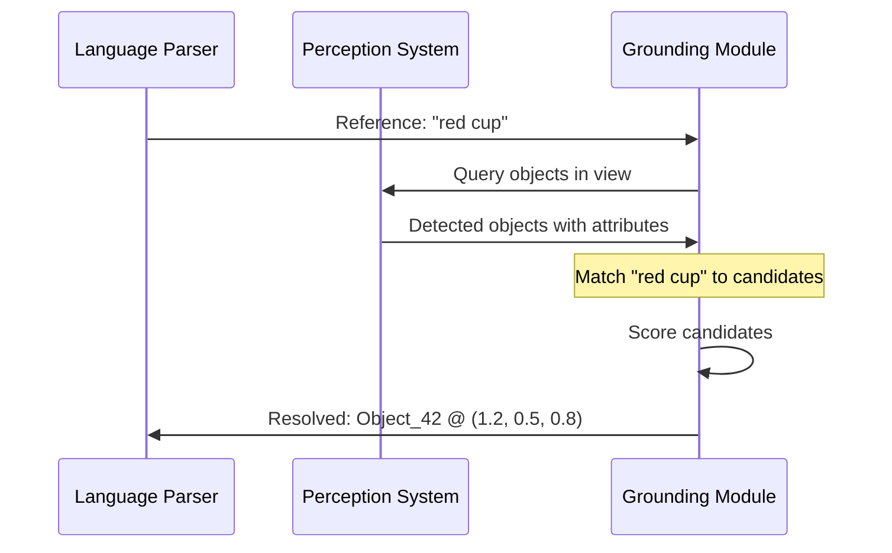
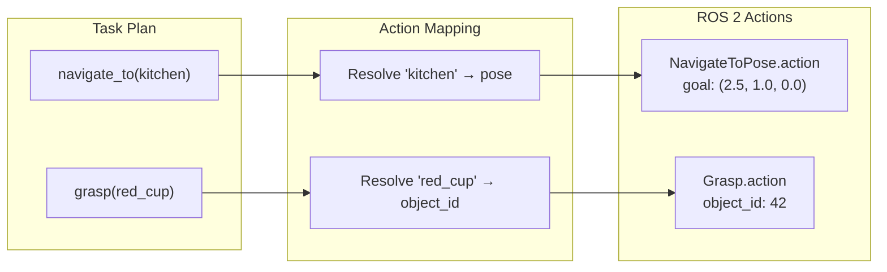

# Voice and Language-Based Robot Planning

**Reading Time**: ~50-65 minutes | **Prerequisites**: Chapter 1 (VLA architecture), Module 1 (ROS 2 actions), Module 3 (perception)

---

## Learning Objectives

By the end of this chapter, you will be able to:

1. Trace a voice command through the complete voice-to-action pipeline
2. Explain how LLMs decompose high-level instructions into executable subtasks
3. Describe the grounding process that maps language to perceived objects
4. Identify how language-based plans map to ROS 2 action servers

---

## 2.1 The Voice-to-Action Pipeline

In Chapter 1, we learned about VLA architecture—how vision and language combine to produce robot actions. Now we focus on the **language path**: from spoken command to executed actions.

### Why Voice?

Voice is the most natural interface for human-robot interaction:
- **No training required**: People already know how to speak
- **Hands-free**: User can point, gesture, or carry objects
- **High bandwidth**: Complex instructions in seconds
- **Contextual**: "Put it over there" with gesture

### The Four-Stage Pipeline

A voice command passes through four stages before becoming robot action:



| Stage | Input | Output | Technology |
|-------|-------|--------|------------|
| **Speech Recognition** | Audio waveform | Text transcript | Whisper, cloud ASR |
| **Intent Parsing** | Text | Structured intent | LLM, NLU model |
| **Task Decomposition** | Intent | Subtask sequence | LLM planner |
| **Execution** | Subtasks | Robot motion | ROS 2 actions |

### End-to-End Example

**Command**: "Bring me the red cup from the kitchen"

1. **Speech**: Audio → "Bring me the red cup from the kitchen"
2. **Intent**: `{action: "fetch", object: "red cup", from: "kitchen", to: "user"}`
3. **Plan**: ["navigate(kitchen)", "find(red cup)", "grasp(red cup)", "navigate(user)", "handover()"]
4. **Execute**: Each subtask becomes a ROS 2 action call

:::tip Success Check
Trace the voice command "Pick up the book on the table" through the four-stage pipeline. What is the output of each stage?
:::

---

## 2.2 Speech Recognition with Whisper

The first stage converts audio into text using **Automatic Speech Recognition (ASR)**.

### What is ASR?

ASR systems convert spoken audio into written text:
- Input: Audio waveform (samples over time)
- Output: Text transcript + confidence scores

### OpenAI Whisper

**Whisper** is OpenAI's open-source ASR model:



### Whisper Capabilities

| Feature | Description |
|---------|-------------|
| **Multi-language** | 99+ languages supported |
| **Robust** | Handles accents, noise, domains |
| **Timestamps** | Word-level timing available |
| **Sizes** | Tiny → Large (speed vs. accuracy) |
| **Open source** | Run locally or via API |

### Handling Recognition Errors

ASR isn't perfect. Strategies for robustness:

| Error Type | Example | Mitigation |
|------------|---------|------------|
| **Misheard words** | "cup" → "cut" | Context-aware correction |
| **Missing words** | "Pick up [the] cup" | Grammar parsing |
| **Added words** | "um, pick up cup" | Filler word removal |
| **Low confidence** | Unclear audio | Ask for confirmation |

### Real-Time vs. Batch Processing

| Mode | Latency | Use Case |
|------|---------|----------|
| **Real-time** | < 1 second | Interactive commands |
| **Batch** | Several seconds | Longer dictations |

For robotics, **streaming ASR** provides the best experience—the robot starts understanding as you speak.

### Conceptual Processing

```python
# Conceptual Whisper usage
import whisper

class SpeechRecognition:
    def __init__(self):
        self.model = whisper.load_model("base")

    def transcribe(self, audio_path: str) -> dict:
        result = self.model.transcribe(audio_path)
        return {
            "text": result["text"],
            "confidence": result.get("confidence", None),
            "language": result["language"]
        }

# Example output:
# {
#   "text": "Bring me the red cup from the kitchen",
#   "confidence": 0.94,
#   "language": "en"
# }
```

:::tip Success Check
What does Whisper output? How would you handle a low-confidence transcription in a safety-critical robot application?
:::

---

## 2.3 Intent Parsing: Understanding What the User Wants

Text alone isn't enough—the robot needs **structured understanding** of what the user wants.

### From Transcript to Intent

**Intent parsing** extracts structured information:



### Intent Components

| Component | Description | Example |
|-----------|-------------|---------|
| **Action Type** | What operation to perform | fetch, place, navigate, look |
| **Target Object** | What to manipulate | cup, book, door |
| **Object Attributes** | Properties of target | red, large, on the left |
| **Source Location** | Where object is | kitchen, table, shelf |
| **Destination** | Where to go/place | user, counter, box |
| **Constraints** | Timing, ordering | quickly, carefully, after |

### LLM-Based Intent Extraction

Modern systems use LLMs for intent parsing:

```python
# Conceptual intent extraction
INTENT_PROMPT = """
Extract the intent from this robot command.
Return JSON with: action, target (with attributes), source, destination.

Command: "{command}"

JSON:
"""

def extract_intent(transcript: str) -> dict:
    prompt = INTENT_PROMPT.format(command=transcript)
    response = llm.complete(prompt)
    return json.loads(response)

# Input: "Put the big red box on the top shelf"
# Output: {
#   "action": "place",
#   "target": {"type": "box", "size": "big", "color": "red"},
#   "destination": {"type": "shelf", "position": "top"}
# }
```

### Handling Ambiguity

Commands are often ambiguous:

| Ambiguity | Example | Resolution Strategy |
|-----------|---------|---------------------|
| **Missing info** | "Get me a drink" | Ask: "Which drink?" or infer |
| **Multiple targets** | "Get the cup" (3 cups visible) | Ground to perception (Section 2.5) |
| **Unclear reference** | "Put it there" | Use context: recent object, pointed location |
| **Vague action** | "Help me with this" | Ask for clarification |

### Intent vs. Task Plan

**Intent** is *what* the user wants; **Task Plan** is *how* to achieve it:

- Intent: `{action: "fetch", target: "cup", source: "kitchen"}`
- Plan: `[navigate(kitchen), find(cup), approach(cup), grasp(cup), navigate(user)]`

The next section covers task decomposition.

:::tip Success Check
Parse this command into a structured intent: "Carefully move the fragile vase from the living room to the kitchen counter."
:::

---

## 2.4 Task Decomposition: Breaking Down Complex Instructions

High-level instructions like "Make me a coffee" require many steps. **Task decomposition** breaks these into executable subtasks.

### Why Decomposition?

Robots can't execute "Make coffee" directly. They need atomic actions:
1. Navigate to kitchen
2. Locate coffee maker
3. Check for coffee grounds
4. ...

### LLM as Task Planner

LLMs excel at task decomposition because they understand:
- Common task structures
- Physical constraints
- Logical dependencies



### Decomposition Prompt Structure

```python
DECOMPOSITION_PROMPT = """
You are a robot task planner. Given a high-level command and context,
decompose it into a sequence of primitive actions.

Available primitives:
- navigate_to(location): Move robot to location
- look_at(target): Direct gaze at target
- find(object): Search for object in current view
- approach(object): Move close to object
- grasp(object): Pick up object
- release(): Release held object
- speak(text): Say something

Context:
- Robot location: {robot_location}
- Detected objects: {detected_objects}
- Held object: {held_object}

Command: {command}

Respond with a JSON array of actions with parameters.
"""
```

### Task Plan Structure

A good task plan includes:

```json
{
  "goal": "Fetch red cup from kitchen",
  "subtasks": [
    {
      "id": 1,
      "action": "navigate_to",
      "params": {"location": "kitchen"},
      "preconditions": [],
      "expected_result": "robot in kitchen"
    },
    {
      "id": 2,
      "action": "find",
      "params": {"object": "red cup"},
      "preconditions": [1],
      "expected_result": "red cup located"
    },
    {
      "id": 3,
      "action": "approach",
      "params": {"object": "red cup"},
      "preconditions": [2],
      "expected_result": "robot near cup"
    },
    {
      "id": 4,
      "action": "grasp",
      "params": {"object": "red cup"},
      "preconditions": [3],
      "expected_result": "cup in gripper"
    },
    {
      "id": 5,
      "action": "navigate_to",
      "params": {"location": "user"},
      "preconditions": [4],
      "expected_result": "robot at user"
    }
  ]
}
```

### Handling Dependencies

Subtasks have dependencies:
- `grasp(cup)` requires `approach(cup)` first
- `approach(cup)` requires `find(cup)` first
- `find(cup)` requires being in the right location

The planner must respect these **preconditions**.

### Failure and Replanning

What if a subtask fails?
- `find(red cup)` fails → Search other locations? Ask user?
- `grasp(cup)` fails → Retry? Report failure?

Advanced systems include **fallback strategies** in the plan.

:::tip Success Check
Decompose this command into subtasks: "Clear the table and put the dishes in the dishwasher." What dependencies exist between subtasks?
:::

---

## 2.5 Grounding: Connecting Language to Perception

**Grounding** answers the question: "When the user says 'the red cup,' which physical object do they mean?"

### The Grounding Problem

Language references are abstract; the robot needs concrete targets:

- User says: "the red cup"
- Robot sees: Objects at positions [(1.2, 0.5), (1.5, 0.8), (2.0, 1.2)]
- Question: Which one is "the red cup"?

### Grounding Process



### Grounding with Perception

The grounding module uses perception outputs from Module 3:

| Perception Output | Grounding Use |
|-------------------|---------------|
| **Object detection** | List of objects with bounding boxes |
| **Classification** | Object categories (cup, bottle, book) |
| **Attributes** | Color, size, material |
| **Segmentation** | Precise object boundaries |
| **Pose estimation** | 3D position for manipulation |

### Multi-Object Disambiguation

When multiple objects match:

```
User: "Get the cup"
Robot sees: [cup_1 (red), cup_2 (blue), cup_3 (green)]
```

Strategies:
1. **Ask for clarification**: "Which cup—the red, blue, or green one?"
2. **Use recency**: The cup most recently discussed
3. **Use salience**: The most visible/prominent cup
4. **Use context**: "Get the cup" after "I need something to drink" → assume drinking cup

### Grounding Confidence

Not all groundings are certain:

| Confidence | Action |
|------------|--------|
| **High (\>0.9)** | Proceed with action |
| **Medium (0.7-0.9)** | Proceed but monitor |
| **Low (\<0.7)** | Ask for confirmation |

### Conceptual Grounding Module

```python
class GroundingModule:
    def __init__(self, detector, embedder):
        self.detector = detector  # Object detector
        self.embedder = embedder  # CLIP-like embedder

    def ground(self, reference: str, image) -> dict:
        # Detect all objects
        detections = self.detector.detect(image)

        # Embed the language reference
        ref_embedding = self.embedder.encode_text(reference)

        # Score each detection
        scores = []
        for det in detections:
            crop = image[det.bbox]
            img_embedding = self.embedder.encode_image(crop)
            score = cosine_similarity(ref_embedding, img_embedding)
            scores.append((det, score))

        # Return best match
        best = max(scores, key=lambda x: x[1])
        return {
            "object_id": best[0].id,
            "pose": best[0].pose,
            "confidence": best[1]
        }
```

:::tip Success Check
The robot sees three mugs: white (left), red (center), blue (right). The user says "Give me the one in the middle." Describe the grounding process to resolve this reference.
:::

---

## 2.6 Mapping to ROS 2 Action Primitives

The final stage converts planned subtasks into **ROS 2 action calls** that control the robot.

### What Are Action Primitives?

**Action primitives** are atomic robot capabilities:
- Validated and tested
- Safe to execute
- Provide feedback and results

### Action Primitive Catalog

| Primitive | Parameters | ROS 2 Interface | Description |
|-----------|------------|-----------------|-------------|
| `navigate_to` | pose, tolerance | `nav2_msgs/NavigateToPose` | Move to location |
| `look_at` | point, duration | Joint trajectory | Direct gaze |
| `grasp` | object_id, force | Custom action | Close gripper |
| `release` | - | Custom action | Open gripper |
| `reach` | pose, velocity | MoveIt action | Move arm |
| `speak` | text | TTS service | Text-to-speech |
| `wait` | duration | Timer | Pause execution |

### Subtask to Action Mapping



### Action Execution Flow

```python
# Conceptual action execution
class ActionExecutor:
    def __init__(self, node):
        self.nav_client = ActionClient(
            node, NavigateToPose, 'navigate_to_pose'
        )
        self.grasp_client = ActionClient(
            node, Grasp, 'grasp'
        )

    async def execute_plan(self, plan: list):
        for subtask in plan:
            result = await self.execute_subtask(subtask)
            if not result.success:
                return self.handle_failure(subtask, result)
        return PlanResult(success=True)

    async def execute_subtask(self, subtask):
        if subtask.action == "navigate_to":
            return await self.navigate(subtask.params)
        elif subtask.action == "grasp":
            return await self.grasp(subtask.params)
        # ... other actions
```

### Execution Monitoring

ROS 2 actions provide feedback during execution:

| Feedback | Use |
|----------|-----|
| **Progress** | Show status to user |
| **Intermediate state** | Detect problems early |
| **Preemption** | Allow cancellation |

### Actions vs. Services

| When to Use | Interface | Why |
|-------------|-----------|-----|
| **Long-running tasks** | Action | Feedback, preemption |
| **Quick operations** | Service | Simpler, blocking OK |
| **Continuous streams** | Topic | No response needed |

Navigation, manipulation → **Actions**
Configuration, queries → **Services**

### Error Handling

When an action fails:

```python
async def handle_failure(self, subtask, result):
    if result.error == "OBJECT_NOT_FOUND":
        # Try to find object
        search_result = await self.search(subtask.params.object)
        if search_result.found:
            return await self.execute_subtask(subtask)  # Retry
        else:
            return await self.ask_user("I can't find the object")

    elif result.error == "NAVIGATION_FAILED":
        # Try alternative path
        return await self.navigate_alternative(subtask.params)

    else:
        return PlanResult(success=False, error=result.error)
```

:::tip Success Check
The task plan includes "grasp(coffee_mug)". Describe how this maps to a ROS 2 action: What information is needed? What feedback might be received during execution?
:::

---

## Chapter Summary

In this chapter, we traced the complete voice-to-action pipeline:

| Stage | Input | Output | Technology |
|-------|-------|--------|------------|
| **Speech Recognition** | Audio | Text transcript | Whisper |
| **Intent Parsing** | Text | Structured intent | LLM |
| **Task Decomposition** | Intent | Subtask sequence | LLM planner |
| **Grounding** | Language references | Object poses | Perception + embedding |
| **Action Execution** | Subtasks | Robot motion | ROS 2 actions |

**Key takeaways:**

1. Voice-to-action requires four stages: recognition, parsing, planning, execution
2. Speech recognition (Whisper) converts audio to text with confidence scores
3. Intent parsing extracts structured meaning from natural language
4. LLMs can decompose complex instructions into executable subtask sequences
5. Grounding resolves language references to specific perceived objects
6. Action primitives provide safe, validated robot capabilities via ROS 2

---

## What's Next

In Chapter 3, we'll bring everything together in the **Capstone**—tracing a complete autonomous task from voice command through all four modules to robot action.

---

## References

- [OpenAI Whisper](https://github.com/openai/whisper)
- [LangChain for Robotics](https://python.langchain.com/docs/use_cases/robotics)
- [ROS 2 Actions Documentation](https://docs.ros.org/en/humble/Tutorials/Intermediate/Writing-an-Action-Server-Client/Cpp.html)
- [CLIP for Grounding](https://openai.com/research/clip)
- [SayCan: Grounding Language in Robot Affordances](https://say-can.github.io/)
