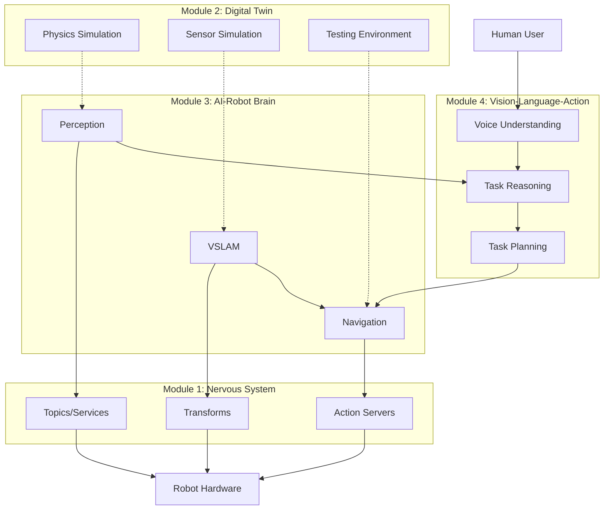
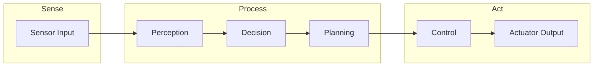
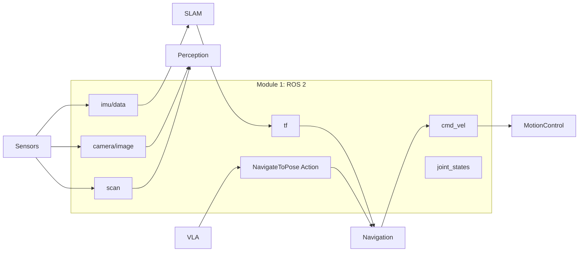
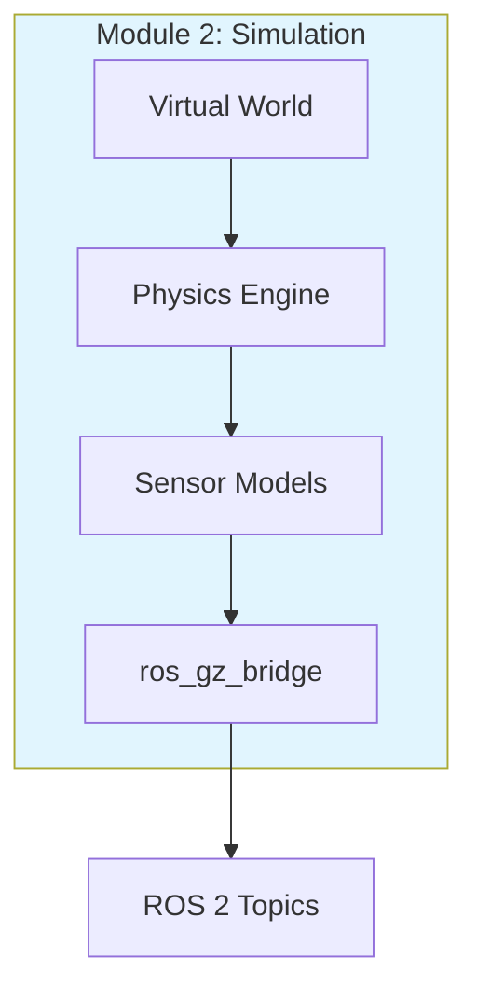
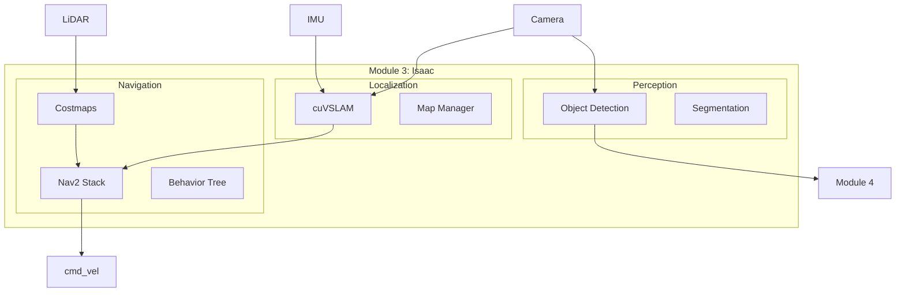
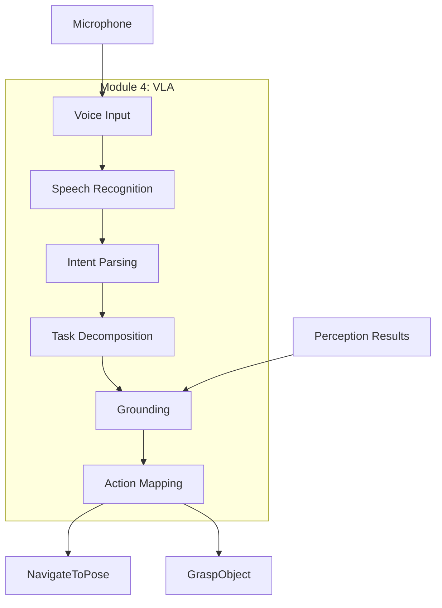
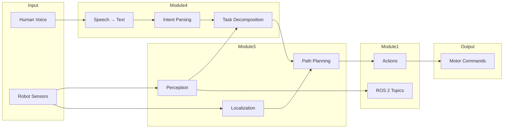
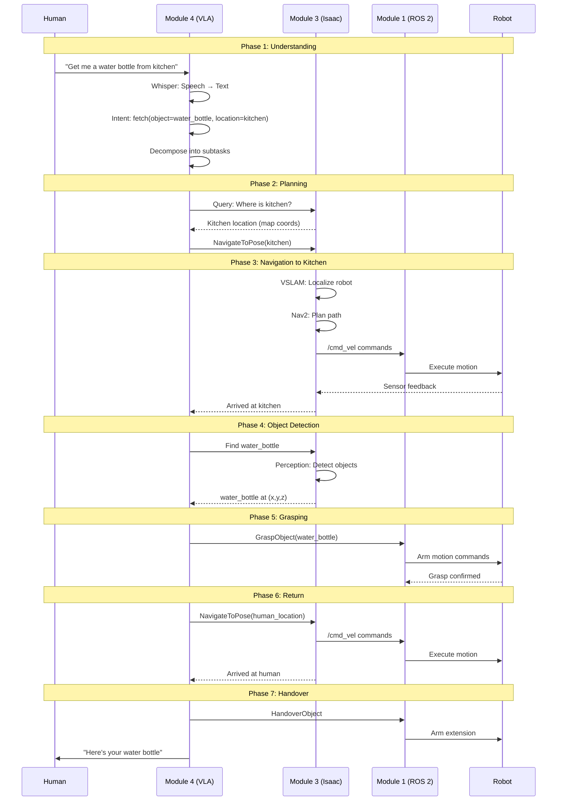
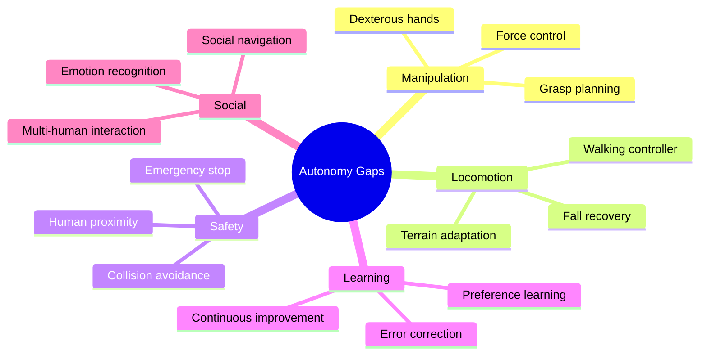

# Capstone: The Autonomous Humanoid

**Reading Time**: ~60-90 minutes | **Prerequisites**: All previous chapters (Modules 1-4, Chapters 1-2)

---

## Learning Objectives

By the end of this chapter, you will be able to:

1. Diagram the complete autonomy stack showing all four modules' contributions
2. Trace an autonomous task from human command through every processing stage to completion
3. Identify which module handles each component of autonomous behavior
4. Evaluate a humanoid system design and identify gaps for full autonomy

---

## 3.1 The Complete Autonomy Stack

Throughout this book, we've explored individual capabilities: communication, simulation, perception, navigation, and reasoning. Now we bring them together into a **complete autonomy stack**.

### The Layered Architecture

An autonomous humanoid robot requires multiple capability layers:



### Module Contributions to Autonomy

| Module | Layer | Contribution to Autonomy |
|--------|-------|--------------------------|
| **Module 1** | Foundation | Communication backbone, data transport, coordination |
| **Module 2** | Development | Safe testing, synthetic training data, validation |
| **Module 3** | Capabilities | Perception, localization, navigation, motion planning |
| **Module 4** | Intelligence | Language understanding, reasoning, task planning |

### The Vertical Slice Concept

A **vertical slice** traces a single capability from sensors to actuators:



Every autonomous action follows this pattern:
1. **Sense**: Gather information (cameras, LiDAR, IMU)
2. **Process**: Understand, decide, plan (perception, reasoning, navigation)
3. **Act**: Execute motion (control commands, joint movements)

### Integration Points

Each module connects to others through well-defined interfaces:

| From Module | To Module | Interface | Data |
|-------------|-----------|-----------|------|
| 2 → 3 | Simulation → Perception | ROS 2 topics | Sensor messages |
| 3 → 1 | VSLAM → TF | Transform tree | Robot pose |
| 4 → 3 | Planning → Navigation | Nav2 goals | Target poses |
| 3 → 1 | Navigation → Control | /cmd_vel | Velocity commands |
| 1 → Hardware | Topics → Motors | Joint commands | Position/torque |

:::tip Success Check
Name the four modules and their primary contribution to autonomy. What is a "vertical slice" in the context of autonomous systems?
:::

---

## 3.2 Module Integration Architecture

Let's examine how the four modules work together with specific data pathways.

### Module 1: ROS 2 as Communication Backbone

**Role**: All inter-module communication flows through ROS 2



**Key ROS 2 interfaces**:

| Topic/Action | Type | Purpose |
|--------------|------|---------|
| `/camera/image` | sensor_msgs/Image | Visual perception input |
| `/scan` | sensor_msgs/PointCloud2 | LiDAR for navigation |
| `/imu/data` | sensor_msgs/Imu | Balance and orientation |
| `/tf` | tf2_msgs/TFMessage | Coordinate transforms |
| `/cmd_vel` | geometry_msgs/Twist | Velocity commands |
| `NavigateToPose` | nav2_msgs/action | Navigation goals |

### Module 2: Simulation for Development

**Role**: Provides safe development and testing environment



**Simulation enables**:
- Training perception models with synthetic data
- Testing navigation in virtual environments
- Validating full autonomy pipeline before hardware

### Module 3: Perception and Navigation

**Role**: Robot's ability to see, locate itself, and move



### Module 4: High-Level Reasoning

**Role**: Understanding intent and planning actions



### Complete Data Flow



:::tip Success Check
Which module handles coordinate transforms? Which module converts voice to text? How does Module 4 send navigation goals to Module 3?
:::

---

## 3.3 Scenario: "Fetch a Drink from the Kitchen"

Let's trace a complete autonomous task through all modules.

### The Command

A human says: **"Hey robot, get me a water bottle from the kitchen."**

### Complete Sequence



### Step-by-Step Breakdown

#### Phase 1: Voice Understanding (Module 4)

| Step | Process | Input | Output |
|------|---------|-------|--------|
| 1.1 | Audio capture | Human speech | Audio waveform |
| 1.2 | Whisper ASR | Audio | "Get me a water bottle from kitchen" |
| 1.3 | Intent parsing | Text | `{action: fetch, object: water_bottle, location: kitchen}` |
| 1.4 | Task decomposition | Intent | Subtask list |

**Subtasks generated**:
1. Navigate to kitchen
2. Find water bottle
3. Grasp water bottle
4. Navigate to human
5. Hand over object

#### Phase 2: Task Planning (Module 4 + Module 3)

| Step | Process | Input | Output |
|------|---------|-------|--------|
| 2.1 | Location query | "kitchen" | Semantic map lookup |
| 2.2 | Grounding | "kitchen" + map | Pose (5.0, 3.0, 0.0) |
| 2.3 | Goal creation | Pose | NavigateToPose goal |

#### Phase 3: Navigation (Module 3)

| Step | Process | Input | Output |
|------|---------|-------|--------|
| 3.1 | Localization | Camera, IMU | Current pose in /tf |
| 3.2 | Global planning | Current + goal pose | Path waypoints |
| 3.3 | Local planning | Path + costmap | Velocity trajectory |
| 3.4 | Control | Trajectory | /cmd_vel |
| 3.5 | Execution | /cmd_vel | Robot motion |

#### Phase 4: Object Detection (Module 3)

| Step | Process | Input | Output |
|------|---------|-------|--------|
| 4.1 | Image capture | Camera | RGB image |
| 4.2 | Object detection | Image | Bounding boxes |
| 4.3 | Object matching | "water_bottle" + boxes | Target object |
| 4.4 | 3D localization | Depth + detection | Object pose |

#### Phase 5: Grasping (Module 1 + Hardware)

| Step | Process | Input | Output |
|------|---------|-------|--------|
| 5.1 | Grasp planning | Object pose | Grasp trajectory |
| 5.2 | Arm motion | Trajectory | Joint commands |
| 5.3 | Gripper control | Grasp point | Gripper close |
| 5.4 | Verification | Force sensors | Grasp success |

#### Phase 6-7: Return and Handover

Repeat navigation to human location, then execute handover motion.

### Error Handling

| Phase | Potential Error | Recovery Action |
|-------|-----------------|-----------------|
| Navigation | Path blocked | Nav2 recovery: spin, backup, replan |
| Object detection | Object not found | Move to better viewpoint, re-scan |
| Grasping | Grasp failed | Retry with adjusted approach |
| Handover | Human not ready | Wait, prompt verbally |

:::tip Success Check
Trace the "fetch water bottle" task through all four modules. At which phase does the robot use VSLAM? At which phase does it use perception?
:::

---

## 3.4 Data Flow Tracing

Let's trace the specific data transformations at each stage.

### Message Types by Stage

```mermaid
flowchart TD
    subgraph Voice["Voice Input"]
        Audio[audio_msgs/Audio<br/>16kHz waveform]
    end

    subgraph ASR["Speech Recognition"]
        Text[std_msgs/String<br/>"get me water bottle"]
    end

    subgraph Intent["Intent Processing"]
        Struct[custom_msgs/Intent<br/>action, object, location]
    end

    subgraph Navigation["Navigation"]
        Goal[geometry_msgs/PoseStamped<br/>x, y, theta]
        Path[nav_msgs/Path<br/>waypoints]
        Vel[geometry_msgs/Twist<br/>linear, angular vel]
    end

    subgraph Perception["Perception"]
        Image[sensor_msgs/Image<br/>RGB 640x480]
        Detection[vision_msgs/Detection3D<br/>class, pose, confidence]
    end

    Audio --> Text --> Struct --> Goal --> Path --> Vel
    Image --> Detection --> Struct
```

### Data Transformation Summary

| Stage | Input | Processing | Output | Module |
|-------|-------|------------|--------|--------|
| **Speech capture** | Microphone | ADC sampling | audio_msgs/Audio | M1 |
| **ASR** | Audio waveform | Whisper inference | Text string | M4 |
| **Intent parsing** | Text | NLU/LLM | Structured intent | M4 |
| **Grounding** | Intent + map | Semantic lookup | Target pose | M4 |
| **Localization** | Camera, IMU | cuVSLAM | Robot pose in /tf | M3 |
| **Global planning** | Poses, costmap | A*/Dijkstra | Path waypoints | M3 |
| **Local planning** | Path, obstacles | DWB/TEB | Velocity trajectory | M3 |
| **Control** | Velocities | Footstep planning | Joint commands | M1 |
| **Perception** | Camera image | Object detection | 3D detections | M3 |
| **Grasp planning** | Object pose | Motion planning | Arm trajectory | M1 |

### Timing Considerations

| Component | Typical Latency | Update Rate |
|-----------|-----------------|-------------|
| Speech recognition | 200-500 ms | On demand |
| Intent parsing | 50-200 ms | On demand |
| LLM task planning | 500-2000 ms | On demand |
| Object detection | 20-50 ms | 10-30 Hz |
| VSLAM localization | 10-30 ms | 30-60 Hz |
| Navigation planning | 100-500 ms | 1-5 Hz (replan) |
| Local control | 5-10 ms | 100-200 Hz |

### Bottlenecks and Considerations

| Bottleneck | Impact | Mitigation |
|------------|--------|------------|
| LLM latency | Slow response to commands | Local models, caching |
| Perception frame rate | Missed obstacles | GPU acceleration |
| Navigation replanning | Jerky motion | Predictive planning |
| Communication delays | Control instability | Real-time ROS 2 |

:::tip Success Check
What message type carries velocity commands? What is the typical latency for object detection? Why is local control much faster than navigation planning?
:::

---

## 3.5 Gaps and Future Directions

This book provides the conceptual foundation, but **true humanoid autonomy** requires additional capabilities.

### What This Book Covers vs. What's Missing

| Capability | Book Coverage | Gap |
|------------|---------------|-----|
| **Communication** | Complete | - |
| **Simulation** | Complete | - |
| **Perception** | Concepts + Isaac | Detailed training pipelines |
| **Localization** | VSLAM concepts | Multi-sensor fusion |
| **Navigation** | Nav2 architecture | Humanoid-specific planners |
| **Voice understanding** | Pipeline overview | Production ASR integration |
| **Task planning** | LLM decomposition | Real-time re-planning |
| **Manipulation** | Action interface | Full grasp planning |
| **Balance control** | Mentioned | Full walking controller |

### Gap Analysis



### Key Gaps Detailed

#### 1. Manipulation Beyond Concepts

| What We Covered | What's Needed |
|-----------------|---------------|
| Grasp action interface | Full motion planning |
| Conceptual pipeline | Force/torque feedback |
| ROS 2 action client | Collision-aware planning |

**Future work**: MoveIt 2 integration, tactile sensing, learned manipulation policies

#### 2. Safety for Real-World Deployment

| Safety Aspect | Current State | Required |
|---------------|---------------|----------|
| Collision detection | Costmap avoidance | Full-body checking |
| Human safety | Basic awareness | ISO 10218 compliance |
| Emergency stop | Software stop | Hardware E-stop |
| Fault handling | Recovery behaviors | Comprehensive fault tree |

**Future work**: Safety-rated controllers, certified systems, human-robot collaboration standards

#### 3. Multi-Robot Coordination

| Aspect | Single Robot | Multi-Robot |
|--------|--------------|-------------|
| Localization | Self-only | Shared maps |
| Task planning | Individual | Distributed allocation |
| Communication | To operator | Robot-to-robot |
| Collision avoidance | Static obstacles | Other robots |

**Future work**: Fleet management, distributed SLAM, collaborative manipulation

#### 4. Continuous Learning

| Current Approach | Limitation | Future Direction |
|------------------|------------|------------------|
| Pre-trained models | Static knowledge | Online adaptation |
| Fixed behaviors | No improvement | Learning from feedback |
| Explicit programming | Brittleness | Imitation learning |

**Future work**: Reinforcement learning, preference learning, sim-to-real transfer

### Research Frontiers

| Frontier | Description | Key Challenge |
|----------|-------------|---------------|
| **End-to-end VLA** | Direct vision-to-action models | Generalization |
| **Foundation models for robotics** | Large pre-trained robot models | Training data |
| **Sim-to-real transfer** | Simulation-trained policies on real robots | Domain gap |
| **Human-robot collaboration** | Working alongside humans | Predictability |

### What You Can Build Now

With the concepts from this book, you can:

| Capability | Modules Used | Achievable |
|------------|--------------|------------|
| Voice-controlled navigation | M1, M3, M4 | Yes |
| Object finding | M1, M3 | Yes |
| Basic pick-and-place | M1, M3, M4 | Conceptually |
| Simulated full autonomy | M1, M2, M3, M4 | Yes |
| Real-world deployment | All | With additional work |

:::tip Success Check
List three major gaps between this book and production humanoid autonomy. What additional capability would be most important for real-world deployment?
:::

---

## Chapter Summary

In this capstone chapter, we integrated all four modules into a complete autonomy stack:

| Module | Role | Key Integration |
|--------|------|-----------------|
| **Module 1** | Communication backbone | Topics, services, actions, transforms |
| **Module 2** | Development environment | Simulation for testing and training |
| **Module 3** | Robot capabilities | Perception, VSLAM, navigation |
| **Module 4** | Intelligence | Voice understanding, task planning |

**Key takeaways:**
1. Autonomous humanoid robots require integration of multiple capability layers
2. Each module contributes essential functionality to the autonomy stack
3. A complete autonomous task flows through perception, reasoning, and action
4. Understanding data flow helps identify integration challenges
5. Current technology has gaps that future work will address
6. This book provides the conceptual foundation for building autonomous systems

---

## Synthesis Questions

Test your understanding of the complete autonomy stack:

1. **Draw the autonomy stack** and label which module handles each layer
2. **Trace "pick up the blue book"** through the complete pipeline—what message types flow?
3. **If navigation fails mid-task**, which modules are involved in recovery?
4. **What would need to be added** for outdoor autonomous operation?
5. **How would multi-robot coordination** change the architecture?

---

## Book Conclusion

Congratulations! You've completed the **Physical AI & Humanoid Robotics** conceptual guide.

### What You've Learned

| Module | Key Concepts |
|--------|--------------|
| **Module 1** | ROS 2 architecture, pub/sub, services, URDF |
| **Module 2** | Digital twins, physics simulation, sensor models |
| **Module 3** | AI perception, VSLAM, Nav2 navigation |
| **Module 4** | VLA systems, voice-to-action, task planning |

### Your Foundation

You now have the conceptual foundation to:
- Understand humanoid robot system architecture
- Read technical papers and documentation with context
- Design integration between perception, planning, and control
- Evaluate autonomous system designs
- Identify where to dive deeper based on your interests

### Next Steps

1. **Hands-on practice**: Set up ROS 2, run simulations, experiment with Isaac
2. **Deep dives**: Pick one area (perception, navigation, VLA) and go deeper
3. **Build projects**: Start small—voice-controlled turtlebot, then scale up
4. **Join the community**: ROS Discourse, Isaac forums, robotics Discord servers

---

## References

- [ROS 2 Documentation](https://docs.ros.org/en/humble/)
- [NVIDIA Isaac Documentation](https://developer.nvidia.com/isaac)
- [Nav2 Documentation](https://navigation.ros.org/)
- [OpenAI Whisper](https://github.com/openai/whisper)
- [Gazebo Documentation](https://gazebosim.org/docs)
