# Module 4 Assets: Vision-Language-Action & Autonomy

**Purpose**: Reusable Mermaid diagrams and code snippets for Module 4 chapters.

---

## Diagrams

### D4.1: VLA System Overview

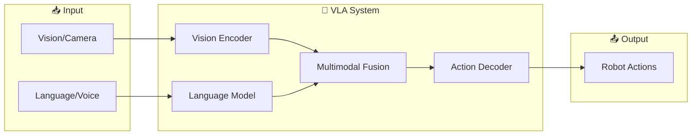

### D4.2: Vision Encoder Pipeline

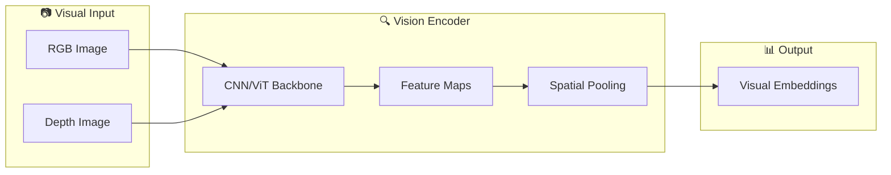

### D4.3: Language Model in VLA

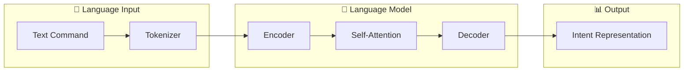

### D4.4: Multimodal Fusion Approaches

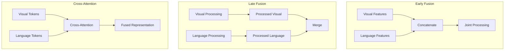

### D4.5: Action Space for Humanoids

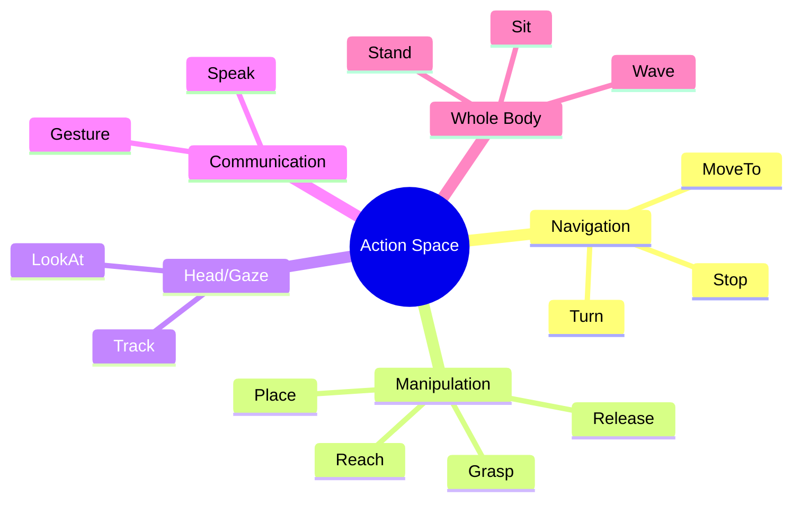

### D4.6: Voice-to-Action Pipeline

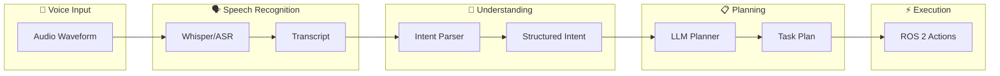

### D4.7: Whisper Speech Pipeline

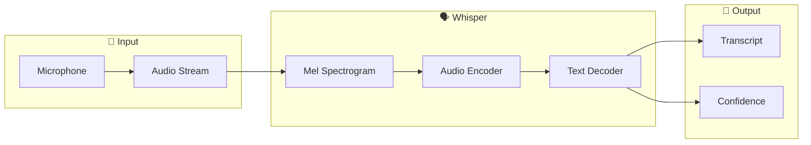

### D4.8: Intent Extraction

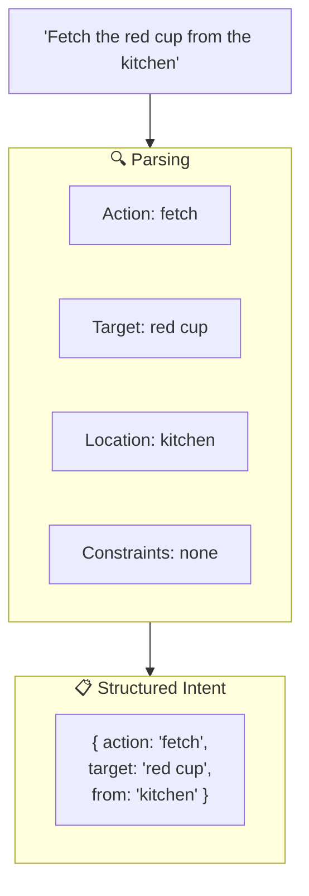

### D4.9: LLM Task Decomposition

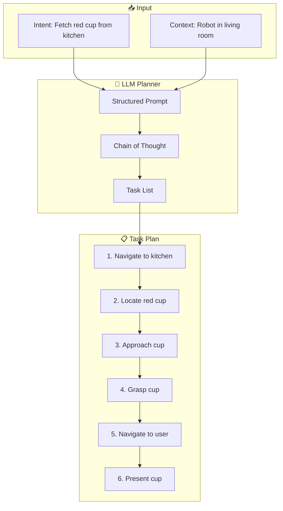

### D4.10: Grounding Process

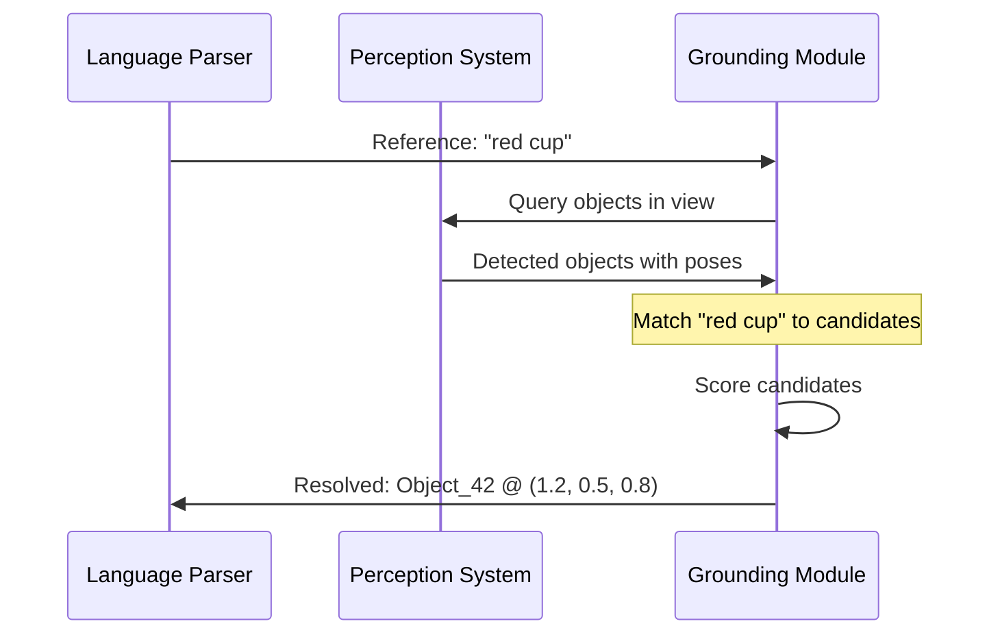

### D4.11: Action Primitive Catalog

| Primitive | Parameters | ROS 2 Interface | Description |
|-----------|------------|-----------------|-------------|
| `navigate_to` | pose, tolerance | `nav2_msgs/NavigateToPose` | Move to location |
| `look_at` | point, duration | `control_msgs/FollowJointTrajectory` | Direct gaze |
| `grasp` | object_id, force | Custom action | Close gripper |
| `release` | - | Custom action | Open gripper |
| `reach` | pose, velocity | `moveit_msgs/MoveGroup` | Move arm |
| `speak` | text | `std_msgs/String` | Text-to-speech |

### D4.12: Complete Autonomy Stack

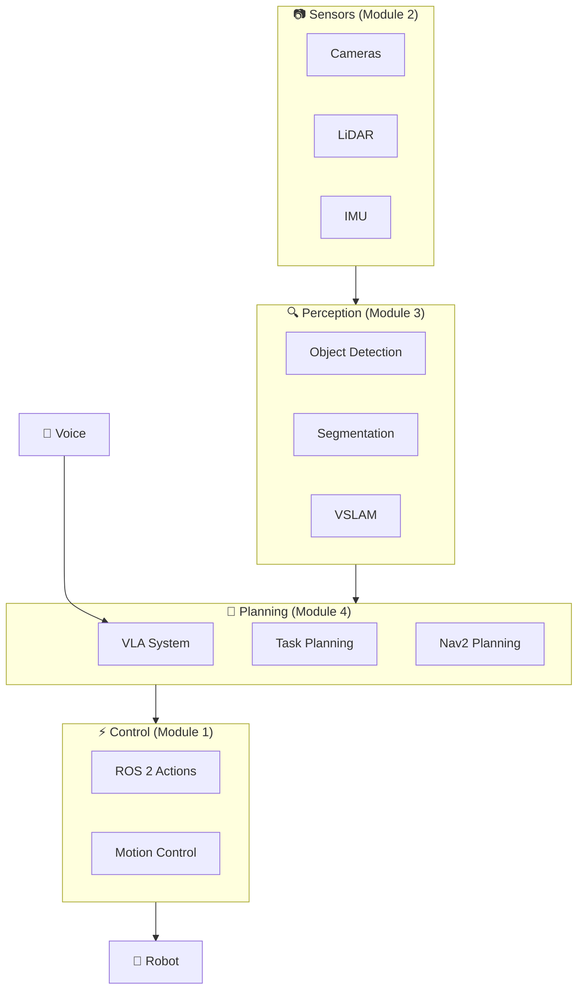

### D4.13: Fetch Drink Scenario Sequence

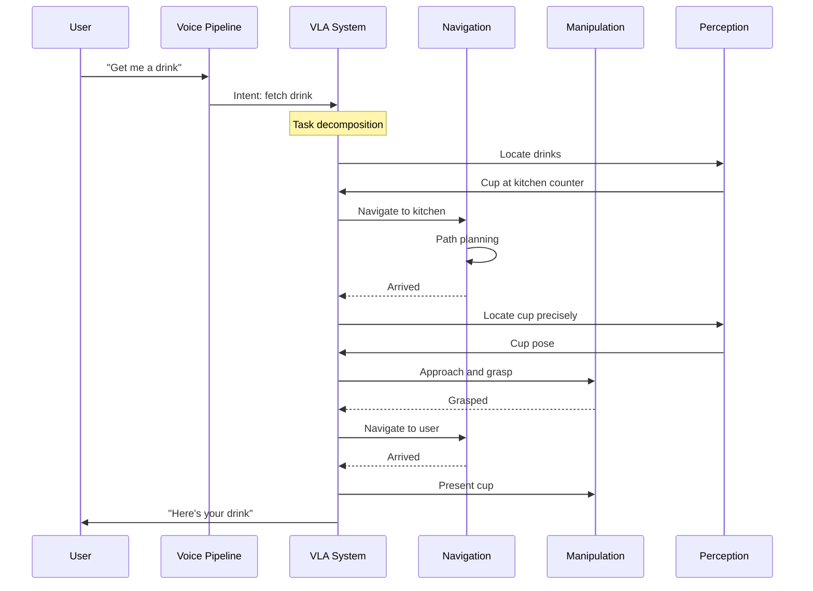

### D4.14: Data Flow Trace

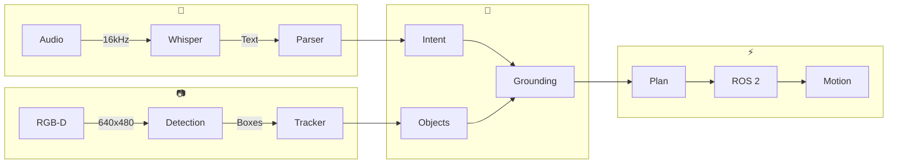

### D4.15: Gap Analysis for Autonomous Humanoids

| Capability | Current State | Gap | Research Direction |
|------------|---------------|-----|-------------------|
| **Language Understanding** | Good for simple commands | Complex reasoning, ambiguity | Larger context LLMs |
| **Grounding** | Works in controlled scenes | Cluttered environments | Better open-vocab detection |
| **Task Planning** | Linear task sequences | Dynamic replanning | Hierarchical planners |
| **Manipulation** | Basic grasping | Dexterous manipulation | Learning-based control |
| **Recovery** | Limited | Graceful failure handling | Robust error recovery |

---

## Code Snippets

### C4.1: Voice Command Processing Concept

```python
# Conceptual voice-to-intent pipeline
import whisper
from openai import OpenAI

class VoiceToIntent:
    def __init__(self):
        self.whisper = whisper.load_model("base")
        self.llm = OpenAI()

    def transcribe(self, audio_path: str) -> str:
        result = self.whisper.transcribe(audio_path)
        return result["text"]

    def parse_intent(self, transcript: str) -> dict:
        response = self.llm.chat.completions.create(
            model="gpt-4",
            messages=[{
                "role": "system",
                "content": "Extract intent as JSON: {action, target, location}"
            }, {
                "role": "user",
                "content": transcript
            }]
        )
        return json.loads(response.choices[0].message.content)
```

### C4.2: Task Decomposition Prompt Concept

```python
# Conceptual LLM prompt for task decomposition
DECOMPOSITION_PROMPT = """
You are a robot task planner. Given a high-level command and context,
decompose it into a sequence of primitive actions.

Available primitives:
- navigate_to(location): Move robot to location
- look_at(target): Direct gaze at target
- grasp(object): Pick up object
- release(): Release held object
- speak(text): Say something

Command: {command}
Context: {context}
Detected objects: {objects}

Output a JSON list of actions with parameters.
"""
```

### C4.3: ROS 2 Action Client Concept

```python
# Conceptual ROS 2 action execution
import rclpy
from rclpy.action import ActionClient
from nav2_msgs.action import NavigateToPose

class ActionExecutor:
    def __init__(self, node):
        self.nav_client = ActionClient(
            node, NavigateToPose, 'navigate_to_pose'
        )

    async def navigate_to(self, x: float, y: float, theta: float):
        goal = NavigateToPose.Goal()
        goal.pose.header.frame_id = 'map'
        goal.pose.pose.position.x = x
        goal.pose.pose.position.y = y
        # Set orientation from theta...

        future = self.nav_client.send_goal_async(goal)
        result = await future
        return result.status
```

### C4.4: Grounding Module Concept

```python
# Conceptual grounding: language reference → object pose
class GroundingModule:
    def __init__(self, detector, embedder):
        self.detector = detector  # Object detector
        self.embedder = embedder  # Text embedder (CLIP-like)

    def ground(self, reference: str, image) -> dict:
        # Detect all objects
        detections = self.detector.detect(image)

        # Embed the language reference
        ref_embedding = self.embedder.encode_text(reference)

        # Score each detection
        scores = []
        for det in detections:
            crop = image[det.bbox]
            img_embedding = self.embedder.encode_image(crop)
            score = cosine_similarity(ref_embedding, img_embedding)
            scores.append((det, score))

        # Return best match
        best = max(scores, key=lambda x: x[1])
        return {"object": best[0], "confidence": best[1]}
```

---

## Integration Reference

| Book Module | Autonomy Layer | Key Interface |
|-------------|---------------|---------------|
| Module 1: ROS 2 | Control & Communication | Topics, Services, Actions |
| Module 2: Simulation | Virtual Testing | Gazebo/Unity environments |
| Module 3: Isaac | Perception & Localization | Detection, VSLAM, Nav2 |
| Module 4: VLA | Planning & Reasoning | Voice → Intent → Tasks |

---

**Usage**: Import these diagrams and snippets into chapter markdown files using MDX imports or copy-paste.
