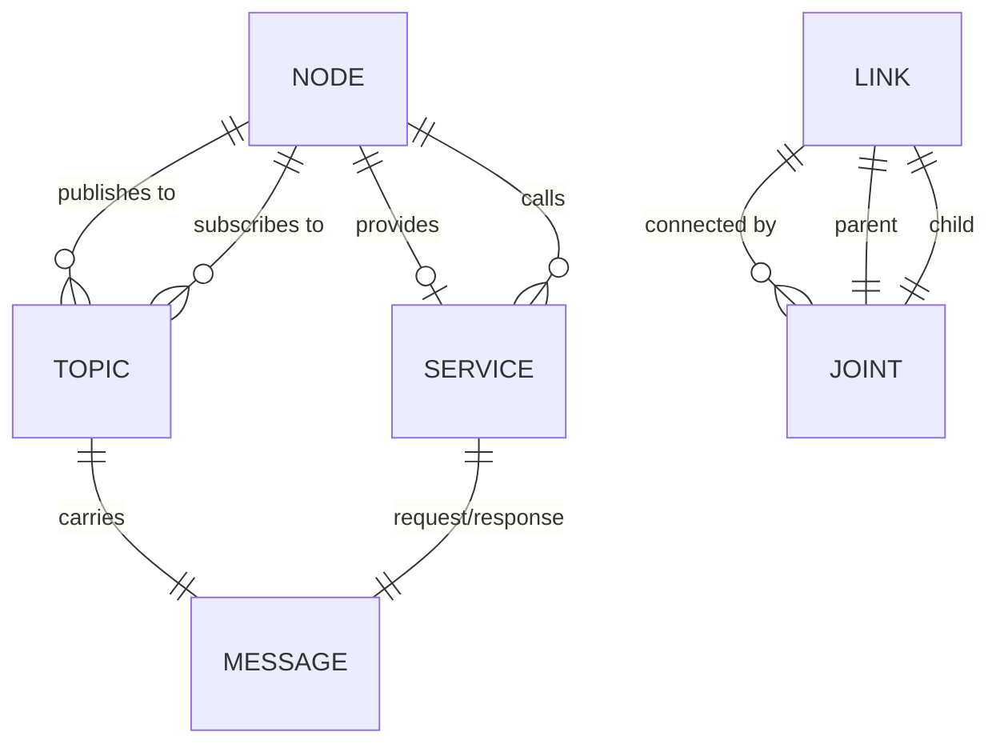

# Data Model: Module 1 - The Robotic Nervous System (ROS 2)

**Phase**: 1 (Design) | **Date**: 2025-12-16 | **Spec**: [spec.md](./spec.md)

## Overview

This document defines the key entities, their attributes, and relationships for Module 1 content. It also maps entities to specific chapters and sections.

---

## 1. Entity Definitions

### Node

```yaml
entity: Node
description: An independent ROS 2 process with defined interfaces
attributes:
  - name: string (unique within namespace)
  - namespace: string (optional, for organization)
  - publishers: list[Publisher]
  - subscribers: list[Subscriber]
  - services: list[Service]
  - timers: list[Timer]
relationships:
  - publishes_to: Topic (0..*)
  - subscribes_to: Topic (0..*)
  - provides: Service (0..*)
  - calls: Service (0..*)
analogy: "Neuron - independent processing unit"
introduced_in: Chapter 1, Section 1.1
```

### Topic

```yaml
entity: Topic
description: Named channel for asynchronous message passing
attributes:
  - name: string (e.g., "/camera/image_raw")
  - message_type: string (e.g., "sensor_msgs/Image")
  - qos_profile: QoSProfile (reliability, durability)
relationships:
  - published_by: Node (0..*)
  - subscribed_by: Node (0..*)
  - carries: Message (1)
analogy: "Sensory pathway - continuous data stream"
introduced_in: Chapter 1, Section 1.2
```

### Service

```yaml
entity: Service
description: Named endpoint for synchronous request-response
attributes:
  - name: string (e.g., "/spawn_entity")
  - request_type: string (message type)
  - response_type: string (message type)
relationships:
  - provided_by: Node (1)
  - called_by: Node (0..*)
analogy: "Motor command - discrete action request"
introduced_in: Chapter 1, Section 1.3
```

### Message

```yaml
entity: Message
description: Typed data structure for inter-node communication
attributes:
  - type: string (package/MessageName)
  - fields: list[Field]
  - timestamp: Time (optional)
relationships:
  - carried_by: Topic | Service
  - defined_in: .msg | .srv file
analogy: "Neural signal - typed data packet"
introduced_in: Chapter 1, Section 1.2
```

### Link (URDF)

```yaml
entity: Link
description: Rigid body segment in robot description
attributes:
  - name: string (unique within robot)
  - visual: Geometry (optional)
  - collision: Geometry (optional)
  - inertial: InertialProperties (optional)
relationships:
  - connected_to: Joint (0..*)
  - parent_of: Link (0..*, via joints)
  - child_of: Link (0..1, via joint)
analogy: "Bone - structural segment"
introduced_in: Chapter 3, Section 3.1
```

### Joint (URDF)

```yaml
entity: Joint
description: Kinematic connection between two links
attributes:
  - name: string (unique within robot)
  - type: enum (revolute, continuous, prismatic, fixed, floating)
  - parent: Link (reference)
  - child: Link (reference)
  - origin: Transform (position and orientation)
  - axis: Vector3 (for revolute/prismatic)
  - limits: JointLimits (optional, for revolute/prismatic)
relationships:
  - connects: Link (parent) → Link (child)
  - constrains: Motion (based on type)
analogy: "Joint - articulation point"
introduced_in: Chapter 3, Section 3.2
```

---

## 2. Entity Relationship Diagram



---

## 3. Chapter-Entity Mapping

### Chapter 1: ROS 2 Architecture and Communication

| Section | Primary Entities | Coverage |
|---------|------------------|----------|
| 1.1 The Nervous System Analogy | Node, Topic, Service | Introduce all with analogy |
| 1.2 Topics and Messages | Topic, Message | Deep dive on pub-sub |
| 1.3 Services | Service | Deep dive on request-response |
| 1.4 Nodes in the Graph | Node | Node composition and lifecycle |
| 1.5 Choosing Communication Patterns | Topic, Service | Decision framework |

### Chapter 2: Python Agents with rclpy

| Section | Primary Entities | Coverage |
|---------|------------------|----------|
| 2.1 rclpy Node Structure | Node | Python implementation |
| 2.2 Publishers and Subscribers | Topic, Message | Code patterns |
| 2.3 Service Clients and Servers | Service | Code patterns |
| 2.4 AI Agent Integration | Node | Decision logic placement |

### Chapter 3: URDF for Humanoid Robots

| Section | Primary Entities | Coverage |
|---------|------------------|----------|
| 3.1 What is URDF? | Link, Joint | Introduction and purpose |
| 3.2 Links and Their Properties | Link | Visual, collision, inertial |
| 3.3 Joints and Motion | Joint | Types and constraints |
| 3.4 Humanoid Structure | Link, Joint | Full robot example |

---

## 4. Diagram Specifications

### D1.1: Nervous System Analogy

```yaml
diagram_id: D1.1
type: conceptual
format: mermaid (mindmap or flowchart)
purpose: Visual mapping of biological to ROS 2 concepts
elements:
  - Central: "Robot Nervous System"
  - Branch 1: "Neurons → Nodes"
  - Branch 2: "Sensory Pathways → Topics"
  - Branch 3: "Motor Commands → Services"
  - Branch 4: "Neural Signals → Messages"
placement: Chapter 1, Section 1.1 (opening)
```

### D1.2: ROS 2 Node Graph

```yaml
diagram_id: D1.2
type: architecture
format: mermaid (graph)
purpose: Show typical robot node topology
elements:
  - Nodes: camera_node, lidar_node, perception_node, planner_node, controller_node
  - Topics: /camera/image, /lidar/scan, /obstacles, /cmd_vel
  - Connections: publisher/subscriber relationships
placement: Chapter 1, Section 1.4
```

### D2.1: rclpy Node Structure

```yaml
diagram_id: D2.1
type: architecture
format: mermaid (class or block)
purpose: Show internal structure of Python node
elements:
  - Node class with __init__
  - Publishers, Subscribers, Timers
  - Callback methods
  - Main entry point
placement: Chapter 2, Section 2.1
```

### D3.1: URDF Element Hierarchy

```yaml
diagram_id: D3.1
type: hierarchy
format: mermaid (flowchart top-down)
purpose: Show URDF element containment
elements:
  - robot (root)
  - link (with visual, collision, inertial)
  - joint (with parent, child, axis, limits)
placement: Chapter 3, Section 3.1
```

### D3.2: Humanoid Kinematic Chain

```yaml
diagram_id: D3.2
type: tree
format: mermaid (graph TD)
purpose: Show humanoid link-joint structure
elements:
  - base_link (torso)
  - head, left_arm, right_arm, left_leg, right_leg branches
  - Joint labels between links
placement: Chapter 3, Section 3.4
```

---

## 5. Code Snippet Inventory

### Chapter 1 Snippets

| ID | Description | Lines | Language |
|----|-------------|-------|----------|
| C1.1 | Topic message definition example | 5 | yaml |
| C1.2 | Service definition example | 8 | yaml |

### Chapter 2 Snippets

| ID | Description | Lines | Language |
|----|-------------|-------|----------|
| C2.1 | Minimal rclpy node | 15 | python |
| C2.2 | Publisher setup | 8 | python |
| C2.3 | Subscriber with callback | 12 | python |
| C2.4 | Service server | 15 | python |
| C2.5 | AI decision callback | 10 | python |

### Chapter 3 Snippets

| ID | Description | Lines | Language |
|----|-------------|-------|----------|
| C3.1 | Basic link definition | 10 | xml |
| C3.2 | Joint definition | 12 | xml |
| C3.3 | Humanoid arm chain | 25 | xml |

---

## 6. Glossary Entries for Module 1

| Term | Definition |
|------|------------|
| Node | Independent ROS 2 process with defined communication interfaces |
| Topic | Named channel for publish-subscribe message passing |
| Service | Named endpoint for synchronous request-response communication |
| Message | Typed data structure for inter-node communication |
| Publisher | Node interface that sends messages to a topic |
| Subscriber | Node interface that receives messages from a topic |
| Callback | Function invoked when a message arrives or timer fires |
| URDF | Unified Robot Description Format for robot structure |
| Link | Rigid body segment in URDF |
| Joint | Kinematic connection between URDF links |
| Kinematic Chain | Series of links connected by joints |

---

**Next**: Create chapter contracts in [contracts/](./contracts/) directory.
