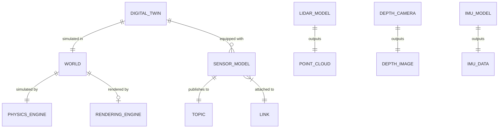

# Data Model: Module 2 - The Digital Twin (Gazebo & Unity)

**Phase**: 1 (Design) | **Date**: 2025-12-16 | **Spec**: [spec.md](./spec.md)

## Overview

This document defines the key entities, their attributes, and relationships for Module 2 content on simulation and digital twins.

---

## 1. Entity Definitions

### Digital Twin

```yaml
entity: Digital Twin
description: Virtual replica of a physical robot for development and testing
attributes:
  - physical_counterpart: Robot (reference to real system)
  - fidelity_level: enum (kinematic, rigid_body, deformable)
  - synchronization: enum (offline, real-time, predictive)
  - purpose: list[string] (testing, training, monitoring)
relationships:
  - simulated_in: World (1)
  - composed_of: Link, Joint (via URDF/SDF)
  - equipped_with: SensorModel (0..*)
introduced_in: Chapter 1, Section 1.1
```

### Physics Engine

```yaml
entity: Physics Engine
description: Component computing forces, collisions, and motion
attributes:
  - name: string (DART, Bullet, ODE, PhysX)
  - timestep: float (simulation step in seconds)
  - solver_iterations: int (accuracy vs speed trade-off)
  - gravity: Vector3 (default: 0, 0, -9.81)
relationships:
  - simulates: World (1)
  - computes: Collision, ContactForce
introduced_in: Chapter 1, Section 1.2
```

### World

```yaml
entity: World
description: Simulated environment containing robot and objects
attributes:
  - name: string (unique identifier)
  - gravity: Vector3 (world gravity vector)
  - ambient_light: Color (for rendering)
  - ground_plane: boolean (flat floor present)
  - objects: list[Model] (static and dynamic entities)
relationships:
  - contains: DigitalTwin (1..*)
  - rendered_by: RenderingEngine (0..1)
  - simulated_by: PhysicsEngine (1)
introduced_in: Chapter 1, Section 1.3
```

### Sensor Model

```yaml
entity: Sensor Model
description: Virtual representation of physical sensor
attributes:
  - type: enum (lidar, depth_camera, imu, camera, force_torque)
  - update_rate: float (Hz)
  - noise_model: NoiseParameters
  - range: tuple (min, max)
  - topic: string (ROS 2 topic name)
relationships:
  - attached_to: Link (1)
  - publishes_to: Topic (1)
  - outputs: SensorData (specific type)
introduced_in: Chapter 3, Section 3.1
```

### Point Cloud

```yaml
entity: Point Cloud
description: 3D data output from LiDAR sensors
attributes:
  - points: list[Point3D] (x, y, z coordinates)
  - intensity: list[float] (optional reflectance values)
  - frame_id: string (coordinate frame reference)
  - timestamp: Time (acquisition time)
  - width: int (organized clouds)
  - height: int (1 for unorganized)
ros_type: sensor_msgs/PointCloud2
introduced_in: Chapter 3, Section 3.2
```

### Depth Image

```yaml
entity: Depth Image
description: 2D image where pixels represent distance
attributes:
  - width: int (horizontal resolution)
  - height: int (vertical resolution)
  - encoding: string (32FC1, 16UC1)
  - data: array[float|uint16] (depth values)
  - frame_id: string (camera frame)
  - timestamp: Time (acquisition time)
ros_type: sensor_msgs/Image
introduced_in: Chapter 3, Section 3.3
```

### IMU Data

```yaml
entity: IMU Data
description: Inertial measurement unit readings
attributes:
  - linear_acceleration: Vector3 (m/s^2)
  - angular_velocity: Vector3 (rad/s)
  - orientation: Quaternion (optional)
  - covariance: array[9] (uncertainty)
  - frame_id: string (sensor frame)
  - timestamp: Time (measurement time)
ros_type: sensor_msgs/Imu
introduced_in: Chapter 3, Section 3.4
```

---

## 2. Entity Relationship Diagram



---

## 3. Chapter-Entity Mapping

### Chapter 1: Digital Twins and Physics Simulation with Gazebo

| Section | Primary Entities | Coverage |
|---------|------------------|----------|
| 1.1 What is a Digital Twin? | Digital Twin | Concept, purpose, benefits |
| 1.2 Physics Simulation Fundamentals | Physics Engine | Core phenomena, architecture |
| 1.3 The Simulated World | World | Environment structure |
| 1.4 Gazebo for ROS 2 Robotics | All above | Platform introduction |
| 1.5 Gazebo-ROS 2 Integration | Digital Twin, Topic | Bridge architecture |

### Chapter 2: High-Fidelity Rendering and HRI in Unity

| Section | Primary Entities | Coverage |
|---------|------------------|----------|
| 2.1 Why Visual Fidelity Matters | World (rendering) | Perception testing rationale |
| 2.2 Unity for Robotics | Digital Twin | Platform introduction |
| 2.3 Gazebo vs Unity | All | Decision framework |
| 2.4 Human-Robot Interaction Scenarios | World | HRI environment design |

### Chapter 3: Simulated Sensors for Perception

| Section | Primary Entities | Coverage |
|---------|------------------|----------|
| 3.1 Sensor Models Overview | Sensor Model | Purpose, parameters |
| 3.2 LiDAR Simulation | Sensor Model, Point Cloud | Full coverage |
| 3.3 Depth Camera Simulation | Sensor Model, Depth Image | Full coverage |
| 3.4 IMU Simulation | Sensor Model, IMU Data | Full coverage |
| 3.5 Sensor-to-ROS 2 Pipeline | All sensors, Topic | Integration |

---

## 4. Diagram Specifications

### D1.1: Digital Twin Concept

```yaml
diagram_id: D1.1
type: conceptual
format: mermaid (flowchart)
purpose: Show relationship between physical and virtual robot
elements:
  - Physical Robot (real world)
  - Digital Twin (simulation)
  - Bidirectional arrows: state sync, commands
  - Benefits callouts
placement: Chapter 1, Section 1.1 (opening)
```

### D1.2: Physics Engine Pipeline

```yaml
diagram_id: D1.2
type: architecture
format: mermaid (flowchart TD)
purpose: Show physics simulation steps
elements:
  - World State → Collision Detection
  - Contact Generation → Constraint Solver
  - Integration → New World State
  - Loop arrow
placement: Chapter 1, Section 1.2
```

### D2.1: Gazebo vs Unity Comparison

```yaml
diagram_id: D2.1
type: comparison
format: table or radar chart description
purpose: Decision framework for platform selection
elements:
  - Criteria: Physics, Rendering, ROS 2, HRI, Cost
  - Ratings for each platform
  - Recommendation guidelines
placement: Chapter 2, Section 2.3
```

### D3.1: Sensor to ROS 2 Pipeline

```yaml
diagram_id: D3.1
type: architecture
format: mermaid (flowchart LR)
purpose: Show data flow from simulated sensor to ROS 2 node
elements:
  - Simulated Sensor → Sensor Plugin
  - Sensor Plugin → ros_gz_bridge
  - Bridge → ROS 2 Topic
  - Topic → Perception Node
placement: Chapter 3, Section 3.5
```

### D3.2: Point Cloud Visualization

```yaml
diagram_id: D3.2
type: visualization (described)
format: description for illustration
purpose: Show what LiDAR output looks like
elements:
  - 3D point cloud rendering
  - Color by intensity or range
  - Humanoid robot context
placement: Chapter 3, Section 3.2
```

---

## 5. Code/Configuration Snippet Inventory

### Chapter 1 Snippets

| ID | Description | Format | Lines |
|----|-------------|--------|-------|
| S1.1 | SDF world excerpt | XML | 15 |
| S1.2 | ros_gz_bridge launch | Python/YAML | 10 |

### Chapter 3 Snippets

| ID | Description | Format | Lines |
|----|-------------|--------|-------|
| S3.1 | LiDAR sensor SDF | XML | 12 |
| S3.2 | Depth camera SDF | XML | 12 |
| S3.3 | IMU sensor SDF | XML | 10 |

---

## 6. Glossary Entries for Module 2

| Term | Definition |
|------|------------|
| Digital Twin | Virtual replica of physical robot for simulation |
| Physics Engine | Component computing forces, collisions, motion |
| World | Simulated environment with objects and physics |
| SDF | Simulation Description Format (Gazebo) |
| Rigid Body | Object treated as non-deformable solid |
| Collision Detection | Finding contact between objects |
| Contact Force | Reaction force at collision points |
| Sensor Model | Virtual sensor with configurable parameters |
| Point Cloud | 3D data from LiDAR (set of XYZ points) |
| Depth Image | 2D image with distance values per pixel |
| IMU | Inertial Measurement Unit (acceleration + rotation) |
| Noise Model | Mathematical model of sensor imperfections |

---

**Next**: Create chapter contracts in [contracts/](./contracts/) directory.
