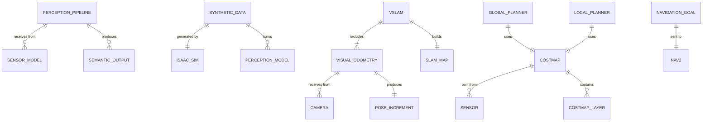

# Data Model: Module 3 - The AI-Robot Brain (NVIDIA Isaac)

**Phase**: 1 (Design) | **Date**: 2025-12-16 | **Spec**: [spec.md](./spec.md)

## Overview

This document defines the key entities, their attributes, and relationships for Module 3 content on AI perception and navigation.

---

## 1. Entity Definitions

### Perception Pipeline

```yaml
entity: Perception Pipeline
description: End-to-end flow from raw sensor data to semantic understanding
attributes:
  - input_types: list[enum] (rgb, depth, lidar, imu)
  - preprocessing: list[string] (normalization, cropping, resizing)
  - model: NeuralNetwork (detection, segmentation, depth)
  - output_types: list[enum] (boxes, masks, depth_map, poses)
  - inference_device: enum (cpu, gpu, tensorrt)
relationships:
  - receives_from: SensorModel (1..*)
  - produces: SemanticOutput (1..*)
  - trained_on: SyntheticData (for sim-trained models)
introduced_in: Chapter 1, Section 1.1
```

### Synthetic Data

```yaml
entity: Synthetic Data
description: Computer-generated training data with automatic labels
attributes:
  - scene_type: enum (indoor, outdoor, warehouse, home)
  - randomization: list[RandomizationType]
  - ground_truth: list[LabelType]
  - format: enum (coco, kitti, custom)
  - sample_count: int (number of images/frames)
relationships:
  - generated_by: IsaacSim (1)
  - trains: PerceptionModel (1..*)
  - contains: GroundTruth (1..*)
introduced_in: Chapter 1, Section 1.2
```

### Domain Randomization

```yaml
entity: Domain Randomization
description: Technique of varying simulation parameters for model robustness
attributes:
  - type: enum (texture, lighting, pose, camera, distractor)
  - range: tuple (min, max values)
  - distribution: enum (uniform, gaussian, discrete)
  - parameters: dict (type-specific settings)
relationships:
  - applied_to: Scene (1..*)
  - improves: ModelGeneralization
introduced_in: Chapter 1, Section 1.3
```

### Visual Odometry

```yaml
entity: Visual Odometry
description: Estimation of robot pose changes from sequential images
attributes:
  - method: enum (feature_based, direct, hybrid)
  - features: enum (orb, sift, learned)
  - output_rate: float (Hz)
  - drift_rate: float (error per distance)
relationships:
  - receives_from: Camera (1..*)
  - produces: PoseIncrement (stream)
  - part_of: VSLAM (optional)
ros_type: geometry_msgs/PoseStamped (or Odometry)
introduced_in: Chapter 2, Section 2.1
```

### SLAM Map

```yaml
entity: SLAM Map
description: Spatial representation built by localization and mapping
attributes:
  - type: enum (sparse, dense, semi_dense)
  - landmarks: list[Landmark] (visual features)
  - keyframes: list[Keyframe] (reference images)
  - graph: PoseGraph (optimized trajectory)
  - scale: float (for monocular, may be unknown)
relationships:
  - built_by: VSLAM (1)
  - used_by: Localization, Navigation
  - contains: Landmark (0..*)
introduced_in: Chapter 2, Section 2.2
```

### Costmap

```yaml
entity: Costmap
description: 2D/3D grid representing traversability costs for navigation
attributes:
  - resolution: float (meters per cell)
  - width: int (cells)
  - height: int (cells)
  - layers: list[CostmapLayer]
  - frame_id: string (coordinate frame)
relationships:
  - built_from: Sensors, StaticMap
  - used_by: GlobalPlanner, LocalPlanner
  - contains: CostmapLayer (1..*)
ros_type: nav_msgs/OccupancyGrid (2D) or custom (3D)
introduced_in: Chapter 3, Section 3.2
```

### Navigation Goal

```yaml
entity: Navigation Goal
description: Target pose for the robot to reach
attributes:
  - position: Point3D (x, y, z)
  - orientation: Quaternion (target heading)
  - frame_id: string (coordinate frame)
  - tolerance: float (acceptable error)
relationships:
  - sent_to: Nav2 (1)
  - produces: Path via GlobalPlanner
  - results_in: NavigationResult
ros_type: geometry_msgs/PoseStamped
introduced_in: Chapter 3, Section 3.1
```

---

## 2. Entity Relationship Diagram



---

## 3. Chapter-Entity Mapping

### Chapter 1: Perception and Synthetic Data with Isaac Sim

| Section | Primary Entities | Coverage |
|---------|------------------|----------|
| 1.1 AI Perception for Robots | Perception Pipeline | End-to-end concept |
| 1.2 Synthetic Data Generation | Synthetic Data | Pipeline, benefits |
| 1.3 Domain Randomization | Domain Randomization | Types, purpose |
| 1.4 Ground Truth Labels | Ground Truth | Types, formats |
| 1.5 Isaac Sim Workflow | Isaac Sim, Synthetic Data | Platform overview |

### Chapter 2: Visual SLAM with Isaac ROS

| Section | Primary Entities | Coverage |
|---------|------------------|----------|
| 2.1 Visual Odometry Concepts | Visual Odometry | Feature tracking, pose estimation |
| 2.2 From VO to Full SLAM | SLAM Map | Loop closure, map building |
| 2.3 Isaac ROS VSLAM | VSLAM, Visual Odometry | GPU acceleration, integration |
| 2.4 VSLAM Output and Integration | SLAM Map, Pose | Connection to Nav2 |

### Chapter 3: Path Planning with Nav2

| Section | Primary Entities | Coverage |
|---------|------------------|----------|
| 3.1 Nav2 Architecture Overview | Navigation Goal, Nav2 | Stack components |
| 3.2 Costmaps and Obstacle Representation | Costmap, CostmapLayer | Layers, building |
| 3.3 Global and Local Planning | Planner entities | Planning algorithms |
| 3.4 Behavior Trees for Navigation | BehaviorTree | Decision logic |
| 3.5 Humanoid Navigation Considerations | All | Bipedal adaptations |

---

## 4. Diagram Specifications

### D1.1: Perception Pipeline Flow

```yaml
diagram_id: D1.1
type: pipeline
format: mermaid (flowchart LR)
purpose: Show perception from sensor to semantic output
elements:
  - Sensor Data → Preprocessing → Model → Output
  - Output types: boxes, masks, depth
placement: Chapter 1, Section 1.1
```

### D1.2: Synthetic Data Pipeline

```yaml
diagram_id: D1.2
type: pipeline
format: mermaid (flowchart LR)
purpose: Show synthetic data generation flow
elements:
  - Scene Setup → Domain Randomization → Rendering
  - Ground Truth Generation → Dataset Export
placement: Chapter 1, Section 1.2
```

### D2.1: VSLAM Pipeline

```yaml
diagram_id: D2.1
type: pipeline
format: mermaid (flowchart LR)
purpose: Show VSLAM components and flow
elements:
  - Images → Features → Matching → Motion → Map
placement: Chapter 2, Section 2.1
```

### D3.1: Nav2 Architecture

```yaml
diagram_id: D3.1
type: architecture
format: mermaid (flowchart TD)
purpose: Show Nav2 stack components
elements:
  - Behavior Tree at top
  - Global Planner, Local Planner, Controller
  - Costmap feeding planners
placement: Chapter 3, Section 3.1
```

### D3.2: Costmap Layers

```yaml
diagram_id: D3.2
type: layered
format: description or stacked visualization
purpose: Show costmap layer composition
elements:
  - Static layer (from map)
  - Obstacle layer (from sensors)
  - Inflation layer (safety buffer)
placement: Chapter 3, Section 3.2
```

---

## 5. Code/Configuration Snippet Inventory

### Chapter 1 Snippets

| ID | Description | Format | Lines |
|----|-------------|--------|-------|
| S1.1 | Isaac Sim replicator snippet concept | Python | 10 |

### Chapter 2 Snippets

| ID | Description | Format | Lines |
|----|-------------|--------|-------|
| S2.1 | Isaac ROS VSLAM launch concept | YAML | 12 |

### Chapter 3 Snippets

| ID | Description | Format | Lines |
|----|-------------|--------|-------|
| S3.1 | Nav2 params concept | YAML | 15 |
| S3.2 | Costmap layer config | YAML | 10 |

---

## 6. Glossary Entries for Module 3

| Term | Definition |
|------|------------|
| Perception Pipeline | End-to-end flow from sensors to semantic understanding |
| Synthetic Data | Computer-generated training data with automatic labels |
| Domain Randomization | Varying simulation parameters for model robustness |
| Ground Truth | Automatically generated correct labels for training |
| Visual Odometry | Pose estimation from sequential camera images |
| VSLAM | Visual Simultaneous Localization and Mapping |
| Loop Closure | Recognizing previously visited locations to correct drift |
| Keyframe | Reference image used for localization |
| Costmap | Grid representation of navigation costs |
| Global Planner | Computes path from start to goal |
| Local Planner | Optimizes trajectory avoiding local obstacles |
| Behavior Tree | Hierarchical decision structure for robot behavior |

---

**Next**: Create chapter contracts in [contracts/](./contracts/) directory.
